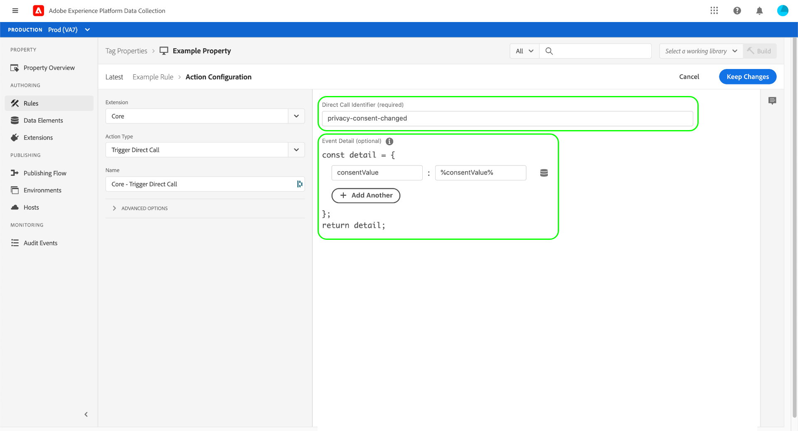

# Core extension overview

>[!NOTE]
>
>Adobe Experience Platform Launch has been rebranded as a suite of data collection technologies in Adobe Experience Platform. Several terminology changes have rolled out across the product documentation as a result. Please refer to the following [document](../../../term-updates.md) for a consolidated reference of the terminology changes.

The Core tag extension is the default extension released with Adobe Experience Platform.

This document provides information regarding the options available when using the Core extension to build a rule.

## Core extension event types {#core-extension-event-types}

This topic describes the event types available in the Core extension. For information about the options that can be set for several different event types, see the [Options](#options) section.

### Browser based events

#### Tab Blur

The tab-blur event triggers the action when a tab loses the focus. There are no settings for this event type.

#### Tab Focus

The tab-focus event triggers the action when a tab gains the focus. There are no settings for this event type.

### Form

#### Blur

The blur event triggers the action when a form loses the focus. See the [Options](#options) section for more information on customizable event settings.

#### Focus

The focus event triggers the action when a form gains the focus. See the [Options](#options) section for more information on customizable event settings.

#### Submit

The submit event triggers the action when a form is submitted. See the [Options](#options) section for more information on customizable event settings.

### Keyboard-controlled events

#### Key Press

The event triggers when a key is pressed. See the [Options](#options) section for more information on customizable event settings.

### Media-based events

#### Media Ended

The event triggers when the media ends. See the [Options](#options) section for more information on customizable event settings.

#### Media-Loaded Data

The event triggers when the media loads data. See the [Options](#options) section for more information on customizable event settings.

#### Media Pause

The event triggers when the media is paused. See the [Options](#options) section for more information on customizable event settings.

#### Media Play

The event triggers when the media is played. See the [Options](#options) section for more information on customizable event settings.

#### Media Stalled

The event triggers if the media stalls. See the [Options](#options) section for more information on customizable event settings.

#### Media-Time Played

The event triggers if the media is played for a specified length of time. You must specify the duration that the media must be played for in order to trigger the event. See the [Options](#options) section for more information on customizable event settings.


#### Media-Volume Changed

The event triggers if the volume is raised or lowered. See the [Options](#options) section for more information on customizable event settings.

### Mobile-device-orientated events

#### Orientation Change

The event triggers if the device's orientation changes. You must specify the duration that the orientation must change for in order to trigger the event. There are no settings for this event type.

#### Zoom Change

The event triggers if the user zooms in or out. There are no settings for this event type.

### Mouse-controlled events

#### Click

The event triggers if the specified element is selected (clicked). Optionally, you can specify property values that must be true for the element before the event is triggered.

If the element is an anchor tag (`<a>`) to linked content, you can also specify whether to delay navigation for a period of time. This can be useful if your rule requires extra time to execute and would not normally complete before page navigation takes place.

>[!WARNING]
>
>This option should be used with extreme caution due to the potential negative consequences it poses to the user experience if used incorrectly.

When you use link delay, Platform actually prevents the browser from navigating off the page. It then performs a JavaScript redirect to the original destination after the specified timeout. This is especially dangerous when when your page markup has `<a>` tags where the intended functionality does not actually navigate the user away from the page. If you cannot solve your problem in any other way, you should be extremely precise with your selector definition so that this event will trigger exactly where you need it and nowhere else.

The default link delay value is 100 milliseconds. Please note that tags will always wait for the amount of time specified and is not connected to the execution of the rule's actions in any way. It is possible that the delay will force the user to wait longer than is necessary, and also possible that the delay will not be long enough for all the rule's actions to successfully complete. Longer delays provide more time for rule execution but also worsen the user experience.

To enact the delay it is necessary to provide both the selected element that triggers the event, and the specific amount of time before the event is triggered.

For the advanced options see the [Options](#options) section for more information.

#### Hover

The event triggers if the user hovers over a specified element. You must also configure whether the rule is triggered immediately or after a specified number of milliseconds. See the [Options](#options) section for more information on customizable event settings.

### Other events

#### Custom Event

The event triggers if a custom event type occurs. Named JavaScript functions that are defined elsewhere in the codebase can be used as a custom event type. You must specify the name of the custom event type and configure any other settings as described in [Options](#options) section below.

#### Data Element Changed

The event triggers if a specified data element changes. You must provide a name for the data element. You can select the data element by either typing its name into the text field, or selecting the data element icon to the right side of the text field and choosing from a list provided within the dialog that appears.

#### Direct Call {#direct-call-event}

A direct call event bypasses event detection and lookup systems. Direct call rules are ideal for situations where you want to tell the system exactly what is happening. Also, they are ideal when the system cannot detect an event in the DOM.

When defining a direct call event, you must specify a string that will act as this event's identifier. If a [trigger direct call action](#direct-call-action) containing the same identifier is fired, then any direct call event rules listening for that identifier will run.


#### Element Exists

The event triggers if a specified element exists. See the [Options](#options) section for more information on customizable event settings.

#### Enters Viewport

The event triggers if the user enters a specified viewport. You must provide a CSS selector as a criteria to target matching elements. You must also configure whether the rule is triggered immediately or after a specified number of milliseconds, and whether the event should trigger every time the event occurs or only the first time.

See the [Options](#options) section for more information on customizable event settings.

#### History Change

The event triggers if a pushState or a hashchange event occurs. There are no settings for this event type.

#### Time-Spent on Page

The event triggers if the user remains on the page for a specified number of seconds. You must specify the number of seconds that must pass before the event is triggered.

### Page-load events

#### DOM Ready

The event triggers when the DOM is ready and the user can interact with the page. There are no settings for this event type.

#### Library Loaded (Page Top) {#library-loaded-page-top}

The event triggers as soon as the tag library is loaded. There are no settings for this event type.

#### Page Bottom {#page-bottom}

The event triggers once `_satellite.pageBottom();` has been called. When loading the tag library asynchronously, this event type should not be used. There are no settings for this event type.

#### Window Loaded

The event triggers when onLoad is called by the browser and the page has finished loading. There are no settings for this event type.

### Options {#options}

Each of the form event types uses the following settings:

#### Specific Elements \| Any Element

* If you choose **[!UICONTROL Specific Elements]**, the options to select the elements and property values appear.
* If you choose **[!UICONTROL Any Element]**, there are no further options required to narrow down the elements.

#### Elements matching the CSS selector

Enter the CSS selector that identifies the elements that trigger the event.

#### And having certain property values

If you select this option, the following parameters become available:

* `property=value`

  Specify the value for the property

* Regex

  Enable if the `property=value` is a regular expression.

* Add

  Add another `property=value` pair.

#### Advanced options (Bubbling)

* Run this rule even when the event originates from a descendant element
* Allow this rule to run even if the event already triggered a rule targeting a descendant element
* After the rule runs, prevent the event from triggering rules targeting ancestor elements

## Core extension condition types

This section describes the condition types available in the Core extension. These condition types can be used with either the regular or exception logic type.

### Data

#### Cookie

Specify the cookie name and value that must exist for an event to trigger an action.

1. Specify a cookie name.
1. Enter the value that must exist in the cookie if the event is to trigger an action.
1. (Optional) Enable Regex if this is a regular expression.

#### Custom Code

Specify any custom code that must exist as a condition of the event.

>[!NOTE]
>
>ES6+ JavaScript is now supported in custom code. Note that some older browsers do not support ES6+. To understand the impact of using ES6+ functions, please test against all web browsers that should be supported.

Use the built-in code editor to enter the custom code:

1. Select **[!UICONTROL Open Editor]**.
1. Type the custom code.
1. Select **[!UICONTROL Save]**.

A variable named `event` will automatically be available, which you can reference from within your custom code. The `event` object will contain useful information about the event that triggered the rule. The easiest way to determine what event data is available is to log `event` to the console from within your custom code:

```javascript
console.log(event);
return true;
```

Run the rule in a browser and inspect the logged event object in the browser's console. Once you understand what information is available, you can use it for programmatic decisioning within your custom code.

*Condition Sequencing*

When the "Run rule components in sequence" option from property settings is enabled you can have subsequent rule components wait while your condition performs an asynchronous task.

When the condition returns a [Promise](https://developer.mozilla.org/en-US/docs/Web/JavaScript/Reference/Global_Objects/Promise), the next condition in the rule will not execute until the returned promise is resolved. If the promise is rejected, tags considers that condition as failed and no further conditions or actions from that rule will be executed.

An example of a condition that returns a promise:

```javascript
return new Promise(function(resolve, reject) {
  setTimeout(function() {
    if (new Date().getDay() === 5) {
      resolve();
    } else {
      reject();
    }
  }, 1000);
});
```

#### Value Comparison {#value-comparison}

Compares two values to determine whether this condition returns true.

If you have a rule with multiple conditions, it is possible that this condition will return true, but the rule will still not fire because the other conditions evaluate as false or one of the exceptions evaluates as true.

1. Provide a value.
1. Select the operator. Refer to the list of  value comparison operators, below, for more details.
1. (Where required) Select whether the comparison should be case-insensitive.
1. Provide another value for the comparison.

The following value comparison operators are available:

**Equal:** The condition returns true if the two values are equal using a non-strict comparison (in JavaScript, the == operator). The values may be of any type. When typing a word like _true_, _false_, _null_, or _undefined_ into a value field, the word is compared as a string and is not be converted to its JavaScript equivalent.

**Does Not Equal:** The condition returns true if the two values are not equalusing a non-strict comparison (in JavaScript, the != operator). The values may be of any type. When typing a word like _true_, _false_, _null_, or _undefined_ into a value field, the word is compared as a string and is not be converted to its JavaScript equivalent.

**Contains:** The condition returns true if the first value contains the second value. Numbers are converted to strings. Any value other than a number or string results in the condition returning false.

**Does Not Contain:** The condition returns true if the first value does not contain the second value. Numbers are converted to strings. Any value other than a number or string will result in the condition returning true.

**Starts With:** The condition returns true if the first value starts with the second value. Numbers are converted to strings. Any value other than a number or string results in the condition returning false.

**Does Not Start With:** The condition returns true if the first value does not start with the second value. Numbers are converted to strings. Any value other than a number or string results in the condition returning true.

**Ends With:** The condition returns true if the first value ends with the second value. Numbers are converted to strings. Any value other than a number or string results in the condition returning false.

**Does Not End With:** The condition returns true if the first value does not end with the second value. Numbers are converted to strings. Any value other than a number or string results in the condition returning true.

**Matches Regex:** The condition returns true if the first value matches the regular expression. Numbers are converted to strings. Any value other than a number or string results in the condition returning false.

**Does Not Match Regex:** The condition returns true if the first value does not match the regular expression. Numbers are converted to strings. Any value other than a number or string results in the condition returning true.

**Is Less Than:** The condition returns true if the first value is less than the second value. Strings representing numbers are converted to numbers. Any value other than a number or a convertible string result in the condition returning false.

**Is Less Than Or Equal To:** The condition returns true if the first value is less than or equal to the second value. Strings representing numbers are converted to numbers. Any value other than a number or a convertible string result in the condition returning false.

**Is Greater Than:** The condition returns true if the first value is greater than the second value. Strings representing numbers are converted to numbers. Any value other than a number or a convertible string result in the condition returning false.

**Is Greater Than Or Equal To:** The condition returns true if the first value is greater than or equal to the second value. Strings representing numbers are converted to numbers. Any value other than a number or a convertible string result in the condition returning false.

**Is True:** The condition returns true if the value is a boolean with the value of true. The value you provide is not converted to a boolean if it is any other type. Any value other than a boolean with the value of true results in the condition returning false.

**Is Truthy:** The condition returns true if the value is true after being converted to a boolean. See [MDN's Truthy documentation](https://developer.mozilla.org/en-US/docs/Glossary/Truthy) for examples of truthy values.

**Is False:** The condition returns true if the value is a boolean with the value of false. The value you provide is not converted to a boolean if it is any other type. Any value other than a boolean with the value of false results in the condition returning false.

**Is Falsy:** The condition returns true if the value is false after being converted to a boolean. See [MDN's Falsy documentation](https://developer.mozilla.org/en-US/docs/Glossary/Falsy) for examples of falsy values.

#### Variable

Specify the JavaScript variable name and value that must exist for an event to trigger an action.

1. Specify the JavaScript variable name.
1. Specify the variable value that must exist as a condition for the event.
1. (Optional) Enable Regex if this is a regular expression.

### Engagement

#### Landing Page

Specify the page the user must land on to trigger the event.

1. Specify the landing page.
1. (Optional) Enable Regex if this is a regular expression.

#### New/Returning Visitor

Specify whether the visitor should be a new visitor or a returning visitor for an event to trigger an action.

Select one of the following:

* New Visitor
* Returning Visitor

#### Page Views

Configure the number of times the visitor must view the page before the action is triggered.

1. Select whether the number of page views must be greater than, equal to, or less than the specified value.
1. Specify the number of page views that determines whether the condition is met.
1. Configure when the page views are counted by selecting one of the following:
   * Lifetime
   * Current Session

#### Sessions

Trigger the action if the user's number of sessions meets the specified criteria.

1. Select whether the number of sessions must be greater than, equal to, or less than the specified value.
1. Specify the number of sessions that determines whether the condition is met.

#### Time On Site

Trigger the action if the user's number of sessions meets the specified criteria.

Configure how long the visitor must be on the site before the action is triggered.

1. Select whether the number of minutes the visitor is on the site must be greater than, equal to, or less than the specified value.
1. Specify the number of minutes that determines whether the condition is met.

#### Traffic Source

Trigger the action if the user's number of sessions meets the specified criteria.

Specify the source of the visitor's traffic that must be true for the action to be triggered.

1. Specify the traffic source.
1. (Optional) Enable Regex if this is a regular expression.

### Technology

#### Browser

Select the browser the visitor must use for the action to be triggered.

Select one or more of the following browsers:

* Chrome
* Firefox
* Internet Explorer/Edge
* Internet Explorer Mobile
* Mobile Safari
* OmniWeb
* Opera
* Opera Mini
* Opera Mobile
* Safari

#### Device Type

Select the device type the visitor must use for the action to be triggered.

Select one or more of the following device types:

* Android
* Blackberry
* Desktop
* iPad
* iPhone
* iPod
* Nokia
* Windows Phone

#### Operating System

Select the operating system the visitor must use for the action to be triggered.

Select one or more of the following operating systems:

* Android
* Blackberry
* iOS
* Linux
* MacOS
* Maemo
* Symbian OS
* Unix
* Windows

#### Screen Resolution

Select the screen resolution visitors must use on their devices for the action to be triggered.

1. Select whether the screen resolution width of the visitor's device must be greater than, equal to, or less than the specified value.
1. Specify the number of pixels required for the screen resolution width.
1. Select whether the screen resolution height of the visitor's device must be greater than, equal to, or less than the specified value.
1. Specify the number of pixels required for the screen resolution height.

#### Window Size

Select the window size visitors must use on their devices for the action to be triggered.

1. Select whether the window size width of the visitor's device must be greater than, equal to, or less than the specified value.
1. Specify the number of pixels required for the window size width.
1. Select whether the window size height of the visitor's device must be greater than, equal to, or less than the specified value.
1. Specify the number of pixels required for the window size height.

### URL

#### Domain

Specify the visitor's domain.

#### Hash

Specify one or more hash patterns that must exist in the URL.

>[!NOTE]
>
>Multiple hash patterns are joined by an OR.

1. Specify the hash pattern.
1. (Optional) Enable Regex if this is a regular expression.
1. Add any other hash patterns.

#### Path And Query String

Specify one or more paths that must exist in the URL.  This includes the path and the query string.

>[!NOTE]
>
>Multiple paths are joined by an OR.

1. Specify the path.
1. (Optional) Enable Regex if this is a regular expression.
1. Add any other paths.

#### Path Without Query String

Specify one or more paths that must exist in the URL.  This includes the path, but does not include the query string.

>[!NOTE]
>
>Multiple paths are joined by an OR.

1. Specify the path.
1. (Optional) Enable Regex if this is a regular expression.
1. Add any other paths.

#### Protocol

Specify the protocol used in the URL.

Select one of the following:

* HTTP
* HTTPS

#### Query String Parameter

Specify URL parameter used in the URL.

1. Specify a URL parameter name.
1. Specify the value used for the URL parameter.
1. (Optional) Enable Regex if this is a regular expression.

#### Subdomain

Specify one or more subdomains that must exist in the URL.

>[!NOTE]
>
>Multiple subdomains are joined by an OR.

1. Specify the subdomain.
1. (Optional) Enable Regex if this is a regular expression.
1. Add any other subdomains.

### Other

#### Date Range

Specify a date range. Choose the date and time the event occurs after, the date it occurs before, and the time zone.

#### Max Frequency

Specify the maximum number of times the condition returns true. You can select from the following options:

* Page view
* Sessions
* Visitor
* Seconds
* Minutes
* Days
* Weeks
* Months

For the condition max frequency 1 per session, these two `localStorage` items are compared. If the `visitorTracking.sessionCount` is greater than the `maxFrequency.session` count, then the sampling condition is true. If they are equal, the condition is false.

`sessionCount` is a `visitorTracking` item, so you the visitor API must be enabled for the sampling condition to work.

#### Sampling

Specify the percentage of the time the condition returns true.

## Core extension action types

This section describes the action types available in the Core extension.

### Custom Code

>[!NOTE]
>
>ES6+ JavaScript is now supported in custom code. Note that some older browsers do not support ES6+. To understand the impact of using ES6+ functions, please test against all web browsers that should be supported.

Provide the code that runs after the event is triggered and conditions are evaluated.

1. Name the action code.
1. Select the language used to define the action:
   * JavaScript
   * HTML
1. Select whether to execute the action code globally.
1. Select **[!UICONTROL Open Editor]**.
1. Edit the code, then select **[!UICONTROL Save]**.

When JavaScript is selected as the language, a variable named `event` will automatically be available, which you can reference from within your custom code. The `event` object will contain useful information about the event that triggered the rule. The easiest way to determine what event data is available is to log `event` to the console from within your custom code:

```javascript
console.log(event);
```

Run the rule in a browser and inspect the logged event object in the browser's console. After you understand what information is available, you can use it for programmatic decisioning within your custom code, send a piece of the `event` object to a server, and so on.

### Custom Code action processing

The Core extension, available to all Adobe Experience Platform users, contains a Custom Code action for executing user-provided JavaScript or HTML. It is often helpful for users to understand how rules with Custom Code actions are processed.

#### Rules using the page top or page bottom events

Code from custom actions is embedded in the main tag library. The code is written to the document using document.write. If a rule has multiple Custom Code actions, the code is written in the order configured in the rule.

#### Rules using any event other than page top or page bottom

Code from custom actions is loaded from the server and written to the document using [Postscribe](https://github.com/krux/postscribe). If a rule has multiple Custom Code actions, the code is loaded in parallel from the server, but written in the order configured in the rule.

While using document.write after a page has loaded would typically present problems, this is not an issue for code provided through Custom Code actions. You may use document.write within Custom Code actions regardless of when the code will be executed.

#### Custom Code Validation

The validator used in the tags code editor is designed to identify issues with developer-written code. Code that has gone through a minification process—such as the AppMeasurement.js code downloaded from the Code Manager—might be falsely flagged as having issues by the validator, which can usually be ignored.

#### Action sequencing

When the "Run rule components in sequence" option from property settings is enabled you can have subsequent rule components wait while your action performs an asynchronous task.  This works differently for JavaScript and HTML custom code.

*JavaScript*

When creating a JavaScript custom code action, you may return a [Promise](https://developer.mozilla.org/en-US/docs/Web/JavaScript/Reference/Global_Objects/Promise) from your action. The next action in the rule will be executed only when the returned promise is resolved. If the promise is rejected, the next actions from the rule will not be executed.

>[!NOTE]
>
>This only works when your JavaScript is not set to execute globally. If you are executing your custom code action in the global scope, tags will treat the promise as immediately resolved and move on to the next item in the processing queue.

An example of a JavaScript custom code action that returns a promise:

```javascript
return new Promise(function(resolve, reject) {
  setTimeout(function() {
    if (new Date().getDay() === 5) {
      resolve();
    } else {
      reject();
    }
  }, 1000);
});
```

*HTML*

When creating an HTML custom code action, a function named `onCustomCodeSuccess()` will be available to use within your custom code. You may call this function to indicate that your custom code has completed and that tags may move on to executing subsequent actions. On the other hand, if your custom code failed in some way, you may call `onCustomCodeFailure()`. That will inform tags to not execute the subsequent actions from that rule.

An example of an HTML custom code action that uses the new callbacks:

```html
<script>
setTimeout(function() {
  if (new Date().getDay() === 5) {
    onCustomCodeSuccess();
  } else {
    onCustomCodeFailure();
  }
}, 1000);
</script>
```

### Trigger Direct Call {#direct-call-action}

This action triggers all rules that use a specific [direct call event](#direct-call-event). When configuring the action, you must provide the identifier string for the direct call event you want to trigger. Optionally, you can also pass data to the direct call event via a `detail` object, which can contain a custom set of key-value pairs.



The action maps directly to the [`track` method](../../../ui/client-side/satellite-object.md?lang=en#track) in the `satellite` object, which can be accessed by client-side code.

## Core extension data element types

Data element types are determined by the extension. There is no limit to the types that can be created.

The following sections describe the types of data elements available in the Core extension. Other extensions use other types of data elements.

### Cookie

Any available domain cookie can be referenced in the cookie name field.

#### Example:

`cookieName`

### Constant

Any constant string value that can be then referenced in actions or conditions.

#### Example:

`string`

### Custom code

>[!NOTE]
>
>ES6+ JavaScript is now supported in custom code. Note that some older browsers do not support ES6+. To understand the impact of using ES6+ functions, please test against all web browsers that should be supported.

Custom JavaScript can be entered into the UI by selecting  Open Editor and inserting code into the editor window.

A return statement is necessary in the editor window in order to indicate what value should be used as the data element value. If a return statement is not included or the value `null` or `undefined` is returned, the data element's default value will be used as the data element value.

**Example:**

```javascript
var pageType = $('div.page-wrapper').attr('class').split('')[1];
if (window.location.pathname == '/') {
  return 'homepage';
} else {
  return pageType;
}
```

If the custom code data element is being retrieved as part of a rule execution, a variable named `event` automatically becomes available, which you can reference from within your custom code. The `event` object will contain useful information about the event that triggered the rule. The easiest way to determine what event data is available is to log `event` to the console from within your custom code:

```javascript
console.log(event);
return true;
```

Run the rule in a browser and inspect the logged event object in the browser's console. Once you understand what information is available under the various rules that may use your data element, you can use it for programmatic decisioning within your custom code or return a piece of the `event` object as the data element's value.

### DOM attribute

Any element value can be retrieved, such as a div or H1 tag.

#### Example:

CSS Selector Chain:

`id#dc logo img`

Get the value of:

`src`

### JavaScript variable

Any available JavaScript object or variable can be referenced using the path field.

Tag data elements can be used to capture your markup JavaScript variables or object properties. These values can then be used within your extensions or custom rules by referencing the tag data elements. If the source of the data changes, it is only necessary to update the reference to the source.

In the example below, the markup contains a JavaScript variable called `Page_Name`.

```markup
<script>
  //data layer
  var Page_Name = "Homepage"
</script>
```

When you create the data element, simply provide the path to that variable.

If you use a data collector object as part of your data layer, use dot notation in the path to reference the object and property you want to capture into the data element, like `_myData.pageName`, or `digitalData.pageName`, and so on.

#### Example:

`window.document.title`

### Local storage

Provide the name of your local storage item in the Local Storage Item Name field.

Local storage gives browsers a way to store information from page to page ([https://www.w3schools.com/html/html5\_webstorage.asp](https://www.w3schools.com/html/html5_webstorage.asp)). Local storage works a lot like cookies, but is much larger and more flexible.

Use the provided field to specify the value you created for a local storage item, such as `lastProductViewed.`

### Merged Objects

Select multiple data elements that will each provide an object. These objects will be deeply (recursively) merged together to produce a new object. The source objects will not be modified. If a property is found at the same location on multiple source objects, the value from the latter object will be used. If a source property value is `undefined`, it will not override a value from a prior source object. If arrays are found at the same location on multiple source objects, the arrays will be concatenated.

As an example, assume you select a data element which provides the following object:

```
{
  "sport": {
    "name": "tennis"
  },
  "dessert": "ice cream",
  "fruits": [
    "apple",
    "banana"
  ]
}
```

Assume you also select another data element which provides the following object:

```
{
  "sport": {
    "name": "volleyball"
  },
  "dessert": undefined,
  "pet": "dog",
  "instrument": undefined,
  "fruits": [
    "cherry",
    "duku"
  ]
}
```

The result of the Merged Objects data element would be the following object:

```
{
  "sport": {
    "name": "volleyball"
  },
  "dessert": "ice cream",
  "pet": "dog",
  "instrument": undefined,
  "fruits": [
    "apple",
    "banana",
    "cherry",
    "duku"
  ]
}
```

### Page info

Use these data points to capture page info for use in your rule logic or to send information to Analytics or external tracking systems.

You can select one of the following page attributes to use in your data element:

* URL
* Hostname
* Pathname
* Protocol
* Referrer
* Title

### Query string parameter

Specify a single URL parameter in the URL Parameter field.

Only the name section is necessary and any special designators like "?" or "=" should be omitted

#### Example:

`contentType`

### Random number

Use this data element to generate a random number. It's often used for sampling data or creating IDs, such as a Hit ID. The random number can slso be used to obfuscate or salt sensitive data. Some examples might include:

* Generate a Hit ID
* Concatenate the number to a user token or timestamp to ensure uniqueness
* Perform a one-way hash on PII data
* Randomly decide when to show a survey request on the site

Specify the minimum and maximum values for your random number.

**Defaults:**

Minimum: 0

Maximum: 1000000000

### Session storage

Provide the name of your session storage item in the Session Storage Item Name field.

Session storage is similar to local storage, except the data is discarded after the session ends, whereas local storage or a cookie might retain the data.

### Visitor behavior

Similar to Page Info, this data element uses common behavior types to enrich logic within rules and other Platform solutions.

Select one of the following visitor behavior attributes:

* Landing page
* Traffic source
* Minutes on site
* Session count
* Session page view count
* Lifetime page view count
* Is new visitor

Some common use cases include:

* Show a survey after a visitor has been on the site for five minutes
* If this is the landing page for the visit, populate an Analytics metric
* Show a new offer to the visitor after X number of Session Counts
* Display a newsletter sign up if this is a first time visitor

### Conditional value

A wrapper for the [Value Comparison](#value-comparison-value-comparison) condition. Based on the result of the comparison, will return one of the two available values in the form. Can thereby handle "If... Then... Else..." scenarios without the need for extra rules.

### Runtime environment

Allows you to select one of the following variables:

* Environment stage - Returns `_satellite.environment.stage` to differentiate between development/staging/production environments.
* Library build date - Returns `turbine.buildInfo.buildDate` which contains the same value like `_satellite.buildInfo.buildDate`.
* Property name - Returns `_satellite.property.name` to get the name of the Launch property.
* Property ID - Returns `_satellite.property.id` to get the ID of the Launch property
* Rule name - Returns `event.$rule.name` containing the name of the executed rule.
* Rule ID - Returns `event.$rule.id` containing the ID of the executed rule.
* Event type - Returns `event.$type` containing the type of event that triggered the rule.
* Event detail payload - Returns `event.detail` containing the payload of a Custom Event or Direct Call Rule.
* Direct call identifier - Returns `event.identifier` containing the identifier of a Direct Call Rule.

### Device Attributes

Returns one of the following visitor device attributes:

* Browser window size
* Screen size

### JavaScript Tools

It is a wrapper for common JavaScript operations. It receives a data element as an input. It returns the result of one of the following transformations of the data element value:

* Basic string manipulation (replace, substring, regex match, first and last index, split, slice)
* Basic array operations (slice, join, pop, shift)
* Basic universal operations (slice, length)