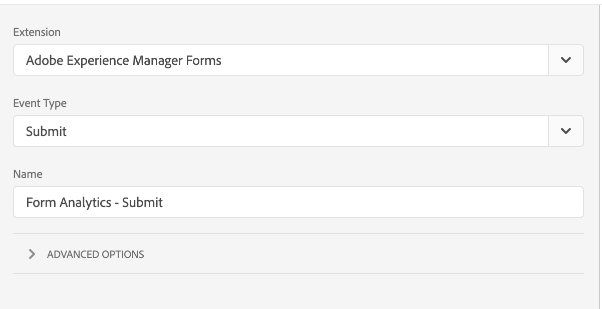
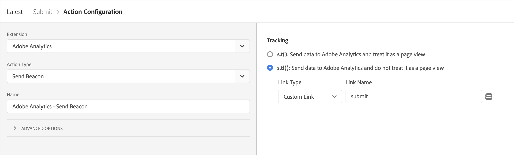
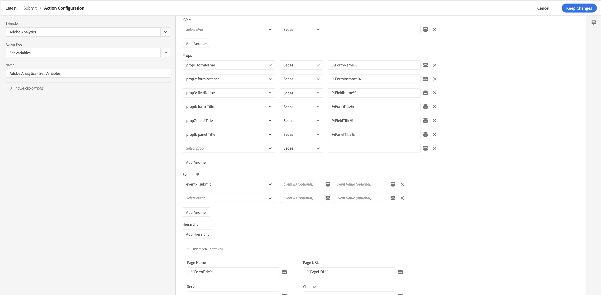

# Adobe Experience Manager Forms extension overview

This document provides an overview of the Adobe Experience Manager Forms tag extension in Adobe Experience Platform.

## Events

The following event types are provided by the extension:

1. **Render**: Triggers when the user renders (opens) a form.
1. **Error**: Triggers when the user makes a validation mistake on a form.
1. **Help**: Triggers when the user clicks on the help icon of a field.
1. **Submit**: Triggers on form submit.
1. **Field Visit**: Triggers when a field is visited.
1. **Abandon**: Triggers when the user closes the tab or navigates to different URL.
1. **Save**: Triggers when a form is saved to portal.

>[!IMPORTANT]
>
>The Save event is currently not available for forms as a cloud service. Custom events dispatched by rule editor in Adaptive Forms can be captured using the core event "Capture custom event".

## Data elements

The extension provides several data elements that can be used to send properties in analytics calls.

## Getting Started

Follow the steps below to get started with the extension.

1. Install the Adobe Experience Manager Forms extension from the extension catalog. No further configuration is required after installation.
2. Install and configure the [Adobe Analytics extension](../adobe-analytics-extension/overview.md#Configure-the-Adobe-Analytics-extension). 

## Creating a rule

A rule that utilizes the Experience Manager Forms extension would look like the following:

Follow the steps outlined below to create a similar rule for your implementation.

### Add an event

1. Select **Adobe Experience Manager Forms** in the extension dropdown.
2. Select the event to be captured.

### Add an action

1. Select "Adobe Analytics" in the extension dropdown.
2. Select "set variable" in the action Type dropdown.
3. In the configuration view, choose the properties and events to be sent.
4. Add a "send beacon" action to send the analytics call with events and properties set in step 3
   
5. Add a "clear variable" action.

