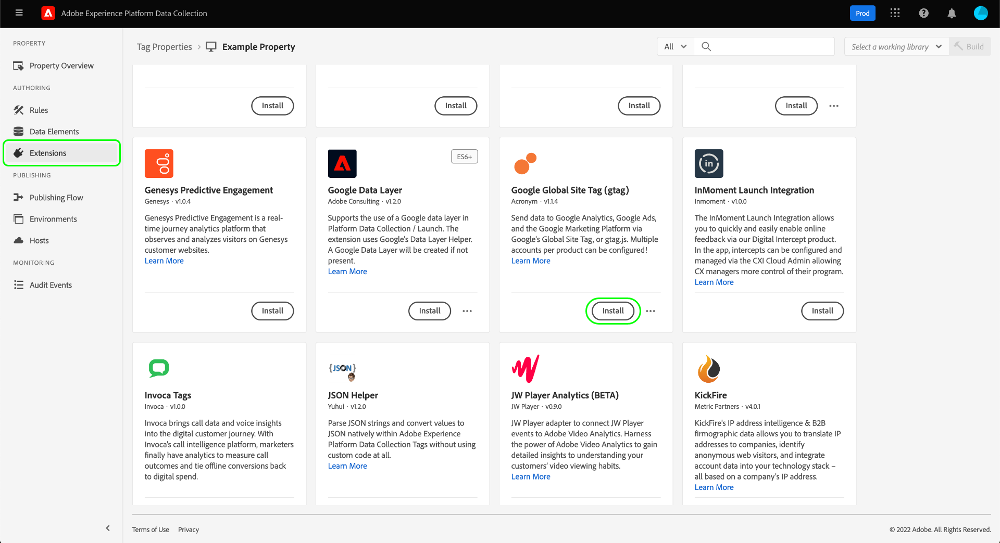

# Google Ads Enhanced Conversions extension

Using the Google Ads API, you can leverage [enhanced conversions](https://support.google.com/google-ads/answer/9888656) by sending first-party customer data in the form of conversion adjustments. Google uses this additional data to improve the reporting of your online conversions driven by ad interactions. 

The [Google Ads Enhanced Conversions event forwarding extension](https://exchange.adobe.com/apps/ec/108630/google-ads-enhanced-conversions) (heretofore referred to as the Enhanced Conversions extension) provides a user-friendly template to easily implement enhanced conversions for the Google Ads API. 

>[!IMPORTANT]
>
>Enhanced conversions will only work for conversion types where customer data is present like subscriptions, sign-ups and purchases. One or more of the following pieces of customer data must be available: 
>
>* Email address (preferred) 
>* Name and home address (street address, city, state/region, and postal code) 
>* Phone number (must be provided in addition to one of the other two pieces of information above) 

## Implementation overview 

Using the Google Ads API, enhanced conversions adds first-party data to a conversion that happened on a client device, usually a website. This means that there are two steps to implement enhanced conversions: 

1. Send a conversion from the client.
1. Send additional first-party data from event forwarding to enhance the conversion data sent from the client.

>[!TIP]
>
>To associate the client-side conversion event with the first-party data sent from event forwarding, the `transaction_ID` must be the same in both calls. For more information on where this value must be provided for each service, see the sections on configuring conversion actions for [tags](#conversion-action-tags) and [event forwarding](#conversion-action-event-forwarding), respectively.

Since sending conversion events involves both a client-side and server-side implementation, this document covers the prerequisite steps for setting up the client-side [Google Global Site Tag (gtag) extension](https://exchange.adobe.com/apps/ec/101437/google-global-site-tag-gtag) in addition to the Enhanced Conversions extension for event forwarding.

## Send a conversion using tags

To send a conversion event from on a website, Google Global Site Tag (gtag) must be deployed. You can achieve this using tags by configuring and installing the Google Global Site Tag (gtag) extension.

### Configure and install the Google Global Site Tag extension

Navigate to the Data Collection UI or Experience Platform and select **[!UICONTROL Tags]** in the left navigation. Select the tag property you wish to install the extension on, then select **[!UICONTROL Extensions]** in the left navigation. Under the **[!UICONTROL Catalog]** tab, locate the [!UICONTROL Google Global Site Tag (gtag)] extension and select **[!UICONTROL Install]**.

The installation dialog appears. From here, select **[!UICONTROL Add Account]** and provide the following values when prompted:

| Account property | Description |
| --- | --- |
| Account Name | A unique name for the account. This name is only used within the tags UI. |
| Account ID | Your Google Ads account ID. To find this value, log into Google Ads and navigate to: **[!DNL Tools and Settings]** > **[!DNL Conversions]** > **[!DNL Select a conversion action]** > **[!DNL Tag Setup]** > **[!DNL Install the Tag yourself]**. The account ID string can be found in the code snippet window that starts with `AW-` or `d`. |
| Product | Select **[!UICONTROL Google Ads (AdWords)]**. |

When finished, select **[!UICONTROL Add Account]**, then select **[!UICONTROL Save]**.

### Add a send conversion action {#conversion-action-tags}

Navigate to or create a Tags rule that listens to the conversion you'd like to enhance and select the Plus icon to add a new action. Select Google Global Site Tag (gtag) extension from the Extension dropdown.  

Complete, at minimum, these fields: 

Event Name (Action): Enter "conversion" as the value 

Add a new field where the key is "transaction_id" and the value is a data element that contains the transaction ID value.  

Conversion Label: Enter the appropriate conversion label from your Google Ads account 

To find the Conversion Label log into Google Ads and navigate to: Tools and Settings 🡪 Conversions 🡪Select a conversion action 🡪 Tag Setup 🡪 Use Google Tag Manager 🡪 find Conversion Label under Instructions 

Pro Tip: While you're in the Tag setup area of your Google Ads account, make sure that "Turn on enhanced conversions" is enabled by: reviewing and accepting the Terms of Service, checking the "Turn on enhanced conversions" box, and selecting "API" as the Implementation method. 

Select Keep Changes and Save to Library 

[[A screenshot of a computer]]

Publish a new Tags build. 

## Send first-party data using event forwarding 

To enhance your client-side conversions using event forwarding, use the Enhanced Conversions extension. Before configuring the extension and adding a Send Conversion action, however, you must create an access token in event forwarding to authenticate to Google Ads API. See the section on [sending a conversion using event forwarding](#conversion-event-forwarding) for more information.

### Create a Google OAuth 2 secret 

Select on Secrets in the left rail menu of event forwarding and select "Add Secret". 

Select a Target Environment and name the secret(s).  

Select Google OAuth 2 as the Type and select "Create Secret(s)" 

In the pop-up modal, select each secret you want to create, select the Google Account profile that has access to Conversion Action you're configuring, and select "Continue". 

Repeat this step until all the secrets have been created. 
 
[[Graphical user interface, text, application]]
 
### Create a Google OAuth 2 data element that references the secret 

Select on Data Element in the left rail menu of event forwarding and select "Add Data Element" 

Name the data element and select "Secret" in the "Data Element Type" dropdown menu 

Select the appropriate Google OAuth 2 secret for each environment and select "Save to Library" 

[[Graphical user interface, text, application, email]]

### Configure and install the Enhanced Conversions extension

Find the extension in the event forwarding catalog and select Install. 

[[Graphical user interface, application]]

Select Configure and populate the two required fields: Customer ID and Secret.  

To find Customer log into Google Ads and navigate to: Help 🡪 Customer ID 
Pro tip: The value for the Secret is the Google OAuth 2 data element you created previously 

### Add a Send Conversion action {#conversion-action-event-forwarding}

Navigate to or create an event forwarding rule that listens to the conversion you'd like to enhance and select the Plus icon to add a new action. Select **[!UICONTROL Google Ads Enhanced Conversions]** extension from the Extension dropdown.  

Complete, at minimum, these fields: 

* Customer ID
*   To find Customer ID log into Google Ads and navigate to: Help 🡪 Customer ID 
* Conversion ID or Conversion Label 
    * This is the Account ID you found earlier that starts with AW- or AU- without the AW- or AU- 
    * To find the Account ID log into Google Ads and navigate to: Tools and Settings 🡪 Conversions 🡪Select a conversion action 🡪 Tag Setup 🡪 Use Google Tag Manager 🡪 find "Conversion ID" and "Conversion Label" 
* Transaction ID 
*    Select the data element that has the same transaction ID value that is sent from the client side using the Google Global Site Tag extension. 
* At least one of the three user identifiers must be included: 
    * Email 
    * Phone Number 
    * Full Address 

Pro Tip: User identification data must be hashed before it is sent to Google. If the data is not hashed when event forwarding receives it toggle the hashing feature on a given field to instruct the extension to hash the value 

Select "Keep Changes" and "Save to Library" 

Publish a new event forwarding Build
