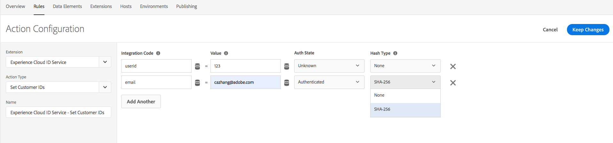

# Adobe Experience Cloud Identity Service extension release notes

>[!NOTE]
>
>Adobe Experience Platform Launch has been rebranded as a suite of data collection technologies in Adobe Experience Platform. Several terminology changes have rolled out across the product documentation as a result. Please refer to the following [document](../../../term-updates.md) for a consolidated reference of the terminology changes.

This document covers the release notes for the Adobe Experience Cloud Identity Service tag extension. For release notes on Experience Cloud Identity Service itself, please refer to the [Identity Service documentation](https://experienceleague.adobe.com/docs/id-service/using/release-notes/release-notes.html).

## Oct 17, 2022

### Experience Cloud ID Extension 5.5.0

* The extension now supports version 5.5.0 of the [Visitor JS Client](https://github.com/Adobe-Marketing-Cloud/id-service). Refer to the [Visitor release notes](https://github.com/Adobe-Marketing-Cloud/id-service/releases/tag/5.5.0) for specific updates.

## Mar 9, 2022

### Experience Cloud ID Extension 5.4.0

* This version contains the latest Visitor 5.4.0, which has the following updates:

  * Ability to configure the lifetime of the `s_ecid` cookie using cookieLifetime config
  * Update for a Firefox browser issue that occurs when a page is loaded in a child iFrame

## Oct 10, 2021

### Experience Cloud ID Extension 5.3.1

* This version contains the latest Visitor 5.3.0, which has the following new updates:

  * Updated algorithm to generate local ECID
  * Latest Opt-In with `Secure` and `SameSite` flags for the privacy cookie
  * Fix for a Firefox browser issue when a page is loaded in a child iFrame

## Jan 12, 2021

### Experience Cloud ID Extension 5.2.0

* Updating to VisitorJS 5.2.0 patch with a fix for ECID DataElement could not get updated when receive consent.

## Nov 3, 2020

### Experience Cloud ID Extension 5.2.1

* This patch contains a fix for writing cookies from an iFrame with attribute `SameSite=None` in Google Chrome browser.

## Oct 27, 2020

### Experience Cloud ID Extension 5.1.0

* Adding `sameSiteCookie` config to specify the `SameSite` attribute of the `AMCV` cookie.
This config supports the following values for `SameSite` attribute:

  * `Strict`
  * `Lax`
  * `None`

Details of these attribute values are on [web.dev](https://web.dev/samesite-cookies-explained/) and [chromium](https://www.chromium.org/updates/same-site)

## Aug 13, 2020

### Experience Cloud ID Extension 5.0.1

* Updating to VisitorJS 5.0.1 patch with a fix for adding d_cf flag when the IAB consent string has changed.

## June 15, 2020

### Experience Cloud ID Extension 5.0.0

* Adding support for `IAB TCF` – Transparency & Consent Framework – `Version 2.0`.

## April 13, 2020

### Experience Cloud ID Extension 4.6.0

* Made `loadSSL` flag on by default. All calls to Identity Service will be on `https` by default. Customers can set it to false if they want to call Identity Services on http from their non-ssl pages.
* Updated the function used to detect Internet-Explorer (IE) version, to fix an issue reported by ESLint.
* Bug fix for a performance issue on Internet-Explorer (IE) 11 when ECID is given optIn pre-approval and updated later.

## January 22, 2020

### Experience Cloud ID Extension 4.5.2

* Updated visitor.js to 4.5.2
* Visitor 4.5.1 includes a bug fix for IAB plugin for Optin
* Updated `setCustomerIDs` method to reject any empty IDs sent.

## January 7, 2020

### Experience Cloud ID Extension 4.4.2

* Updated visitor.js to 4.4.2
* Improvements for `getVisitorValues` method to fetch values faster

## September 19, 2019

### Experience Cloud ID Extension 4.4.1

* Updated visitor.js to 4.4.1
* Fixed a bug for get Opt-In preApprovals Input
* Renamed VIDEO_ANALYTICS to MEDIA_ANALYTICS in preOptInApprovals

  

## July 17, 2019

### Experience Cloud ID Extension 4.4.0

* Updated visitor.js to 4.4.0
* Added SHA256 hashing support for setCustomerIDs

  

## May 13, 2019

### Experience Cloud ID Extension 4.3.1

* Updated visitor.js to 4.3
* Added data element type for ECID as part of the tag extension

  

## April 9, 2019

### Experience Cloud ID Extension 4.2.0

* Updated visitor.js to 4.2 which included support for Audience Manager IAB TCF Plug-in

## February 25, 2019

### Experience Cloud ID Extension 4.1.0

* Updated visitor.js to 4.1 which updated publishDestinations per new API change. With this update the referrer information of the page can be exposed during ID - sync if desired.

## February 15, 2019

### Experience Cloud ID Extension 4.0.0

* Updated visitor.js to 4.0
* Added a configuration options for the new built-in Opt-In Object. Opti-In settings can be used to suppress cookie and beacon calls of Adobe Solutions to better support regulations such as GDPR

  

## March 20, 2018

### Experience Cloud ID Extension 3.1.0

* Updated visitor.js to 3.1
* Adds two configuration properties: `resetBeforeVersion` and `serverState`
