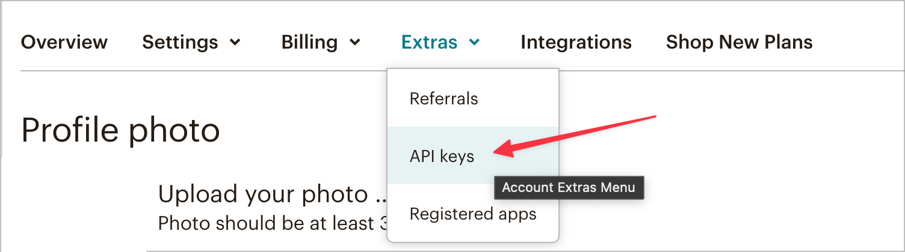
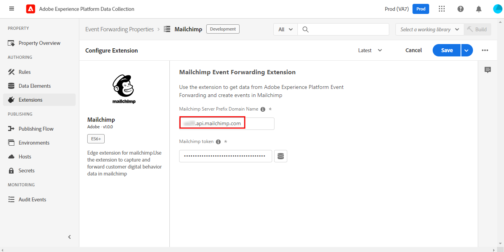
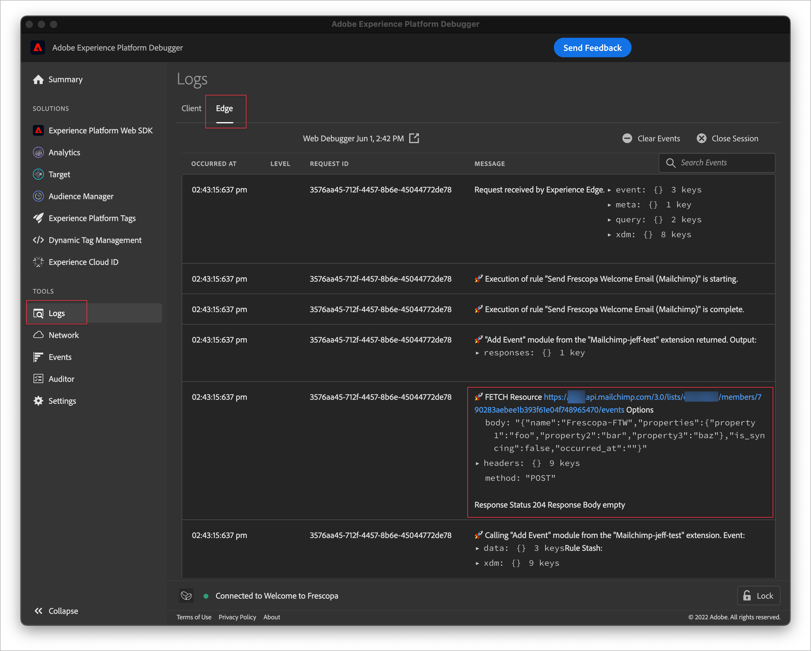

# Mailchimp event forwarding extension overview

>[!NOTE]
>  
>Adobe Experience Platform Launch has been rebranded as a suite of data collection technologies in Adobe Experience Platform. Several terminology changes have rolled out across the product documentation as a result. Please refer to the following [document](https://experienceleague.adobe.com/docs/experience-platform/tags/term-updates.html) for a consolidated reference of the terminology changes.

This is an extension for [event forwarding](https://experienceleague.adobe.com/docs/experience-platform/tags/event-forwarding/overview.html). It sends events to the Mailchimp Marketing API that can trigger emails for Mailchimp marketing campaigns, journeys, or transactions.

To learn more about these Mailchimp products, please see the Mailchimp help documentation for [Campaigns](https://mailchimp.com/help/getting-started-with-campaigns/), [Journeys](https://mailchimp.com/help/about-customer-journeys/), or [Transactions](https://mailchimp.com/help/transactional/). Depending on your Mailchimp account plan, you may have limited access to Mailchimp Customer Journey tools.

Use this reference information to set up your Mailchimp account, to configure the extension, and to configure rules using the Add Event action detailed below.

## Prerequisites

A Mailchimp account is required to use this extension. You can sign up for an account [here](https://login.mailchimp.com/signup/). In the Mailchimp account dashboard, you will need to note the following:

- Your Mailchimp domain
- Your API token
- The Audience ID
- The default "_from_" email address

>[!TIP]
>  
>If you are using Mailchimp Automations like Transactional Emails, or Customer Journeys, the steps and screens may be slightly different than those listed here, but you will still need the same information for this extension: your Mailchimp domain, your API token, and the Audience ID with a default "_from_" email address. See the [Mailchimp Help Center](https://mailchimp.com/help/) for details on each of these values for your specific account and plan.

### Domain Prefix

[Login](https://login.mailchimp.com/) to your Mailchimp account. On the Dashboard view, in the address bar of your browser, you should see a URL like `https://us11.admin.mailchimp.com` or just `us11.admin.mailchimp.com`. The example prefix `us11` is just an example, your value will be different. Record your URL with your prefix for a later step.

### API Key

To find the API key for your account, click on your Profile icon in the lower left of the screen, then click Profile. You should see a URL like `https://us11.admin.mailchimp.com/account/profile/` but with **your** prefix instead of `us11`.

Click on Extras, then API keys:

On this page, in the section titled **Your API keys**, you should see any existing keys, or you can click the **Create A Key** button to create a new one. You can create a new key to use specifically with this extension. Copy the API key and save it for a later step. For more details, see how to [generate your API key](https://mailchimp.com/developer/marketing/guides/quick-start/#generate-your-api-key).

### Audience ID and _From_ address

In the left navigation links, click on **Audience**, then **Audience dashboard**. Then select the audience you will use with this extension. To learn more, see how to [Create a Mailchimp audience](https://mailchimp.com/help/create-audience/).

With your audience created and selected, click the **Manage Audience** dropdown and select **Settings**. This screen shows various settings for your audience.

At the bottom of the Settings screen, you should see `Unique id for audience [audience name]` where \[audience name\] is the name of your actual audience. Copy the Audience ID and save it for a later step.

Scroll up to the page top and click on **Audience name and defaults** and confirm that **Default _From email address_** has the correct value for your campaigns. Note that the Audience ID is also listed at the top of this page. It should be the same value you copied down in the last step.

## Mailchimp Automations

Depending on your Mailchimp plan, and if you use Transactional Emails, Customer Journeys, or other Mailchimp automations, your specific "journey" settings may vary.

>[!IMPORTANT]
>  
>The Event Name you chose to trigger your automation or journey in Mailchimp is the same event name you must send with this extension. Note the Event Name in your Mailchimp Automation and save it for a later step.

## Installation and configuration

This section lists the steps to install and configure the extension. To securely save the Mailchimp API key, you'll use the [Secrets](https://experienceleague.adobe.com/docs/experience-platform/tags/event-forwarding/secrets.html) feature. 

### Create a Secret and Data Element

In the [!DNL event forwarding] property, create a [!UICONTROL Token Type Secret] called `Mailchimp API Key`. For detailed steps, see the [Token Secrets](https://experienceleague.adobe.com/docs/experience-platform/tags/event-forwarding/secrets.html#token) documentation. Then create a [!UICONTROL Data Element] using the [!UICONTROL Core Extension] and the [!UICONTROL Secret Data Element Type] to reference the `Mailchimp API Key` secret you just created. Enter `Mailchimp Token` as the [!UICONTROL Data Element] name. For details, see the steps to [create a data element](https://experienceleague.adobe.com/docs/experience-platform/tags/ui/data-elements.html#create-a-data-element).

### Install and configure the extension

In the same [!DNL event forwarding] property, click on [!UICONTROL Extensions], then [!UICONTROL Catalog] to display the extensions available for installation. See the [Extensions overview](https://experienceleague.adobe.com/docs/experience-platform/tags/ui/extensions/overview.html) for more details.

  

Click [!UICONTROL Install] to view the configuration screen. You should see two fields.

In the [!UICONTROL Mailchimp Server Prefix Domain Name] field, enter the domain you copied earlier from your Mailchimp account. **NOTE:** do not include `http://` or `https://` in this field. Using the [example above](#domain-prefix), the entry would be `us11.api.mailchimp.com`, but please use your specific account prefix, together with `api.mailchimp.com`, like `yourPrefix.api.mailchimp.com`.

  

In the [!UICONTROL Mailchimp token] field, click the [!UICONTROL Data Element] icon and select the `Mailchimp Token` [!UICONTROL Data Element] you created earlier. Click [!UICONTROL Save] to save the changes.

The extension is now installed and configured for use in your property.

## Data collection

To use this extension in a [!UICONTROL Rule], there are several data values the extension sends to Mailchimp with each event. Typically, Adobe customers will configure the Adobe Experience Platform Web SDK [extension](https://experienceleague.adobe.com/docs/experience-platform/tags/extensions/adobe/sdk/overview.html) to send that data to [!DNL Platform Edge Network] for use by the extension in the event forwarding property.

The data required by this extension can be sent from Web SDK as either XDM data, or non-XDM data. See the documentation to learn more about [sending XDM data](https://experienceleague.adobe.com/docs/experience-platform/edge/fundamentals/tracking-events.html#sending-xdm-data) or [sending non-XDM data](https://experienceleague.adobe.com/docs/experience-platform/edge/fundamentals/tracking-events.html#sending-non-xdm-data).

For example, if a customer makes a purchase or registers for an event on our site, we could send a confirmation email through Mailchimp with this extension. We would simply send the required information from Web SDK to the Edge Network, and the extension triggers the email with Mailchimp.

  

### Data Elements

The screenshot above shows the data we can send with each event from this extension to Mailchimp. Once you configure Web SDK to send this data to the Edge Network, you can create [!UICONTROL Data Elements] in the event forwarding property so the extension can access those values.

The table below provides more detail for each possible value.

| Name | Example Path | Type | Description | Required | Limits |
|:---|:---:|:---:|:---|:---:|:---|
| `email` | `arc.event.xdm._tenant.emailId`  or  `arc.event.data._tenant.emailId` | String | The address that receives the email | **Yes** | Must exist in the Mailchimp Audience |
| `listId` | `arc.event.xdm._tenant.listId`  or  `arc.event.data._tenant.listid` | String | Audience ID | **Yes** | Must match an existing Audience ID|
| `name` | `arc.event.xdm._tenant.name`  or  `arc.event.data._tenant.name` | String | The event name | **Yes** | 2-30 characters in length |
| `properties` | `arc.event.xdm._tenant.properties`  or  `arc.event.data._tenant.properties`| Object | An optional list of properties in JSON format with details about the event | No ||
| `isSyncing` | `arc.event.xdm._tenant.isSyncing`  or  `arc.event.data._tenant.isSyncing` | boolean | Events created with `is_syncing` set to `true` **will not** trigger automations. | No ||    
| `occurredAt` | `arc.event.xdm._tenant.occuredAt`  or `arc.event.data._tenant.occuredAt` | String | The date and time the event occurred in ISO 8601 format. | No ||

In the event forwarding property, you can create a [!UICONTROL Data Element] for each of these fields. The [path](https://experienceleague.adobe.com/docs/experience-platform/tags/event-forwarding/overview.html#data-elements) referenced in those [!UICONTROL Data Elements] may be different in your property, depending on how you named and configured Web SDK in the steps above.

>[!NOTE]
>  
>The **Example Path** values above are _examples_ only, the field names and paths may be different based on the specific Web SDK settings you selected in the steps above.

After creating the [!UICONTROL Data Elements] described above, you can simply reference them in the [!UICONTROL Add Event] action of this extension.

  

You can now use this extension and the Add Event action to trigger Mailchimp emails for your audiences.

## Data Validation

When working with event forwarding extensions, the [Adobe Experience Platform Debugger](https://chrome.google.com/webstore/detail/adobe-experience-platform/bfnnokhpnncpkdmbokanobigaccjkpob) is very useful. In the Logs section, under Edge logs you can see the requests made by your event forwarding rules after they're triggered. Here you can see the request made to the Mailchimp API by this extension.

  

In the Mailchimp dashboard, on the Activity Feed view of your Audience or Audience Member, you will see a list of events for that Audience or Audience Member. This should match the events sent by the extension and show any optional data sent, together with the email or campaign they received. See the Mailchimp Automation [help guides](https://mailchimp.com/help/automation/) for more details.
