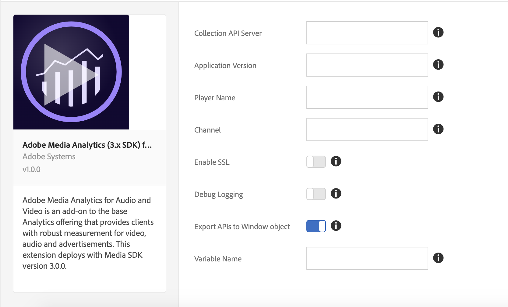

# Adobe Media Analytics (3.x SDK) for Audio and Video extension overview

>[!NOTE]
>
>Adobe Experience Platform Launch has been rebranded as a suite of data collection technologies in Adobe Experience Platform. Several terminology changes have rolled out across the product documentation as a result. Please refer to the following [document](../../../term-updates.md) for a consolidated reference of the terminology changes.

Use this documentation for information on installing, configuring, and implementing the Adobe Media Analytics (3.x SDK) for Audio and Video extension (Media Analytics extension). Included are the options available when using this extension to build a rule, along with examples and links to samples.

The Media Analytics (MA) extension adds the core JavaScript Media SDK (Media 3.x SDK). This extension provides the functionality for adding the `Media` tracker instance to a tags-enabled site or project. The MA extension requires two additional extensions:

* [Analytics Extension](../analytics/overview.md)
* [Experience Cloud ID Extension](../id-service/overview.md)

>[!IMPORTANT]
>
>This extension deploys with Media 3.x SDK, which is not backward compatible with Media 2.x SDK. If your page already uses Media 2.x SDK, use [Adobe Media Analytics for Audio and Video Extension](../media-analytics/overview.md) instead of this extension.

After you have included all three of the extensions mentioned above in your tags-enabled project, you can proceed in one of two ways:

* Use `Media` APIs from your web app
* Include, or build, a player-specific extension that maps specific media player events to the APIs on the `Media` tracker instance. This instance is exposed through the MA extension.

## Install and configure the MA extension

* **Install:** To install the MA extension, open your extension property, select **[!UICONTROL Extensions > Catalog]**, hover over the **[!UICONTROL Adobe Media Analytics (3.x SDK) for Audio and Video]** extension, and select **[!UICONTROL Install]**.

* **Configure:** To configure the MA extension, open the [!UICONTROL Extensions] tab, hover over the extension, and then select **[!UICONTROL Configure]**:



### Configuration options:

| Option | Description |
| :--- | :--- |
| Collection API Server | Defines the Media Collection API Server (Contact your Adobe representative to get this server) |
| Application Version | The version of the media player app/SDK |
| Player Name | Name of the media player in use (e.g., "AVPlayer", "HTML5 Player", "My Custom VideoPlayer") |
| Channel | Channel name property |
| Debug Logging | Enable or Disable logging |
| Enable SSL | Enable or Disable sending pings over HTTPS |
| Export APIs to Window Object | Enable or Disable exporting Media Analytics APIs to global scope |
| Variable Name | A variable you use to export Media Analytics APIs under the `window` object |

**Reminder:** The MA extension requires the [Analytics](../analytics/overview.md) and [Experience Cloud ID](../id-service/overview.md) extensions. You must also add these extensions to your extension property and configure them.

## Using the MA extension

### Using from a webpage/JS-app

The MA extension exports the Media APIs in the global window object by enabling the "Export APIs to Window Object" setting in the [!UICONTROL Configuration] page. It exports the APIs under the configured variable name. For example, if the variable name is configured to be `ADB`, then Media APIs can be accessed by `window.ADB.Media`.

>[!IMPORTANT]
>
>The MA extension exports the APIs only when `window["CONFIGURED_VARIABLE_NAME"]` is undefined and does not override existing variables.

1. **Media APIs:**&nbsp;`window["CONFIGURED_VARIABLE_NAME"].Media`

    This exposes all the APIs and constants from Media SDK: [https://adobe-marketing-cloud.github.io/media-sdks/reference/javascript_3x/APIReference.html](https://adobe-marketing-cloud.github.io/media-sdks/reference/javascript_3x/APIReference.html)
    
1. **Create Media Tracker Instance:**&nbsp;`window["CONFIGURED_VARIABLE_NAME"].Media.getInstance`

    **Return Value:** A `Media` tracker instance for tracking a media session.

    ```javascript
    var Media = window["CONFIGURED_VARIABLE_NAME"].Media;

    var tracker = Media.getInstance();
    ```

1. Using the Media tracker instance, follow the [JS API documentation](https://adobe-marketing-cloud.github.io/media-sdks/reference/javascript_3x/index.html) to implement media tracking.

You can obtain the sample player here: [MA Sample Player](https://github.com/Adobe-Marketing-Cloud/media-sdks/tree/master/samples/launch/js/3.x). The sample player acts as a reference to showcase how to use the MA extension to support Media Analytics directly from a webapp.


### Using from other extensions

The MA extension exposes `media` as a shared module to other extensions. (For additional information on Shared Modules, see [Shared Modules documentation](../../../extension-dev/web/shared.md).)

>[!IMPORTANT]
>
>Shared Modules can only be accessed from other extensions. That is, a webpage/JavaScript app cannot access the shared modules, or use `turbine` (see code sample below) outside of an extension.

1. **Media APIs:**&nbsp;`media` Shared Module

    This exposes all the APIs and constants from Media SDK: [https://adobe-marketing-cloud.github.io/media-sdks/reference/javascript_3x/APIReference.html](https://adobe-marketing-cloud.github.io/media-sdks/reference/javascript_3x/APIReference.html)

1. Create the Media tracker instance as follows:

    **Return Value:** A `Media` tracker instance for tracking a media session.

    ```javascript
    var Media =
      turbine.getSharedModule('adobe-media-analytics', 'media');

    var tracker = Media.getInstance();
    ```

1. Using the Media tracker instance, follow the [JS API documentation](https://adobe-marketing-cloud.github.io/media-sdks/reference/javascript_3x/index.html) to implement media tracking.

>[!NOTE]
>
>**Testing:** For this release, to test your extension you must upload it to [Platform](../../../extension-dev/submit/upload-and-test.md), where you have access to all dependent extensions.
