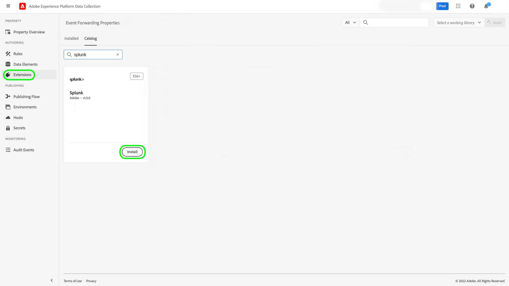
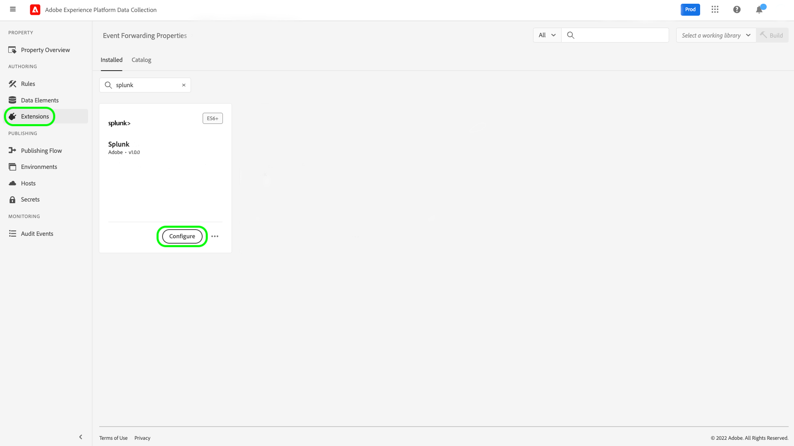
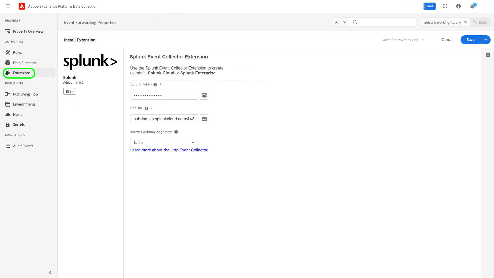
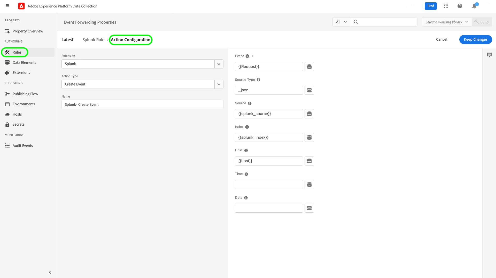
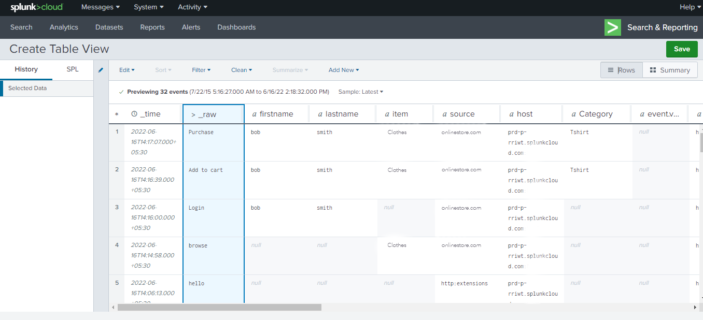

# Splunk extension overview

[Splunk](https://www.splunk.com) is an observability platform that provides search, analysis, and visualization for actionable insights on your data. The Splunk [event forwarding](../../../ui/event-forwarding/overview.md) extension leverages the [Splunk HTTP Event Collector REST API](https://docs.splunk.com/Documentation/Splunk/8.2.5/Data/HECRESTendpoints) to send events from the Adobe Experience Platform Edge Network to the [Splunk HTTP Event Collector](https://docs.splunk.com/Documentation/Splunk/8.2.5/Data/UsetheHTTPEventCollector).

Splunk uses bearer tokens as the authentication mechanism to communicate with the Splunk Event Collector API.

## Use cases {#use-cases}

Marketing teams can use the extension for the following use cases:

| Use case | Description |
| --- | --- |
| Customer behavior analytics | Organizations can capture customer interaction event data from their website and forward relevant events to Splunk. Marketing and analytics teams can then perform subsequent analysis within the Splunk platform to understand key user interactions and behavior. The Splunk platform can be used to generate graphs, dashboards, or other visualizations to inform business stakeholders. |
| Scalable search on large datasets | Organizations can capture transactional or conversational input as event data from the website and forward events to Splunk. Analytics teams can then leverage Splunk's scalable indexation abilities to filter and process large datasets to derive any business insights and make informed decisions. |

{style="table-layout:auto"}

## Prerequisites {#prerequisites}

You must have a Splunk account to use this extension. You can register for a Splunk account on the [Splunk homepage](https://www.splunk.com/page/sign_up).

>[!NOTE]
>
> The Splunk extension supports both Splunk Cloud and Splunk enterprise instances. This guide documents an implementation using [Splunk Cloud](https://www.splunk.com/en_us/products/splunk-cloud-platform.html) as the reference. The configuration process for [Splunk Enterprise](https://www.splunk.com/en_us/products/splunk-enterprise.html) is similar, but requires specific guidance from your Splunk Enterprise administrator.

You must also have the following technical values to configure the extension:

* An [Event Collector token](https://docs.splunk.com/Documentation/Splunk/8.2.5/Data/UsetheHTTPEventCollector#Create_an_Event_Collector_token_on_Splunk_Cloud_Platform). Tokens typically are UUIDv4 format like the following: `12345678-1234-1234-1234-1234567890AB`.
* The Splunk platform instance address and port for your organization. A platform instance address and port will typically have the following format: `mysplunkserver.example.com:443`.
  >[!IMPORTANT]
  >
  > Splunk endpoints referenced within event forwarding should only use port `443`. Non-standard ports are currently not supported in event forwarding implementations.

## Install the Splunk extension {#install}

To install the Splunk Event Collector extension in the UI, navigate to **Event Forwarding** and select a property to add the extension to, or create a new property instead.

Once you have selected or created the desired property, navigate to **Extensions** > **Catalog**. Search for "[!DNL Splunk]", and then select **[!DNL Install]** on the Splunk Extension.

## Configure the Splunk extension {#configure_extension}

>[!IMPORTANT]
>
>Depending on your implementation needs, you may need to create create a schema, data elements, and a dataset before configuring the extension. Please review all the configuration steps before starting in order to determine which entities you need to set up for your use case.

Select **Extensions** in the left navigation. Under **Installed**, select **Configure** on the Splunk extension.

For **[!UICONTROL HTTP Event Collector URL]**, enter your Splunk platform instance address and port. Under **[!UICONTROL Access Token]**, enter your [!DNL Event Collector Token] value. When finished, select **[!UICONTROL Save]**.

## Configure an event forwarding rule {#config_rule}

Start creating a new event forwarding rule [rule](../../../ui/managing-resources/rules.md) and configure its conditions as desired. When selecting the actions for the rule, select the [!UICONTROL Splunk] extension, then select the [!UICONTROL Create Event] action type. Additional controls appear to further configure the Splunk Event.

The next step is to map the Splunk event properties to data elements that you have previously created. The supported optional mappings based on the input event data that can be set up are given below. Refer to the [Splunk documentation](https://docs.splunk.com/Documentation/Splunk/8.2.5/Data/FormateventsforHTTPEventCollector#Event_metadata) for further details.

| API Key | Description |
| --- | --- |
| [!UICONTROL Event]  **(REQUIRED)** | Indicate how you want to provide the event data. Event data can be assigned to the `event` key within the JSON object in the HTTP request, or it can be raw text. The `event` key is at the same level within the JSON event packet as the metadata keys. Within the `event` key-value curly brackets, the data can be in any form you require (such as a string, a number, another JSON object, and so on). |
| [!UICONTROL Host] | The hostname of the client from which you are sending data. |
| [!UICONTROL Source Type] | The source type to assign to the event data. |
| [!UICONTROL Source] | The source value to assign to the event data. For example, if you are sending data from an app you are developing, set this key to the name of the app. |
| [!UICONTROL Index] | The name of the event data's index. The index you specify here must be within the list of allowed indexes if the token has the indexes parameter set. |
| [!UICONTROL Time] | The event time. The default time format is UNIX time (in the format `<sec>.<ms>`) and depends on your local timezone. For example, `1433188255.500` indicates 1433188255 seconds and 500 milliseconds after epoch, or Monday, June 1, 2015, at 7:50:55 PM GMT. |
| [!UICONTROL Fields] | Specify a raw JSON object or a set of key-value pairs that contain explicit custom fields to be defined at index time.  The `fields` key isn't applicable to raw data.  Requests containing the `fields` property must be sent to the `/collector/event` endpoint, or else they will not be indexed. For more information, see the Splunk documentation on [indexed field extractions](http://docs.splunk.com/Documentation/Splunk/8.2.5/Data/IFXandHEC). |

### Validate data within Splunk {#validate}

After creating and executing the event forwarding rule, validate whether the event sent to the Splunk API is displayed as expected in the Splunk UI. If the event collection and Experience Platform integration were successful, you will see events within the Splunk console like so:

## Next steps

This document covered how to install and configure the Splunk event forwarding extension in the UI. For more information on collecting event data in Splunk, refer to the official documentation:

* [Set up and use HTTP Event Collector in Splunk Web ](https://docs.splunk.com/Documentation/Splunk/8.2.5/Data/UsetheHTTPEventCollector)
* [Set up authentication with tokens](https://docs.splunk.com/Documentation/Splunk/8.2.5/Security/Setupauthenticationwithtokens#Prerequisites_for_activating_tokens)
* [Troubleshoot HTTP Event Collector](https://docs.splunk.com/Documentation/Splunk/8.2.5/Data/TroubleshootHTTPEventCollector) (also lists a compendium of [possible error codes](https://docs.splunk.com/Documentation/Splunk/8.2.5/Data/TroubleshootHTTPEventCollector#Possible_error_codes))
