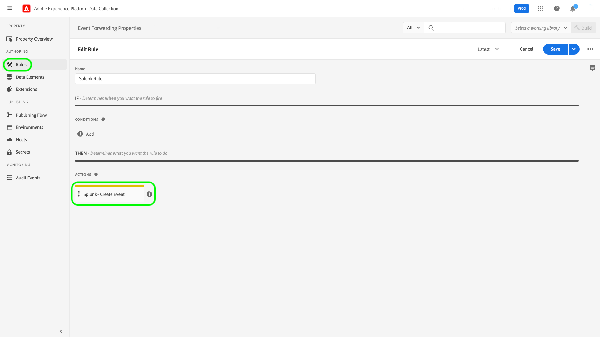
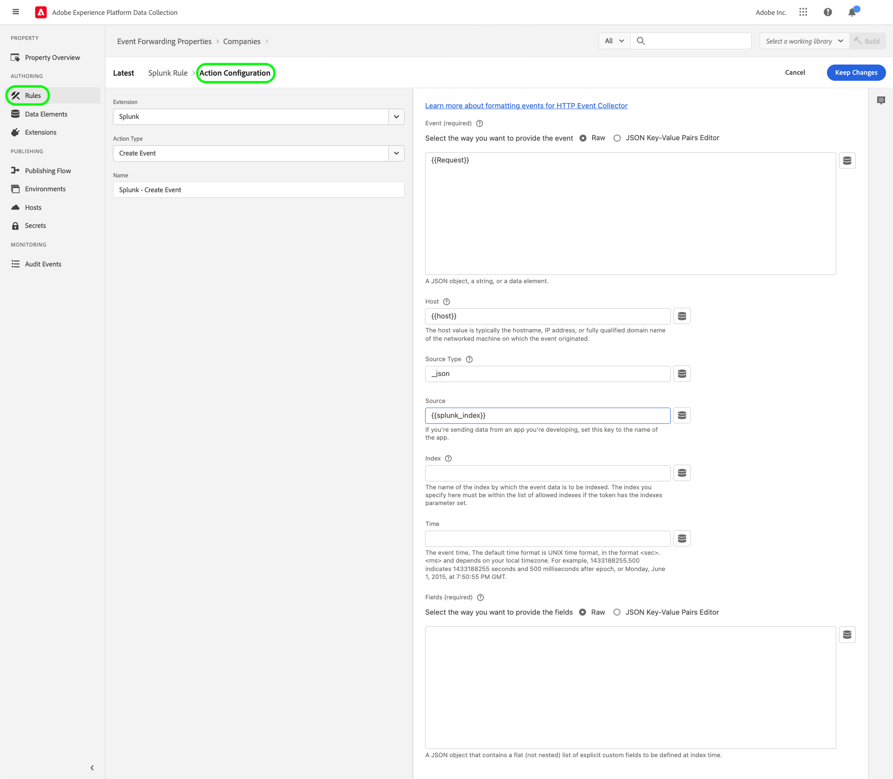

# Splunk extension overview

[Splunk](https://www.splunk.com) is an observability platform that provides search, analysis, and visualization for actionable insights on your data. The Splunk [event forwarding](../../../ui/event-forwarding/overview.md) extension leverages the [Splunk HTTP Event Collector REST API](https://docs.splunk.com/Documentation/Splunk/8.2.5/Data/HECRESTendpoints) to send events from the Adobe Experience Platform Edge Network to the [Splunk HTTP Event Collector](https://docs.splunk.com/Documentation/Splunk/8.2.5/Data/UsetheHTTPEventCollector).

Splunk uses bearer tokens as the authentication mechanism to communicate with the Splunk Event Collector API.

## Use cases {#use-cases}

Marketing teams can use the extension for the following use cases:

| Use case | Description |
| --- | --- |
| Customer behavior analytics | Organizations can capture customer interaction event data from their website and forward relevant events to Splunk. Marketing and analytics teams can then perform subsequent analysis within the Splunk platform to understand key user interactions and behavior. The Splunk platform can be used to generate graphs, dashboards, or other visualizations to inform business stakeholders. |
| Scalable search on large datasets | Organizations can capture transactional or conversational input as event data from the website and forward events to Splunk. Analytics teams can then leverage Splunk's scalable indexation abilities to filter and process large datasets to derive any business insights and make informed decisions. |

{style="table-layout:auto"}

## Prerequisites {#prerequisites}

You must have a Splunk account to use this extension. You can register for a Splunk account on the [Splunk homepage](https://www.splunk.com/page/sign_up).

>[!NOTE]
>
> The Splunk extension supports both Splunk Cloud and Splunk enterprise instances. This guide documents an implementation using [Splunk Cloud](https://www.splunk.com/en_us/products/splunk-cloud-platform.html) as the reference. The configuration process for [Splunk Enterprise](https://www.splunk.com/en_us/products/splunk-enterprise.html) is similar, but requires specific guidance from your Splunk Enterprise administrator.

You must also have the following technical values to configure the extension:

* An [Event Collector token](https://docs.splunk.com/Documentation/Splunk/8.2.5/Data/UsetheHTTPEventCollector#Create_an_Event_Collector_token_on_Splunk_Cloud_Platform). Tokens typically are UUIDv4 format like the following: `12345678-1234-1234-1234-1234567890AB`.
* The Splunk platform instance address and port for your organization. A platform instance address and port will typically have the following format: `mysplunkserver.example.com:443`.
  >[!IMPORTANT]
  >
  > Splunk endpoints referenced within event forwarding should only use port ``443``. Non-standard ports are currently not supported in event forwarding implementations.

## Install the Splunk extension {#install}

To install the Splunk Event Collector extension in the UI, navigate to **Event Forwarding** and select a property to add the extension to, or create a new property instead.

Once you have selected or created the desired property, navigate to **Extensions** > **Catalog**. Search for "[!DNL Splunk]", and then select **[!DNL Install]** on the Splunk Extension.

## Configure the Splunk extension {#configure_extension}

>[!IMPORTANT]
>
>Depending on your implementation needs, you may need to create create a schema, data elements, and a dataset before configuring the extension.

Select **Extensions** in the left navigation. Under **Installed**, select **Configure** on the Splunk Extension.

Under **[!UICONTROL Splunk Token]**, enter your [!DNL Event Collector Token] value. For **[!UICONTROL SiteURL]**, enter your Splunk platform instance address and port. When finished, select **[!UICONTROL Save]**.

## Configure an Event Forwarding rule {config_rule}

1. After configuring the conditions under which the rule would execute, define the Event Forwarding [Rule](https://experienceleague.adobe.com/docs/experience-platform/tags/ui/rules.html)

1. Also complete the associated [Action Configurations](https://experienceleague.adobe.com/docs/platform-learn/data-collection/event-forwarding/set-up-a-datastream.html).

1. Map the data elements, The supported optional mappings based on the input event data that can be set up are given below. Refer to the [Splunk documentation](https://docs.splunk.com/Documentation/Splunk/8.2.5/Data/FormateventsforHTTPEventCollector#Event_metadata) for further details.

    | API Key | Connector Field | Description | Mandatory |
    |---|---|---|---|
    | ``event`` | ``event`` | The event value contains the name of the Event to be sent to Splunk. Event data can be assigned to the "event" key within the JSON object in the HTTP request, or it can be raw text. The "event" key is at the same level within the JSON event packet as the metadata keys. Within the "event" key-value curly brackets, the data can be in whatever format you want: a string, a number, another JSON object, and so on.| Yes |
    | ``host`` | ``host`` |The host value to assign to the event data. This key is typically the hostname of the client from which you're sending data.||
    | ``source`` | ``source`` |The source value to assign to the event data. For example, if you're sending data from an app you're developing, set this key to the name of the app.||
    | ``sourcetype`` | ``sourcetype`` |The sourcetype value to assign to the event data.||
    | ``index`` | ``index`` |The name of the index by which the event data is to be indexed. The index you specify here must be within the list of allowed indexes if the token has the indexes parameter set.||
    | ``time`` | ``time`` |The event time. The default time format is UNIX time format, in the format `<sec>.<ms>` and depends on your local timezone. For example, 1433188255.500 indicates 1433188255 seconds and 500 milliseconds after epoch, or Monday, June 1, 2015, at 7:50:55 PM GMT.||
    | ``fields`` | ``fields`` |The fields key isn't applicable to raw data. This key specifies a JSON object that contains explicit custom fields to be defined at index time. Requests containing the "fields" property must be sent to the /collector/event endpoint, or else they aren't indexed. For more information, see [Indexed field extractions](http://docs.splunk.com/Documentation/Splunk/8.2.5/Data/IFXandHEC).||

### Validate data within Splunk {#validate}

* After triggering the execution of your event forwarding rule, validate whether the event sent to the Splunk API is displayed as expected in the Splunk UI. If the event collection and [!DNL Adobe Experience Platform] integration were successful, you will see events within the Splunk console as follows:

## Additional resources {#additional-resources}
* [Set up and use HTTP Event Collector in Splunk Web ](https://docs.splunk.com/Documentation/Splunk/8.2.5/Data/UsetheHTTPEventCollector)
* [Set up authentication with tokens](https://docs.splunk.com/Documentation/Splunk/8.2.5/Security/Setupauthenticationwithtokens#Prerequisites_for_activating_tokens)
* [Troubleshoot HTTP Event Collector](https://docs.splunk.com/Documentation/Splunk/8.2.5/Data/TroubleshootHTTPEventCollector) which also lists a compendium of [possible error codes](https://docs.splunk.com/Documentation/Splunk/8.2.5/Data/TroubleshootHTTPEventCollector#Possible_error_codes).
