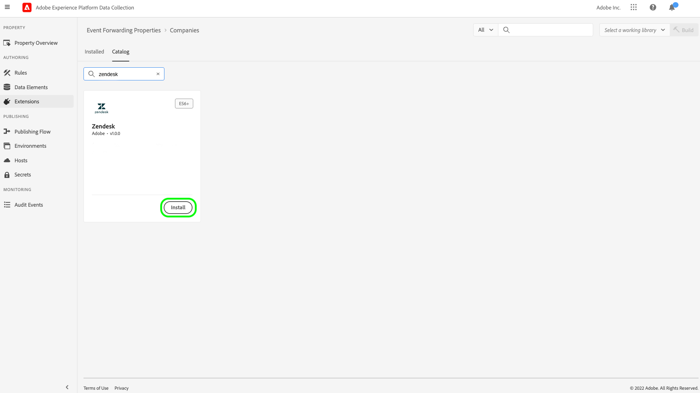
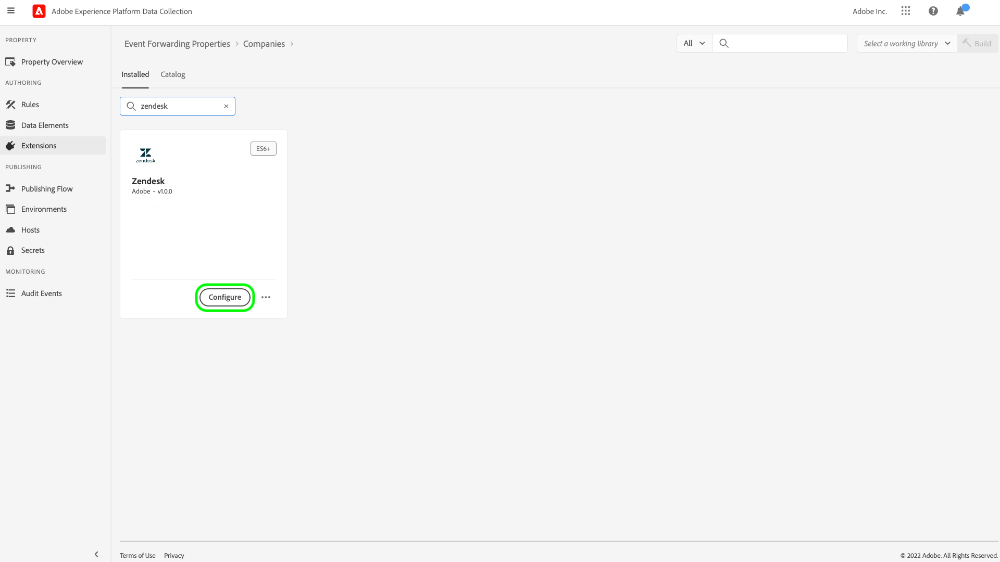
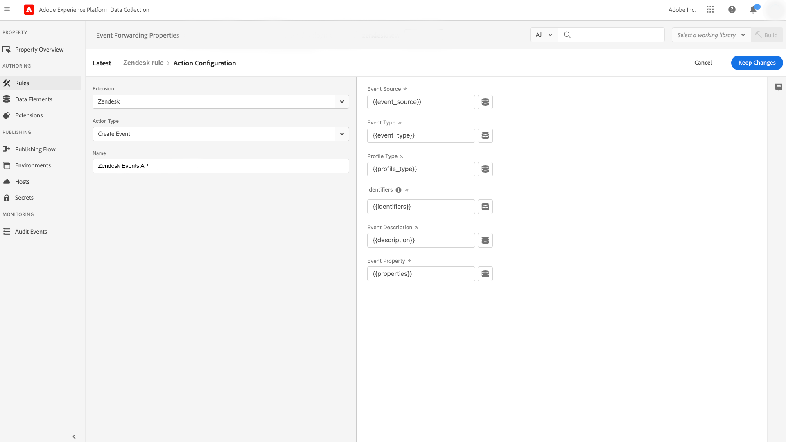
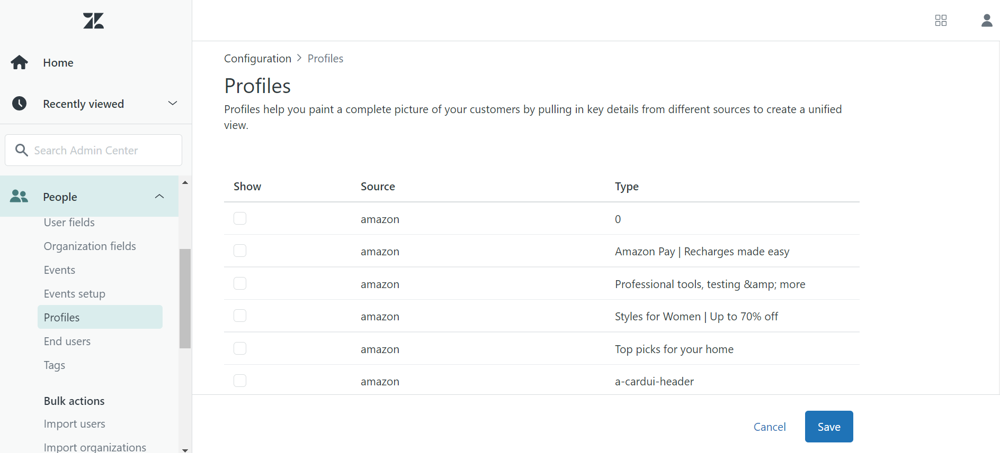

# [!DNL Zendesk] Events API extension overview

[Zendesk](https://www.zendesk.com) is a customer service solution and sales tool. The Zendesk [event forwarding](../../../ui/event-forwarding/overview.md) extension leverages the [!DNL Zendesk Events API](https://developer.zendesk.com/api-reference/custom-data/events-api/events-api/) to send events from the Adobe Experience Platform Edge Network to Zendesk for further processing. You can use the extension to collect customer profile interactions for use in downstream analysis and action.

This document covers how to install and configure the extension in the UI.

## Prerequisites

You must have a Zendesk account to use this extension. You can register for a Zendesk account on the [Zendesk website](https://www.zendesk.com/register/).

You must also gather the following details for your Zendesk configuration:

| Key type | Description | Example |
| --- | --- | --- |
| Subdomain | During the registration process, a unique **subdomain** is created specific to the account. Refer to the [Zendesk documentation](https://developer.zendesk.com/documentation/ticketing/working-with-oauth/creating-and-using-oauth-tokens-with-the-api/) for more information. | `xxxxx.zendesk.com` (where `xxxxx` is the value that was provided during the account creation) |
| API token | Zendesk uses bearer tokens as an authentication mechanism to communicate with the Zendesk API. After logging in to the Zendesk portal, generate an API token. Refer to the [Zendesk documentation](https://support.zendesk.com/hc/en-us/articles/4408889192858-Generating-a-new-API-token) for more information. | `cwWyOtHAv12w4dhpiulfe9BdZFTz3OKaTSzn2QvV` |

{style="table-layout:auto"}

Finally, you must create an event forwarding secret for the API token. Set the secret type to **[!UICONTROL Token]**, and set the value to the API token you gathered from your Zendesk configuration. Refer to the documentation on [secrets in event forwarding](../../../ui/event-forwarding/secrets.md) for more details on configuring secrets.

## Install the extension {#install}

To install the Zendesk extension in the UI, navigate to **Event Forwarding** and select a property to add the extension to, or create a new property instead.

Once you have selected or created the desired property, navigate to **Extensions** > **Catalog**. Search for "[!DNL Zendesk]", and then select **[!DNL Install]** on the Zendesk Extension.

## Configure the extension {#configure}

>[!IMPORTANT]
>
>Depending on your implementation needs, you may need to create create a schema, data elements, and a dataset before configuring the extension. Please review all the configuration steps before starting in order to determine which entities you need to set up for your use case.

Select **Extensions** in the left navigation. Under **Installed**, select **Configure** on the Zendesk extension.

Under **[!UICONTROL Zendesk Domain]**, enter the value for your Zendesk subdomain. Under **[!UICONTROL Zendesk Token]**, select the secret you created earlier that contains the API token.

## Configure an event forwarding rule

Start creating a new event forwarding rule [rule](../../../ui/managing-resources/rules.md) and configure its conditions as desired. When selecting the actions for the rule, select the [!UICONTROL Splunk] extension, then select the [!UICONTROL Create Event] action type.

When setting up the action configuration, you are prompted to assign data elements to the various properties that will be sent to Zendesk.

These data elements should be mapped as referenced below.

### `event` keys

`event` is a JSON object that represents the event triggered by the user. The following keys can be referenced within the `event` object when mapping to data elements:

| `event` key | Type | Platform path | Description | Mandatory | Limits |
| --- | --- | --- | --- | --- | --- |
| `source` | String | `arc.event.xdm._extconndev.event_source`  |  The application which sent the event.  |  Yes  |  Do not use `Zendesk` as a value as it is a protected source name for Zendesk standard events. Attempts to use it will result in an error. Value length must not exceed 40 characters. |
| `type` | String | `arc.event.xdm._extconndev.event_type` | The event name. | Yes | Value length must not exceed 40 characters. |
| `description` | String | `arc.event.xdm._extconndev.description` | A description for the event. | No | (N/A) |
| `created_at` | String | `arc.event.xdm.timestamp` | An ISO-8601 timestamp reflecting the time the event was created. | No | (N/A) |
| `properties` | Object | `arc.event.xdm._extconndev.EventProperties` | A custom JSON object with details about the event. | Yes | (N/A) |

{style="table-layout:auto"}

>[!NOTE]
>
>Refer to the [!DNL Zendesk Events API documentation](https://developer.zendesk.com/api-reference/custom-data/events-api/events-api/) for additional guidance on event properties.

### `profile` keys

`profile` is a JSON object that represents the user that triggered the event. The following keys can be referenced within the `profile` object when mapping to data elements:

| `profile` key | Type | Platform path | Description | Mandatory | Limits |
| --- | --- | --- | --- | --- | --- |
| `source` | String | `arc.event.xdm._extconndev.profile_source` | The product or service associated with the profile, such as `Support`, `CompanyName`, or `Chat`. | Yes | (N/A) |
| `type` | String | `arc.event.xdm._extconndev.profile_type` | The product or service associated with the profile. For example, *Support*, *CompanyName*, or *Chat* | Yes | Profile type length must not exceed 40 characters. |
| `name` | String | `arc.event.xdm._extconndev.name` | The name of the person from the profile | No | (N/A) |
| `user_id` | String | `arc.event.xdm._extconndev.user_id` | The person's user ID in Zendesk. | No | (N/A) |
| `identifiers` | Array | `arc.event.xdm._extconndev.identifiers` | An array containing at least one identifier. Each identifier consists of a type and a value. | Yes | Refer to the [Zendesk documentation](https://developer.zendesk.com/api-reference/custom-data/profiles_api/profiles_api/#identifiers-array) for more information on the `identifiers` array. All fields and values must be unique. |
| `attributes` | Object | `arc.event.xdm._extconndev.attrbutes` | An object containing user-defined properties about the person. | No | Refer to the [Zendesk documentation](https://developer.zendesk.com/documentation/custom-data/profiles/anatomy-of-a-profile/#attributes) for more information on profile attributes. |

{style="table-layout:auto"}

## Validate data within Zendesk {#validate}

If the event collection and Adobe Experience Platform integration are successful, then the events within the Zendesk console should appear as shown below. This indicates a successful integration.

Profiles:

Events:

## Request limits {#limits}

Based on the account type, the Zendesk [!DNL Events API] can handle the following number of requests per minute:

| [!DNL Account Type] | Requests per minute |
| --- | --- |
|[!DNL Team] | 250 |
|[!DNL Growth] | 250 |
|[!DNL Professional] | 500 |
|[!DNL Enterprise] | 750 |
|[!DNL Enterprise Plus] | 1000 |

Refer to the [Zendesk documentation](https://developer.zendesk.com/api-reference/ticketing/account-configuration/usage_limits/#:~:text=API%20requests%20made%20by%20Zendesk%20apps%20are%20subject,sources%20for%20the%20account%2C%20including%20internal%20product%20requests.) for more information on these limits.

## Errors and troubleshooting {#errors-and-troubleshooting}

While using or configuring the extension, the errors below might be returned by the Zendesk Events API:

| Error Code | Description | Resolution | Example |
|---|---|---|---|
| 400 |**Invalid profile length:** This error occurs when the length of a profile attribute contains more than 40 characters. | Limit the length of the profile attribute data to a maximum of 40 characters. | `{"error": [{"code":"InvalidProfileTypeLength","title": "Profile type length > 40 chars"}]}` |
| 401 |**Route not found:** This error occurs when an invalid domain has been supplied. | Verify that a valid domain is supplied in the following format: `{subdomain}.zendesk.com` | `{"error": [{"description": "No route found for host {subdomain}.zendesk.com","title": "RouteNotFound"}]}` |
| 401 | **Invalid or Missing Authentication:** This error occurs when access the token is invalid, missing, or expired. | Verify that access token is valid and has not expired. |`{"error": [{"code":"MissingOrInvalidAuthentication","title": "Invalid or Missing Authentication"}]}` |
| 403 | **Insufficient permissions:** This error occurs when sufficient permissions to access the resource are not provided. | Validate that the required permissions have been provided. |`{"error": [{"code":"PermissionDenied","title": "Insufficient permisssions to perform operation"}]}`|
| 429 | **Too Many Requests:** This error occurs when the endpoint object record limit has been exceeded. |Refer to the section above on [request limits](#limits) for details on per-limit thresholds. |`{"error": [{"code":"TooManyRequests","title": "Too Many Requests"}]}`|

## Next steps

This document covered how to install and configure the Zendesk event forwarding extension in the UI. For more information on collecting event data in Zendesk, refer to the official documentation:

* [Getting Started with Events](https://developer.zendesk.com/documentation/custom-data/events/getting-started-with-events/)
* [Zendesk Events API](https://developer.zendesk.com/api-reference/custom-data/events-api/events-api/)
* [About the Events API](https://developer.zendesk.com/documentation/custom-data/events/about-the-events-api/)
* [Anatomy of an event](https://developer.zendesk.com/documentation/custom-data/events/anatomy-of-an-event/)
* [Zendesk Profiles API](https://developer.zendesk.com/api-reference/custom-data/events-api/events-api/#profile-object)
* [About the Profiles API](https://developer.zendesk.com/documentation/custom-data/profiles/about-the-profiles-api/)
* [Anatomy of a profile](https://developer.zendesk.com/documentation/custom-data/profiles/anatomy-of-a-profile/)
