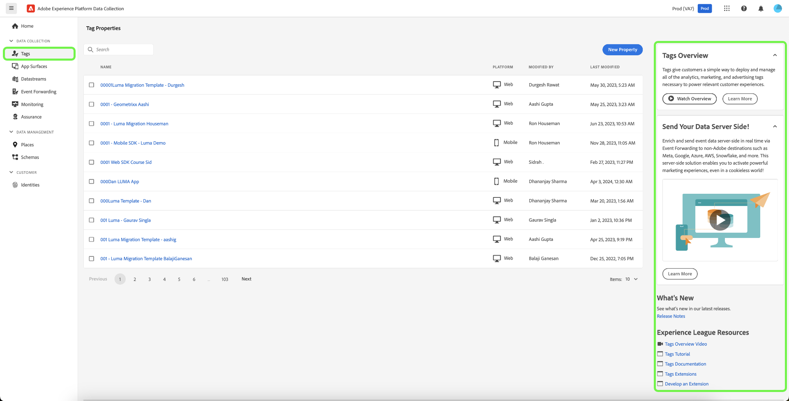

# Tags overview

Tags in Adobe Experience Platform (formerly known as Adobe Experience Platform Launch) are the next generation of tag management capabilities from Adobe. Tags give customers a simple way to deploy and manage all of the analytics, marketing, and advertising tags necessary to power relevant customer experiences.

Tags empower anyone to build and maintain their own integrations, called *extensions*. These extensions are available to [!DNL Adobe Experience Cloud] customers in an app-store experience so they can quickly install, configure, and deploy their tags.

Tags are offered to [!DNL Adobe Experience Cloud] customers as an included value-add feature.

## Key benefits {#key-benefits}

* Faster time to value.
* Trustworthy data through centralized collection, organization, and delivery using data elements.
* Compelling experiences through the integration of data and marketing technology using rule builder.

## Key features {#key-features}

Use the in product help in the right panel to learn more about tags and view additional available resources.

### Extensions {#extensions}

An extension is a package of code (JavaScript, HTML, and CSS) that extends the tags functionality. Build, manage, and update your integrations using a virtually self-service interface. You can think of extensions as apps you use to achieve your tasks.

### Extension catalog {#extension-catalog}

Browse, configure, and deploy marketing/advertising tools built and maintained by independent software vendors.

### Rule builder {#rule-builder}

Create robust rules that combine multiple events, sequenced in the way that you determine using if/then logic with conditions and exceptions. Rules provide options for:

* Events
* Conditions
* Exceptions
* Actions

The rule builder includes real-time error checking and syntax highlighting for your custom code.

When the criteria outlined in your rules are met and conditions are satisfied, the actions you define are executed in order.

### Data elements {#data-elements}

Collect, organize, and deliver data across web-based marketing and advertising technology.

### Enterprise publishing {#enterprise-publishing}

The publishing process enables teams to publish code to pages. Different people can create an implementation, approve it, and publish it on your pages.

* Changes to your code are encapsulated within the libraries you define.
* You specify where and when you want your code deployed.
* Multiple libraries can be built in parallel by different teams.
* Unlimited development environments.
* A deliberate, permission-based process for merging libraries together.

### Open APIs {#open-apis}

Automate implementations of individual technologies or a group of technologies.

* Tags interact with the Reactor API.
* Deployments can be automated through APIs.
* Integrate the APIs with your own internal systems.
* You can build your own user interface if desired.

### Light, modular container tag {#modular-tag}

The content of your container is minified, including your custom code. Everything is modular. If you don't need an item, it is not included in your library. The result is an implementation that is fast and compact. See [Minification](./ui/publishing/builds.md).

## Other highlights {#other-highlights}

Tags provide several improvements over similar systems, including:

* No use of `document.write ()` where Chrome doesn't allow it.
* The Page Top and Page Bottom rules are bundled into the main library to minimize unnecessary HTTP calls.
* Custom action scripts within a rule can be loaded in parallel, but are executed sequentially.
* If you avoid Page Top and Page Bottom rules, the code is mostly asynchronous, with a path to getting fully async.
