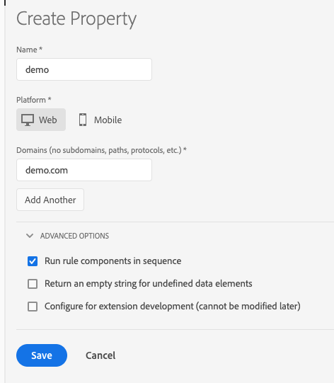

# Properties

## Web properties

A web property is a collection of rules, data elements, configured extensions, environments, and libraries.  Each web property has its own set of embed codes and can be deployed on any number of distinct websites (different domains).

## Mobile properties

A mobile property type can contain multiple applications. For example, in a mobile property you can manage the same set of rules and extensions across multiple iOS and Android applications.

## Best practices for planning properties {#best-practices-for-planning-properties}

Each tag implementation in Adobe Experience Platform can be very different. They have a wide variety of data-collection needs, variable usage, extensions, third-party tags, other systems and technologies, people, teams, geographic regions, and so on. You should structure your properties in a way that matches your organization's workflow, and processes.

Considering the following when planning properties:

* Code structure
* Data
* Variables
* Extensions, tags, and systems
* People

### Code structure

Sites are based on HTML, mobile applications on code.  If the underlying HTML templates or codebases are the same for multiple sites and applications, you may want to consider using a single tag property to manage multiple sites or apps.

### Data

For all of your websites or applications, is the data you are going to collect very similar, somewhat similar, or unique?

If the data you need to collect is similar, it might make sense to group those sites or applications into one property to avoid duplicating rules or copying rules from one property to another.

If your data collection needs are unique for each site or application, it might make sense to separate them into their own properties. This method lets you control the data collection more specifically, without using large amounts of conditional logic in custom scripts.

### Variables

Similar to data, are the variables you are going to set in your [!DNL Analytics] and other extensions very similar, somewhat similar, or unique?

For example, if eVar27 is used for the same source value across all of your websites or applications, it might make sense to group those sites or applications together so you can set those common variables in just one property.

### Extensions, tags, and systems

Are the extensions, tags, and systems you are going to deploy very similar, somewhat similar, or unique?

If the extensions, tags, and systems you are going to deploy are very similar across your sites or applications, you might want to include them in the same property.

If you are deploying [!DNL Adobe Analytics] on only one site or application, and your other extensions and tags are also unique, you might want to create separate properties so that you have more control.

For example, If you are deploying [!DNL Adobe Analytics], [!DNL Target], and the same 3rd-party extensions across all of your sites or applications, that is a reason to group together.

### People

For the individuals, teams, and organizations that are working in Adobe Experience Platform, will they need access to all of your websites and applications, some of them, or just one?

The User Management features allow you to assign different roles to different people for all of your properties, or on a per-property basis. If someone has sufficient rights, that person can perform administrative actions across all the properties in that Experience Platform organization. All the other roles can be assigned on a per-property basis. You can even hide a property from certain users (non-admins) by not giving them any role in that property.

## Properties page

A property is a collection of rules, data elements, configured extensions, environments, and libraries. For web, there is only one publish embed code per property. For mobile, there is one configuration app ID per property.

A property can be any grouping of one or more domains and subdomains. You can manage and track these assets similarly. For example, suppose that you have multiple websites based on one template, and you want to track the same assets on all of them. You can apply one property to multiple domains.

The left side of the screen shows the companies in your organization. This is particularly useful if you manage multiple accounts. Select a company to see the properties and audit logs for that company.

Each property is shown in the Properties list.

The Properties list shows the following information:

* Property name
* Platform
* Status

Select a property to see an overview of that property. The overview shows any activity performed on the property. It also lists the metrics and extensions for the property.

## Create or configure a property

This section provides guidance on how to create or configure a tag property in Adobe Experience Platform.

>[!NOTE]
>
>Only a user with sufficient rights can create a property. See [User Management](user-permissions.md).

Before beginning, review the [Best practices for planning properties](companies-and-properties.md#best-practices-for-planning-properties) for properties.

Navigate to your company page, then select **[!UICONTROL Add Property]**, or select an existing property from the list and select **[!UICONTROL Configure]**.

### For Web

Follow the instructions to create a web property.

1. Fill in the fields:

   **Name:** The name of your property.

   **Domains:** The base URL of any sites you plan to deploy this property to

1. (Advanced) **[!UICONTROL Run rule components in sequence]** Select this checkbox to make conditions and actions wait for the previous one to complete before they run
1. (Advanced) **[!UICONTROL Return an empty string for missing data elements:]** If you reference a data element that does not exist within a library, that would normally return `undefined`. Enable this checkbox if you want that scenario to return an empty string instead.
1. (Advanced) **[!UICONTROL Configure for extension development:]** Enable this checkbox if you plan to install development extensions that are being actively developed by your company
1. Select **[!UICONTROL Save]**.

### For Mobile

Follow the instructions to create a mobile property.

1. Fill in the fields: 

   * **Name:** The name of your property. 
   * **Privacy:** By default the privacy setting is set to Opted In, meaning that you would like for the SDK to collect and send data to solutions. If you select Opted Out, the SDK by default will NOT send data to solutions. If you choose Unknown as the setting, the SDK will require that the application first prompt the user to allow for data collection and sharing.

     >[!NOTE]
     >
     >These settings can be further controlled via API in the mobile application. 

   * **Use HTTPS:** Choose if all data communication should be sent over HTTP or HTTPS.

1. Select **[!UICONTROL Save]**.

After your property is created, Experience Platform automatically adds a default host, a set of environments (Development, Staging, and Production), and the default extensions.

## Delete a property

Follow the steps below to delete a tag property.

>[!NOTE]
>
>Property removal cannot be reversed. The requestor must be an admin-level user. This request cannot be undone.

1. In the Properties list, select the property you want to delete.

   You can select multiple properties to delete.

1. Select **[!UICONTROL Delete]**, then confirm the removal of the property.
