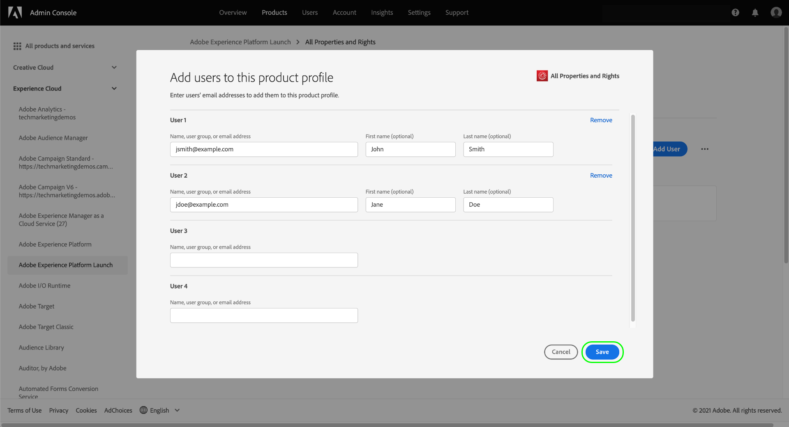

# Manage permissions for tags

>[!NOTE]
>
>Adobe Experience Platform Launch has been rebranded as a suite of data collection technologies in Adobe Experience Platform. Several terminology changes have rolled out across the product documentation as a result. Please refer to the following [document](../../term-updates.md) for a consolidated reference of the terminology changes.

In order to use tags in Adobe Experience Platform, you must be granted access to at least one Adobe Experience Cloud product through Adobe Admin Console. In addition, you must also be granted permissions for tags at the product-profile level in order to perform certain actions when logged into the Data Collection UI.

This guide covers how to grant these permissions to users using the Admin Console.

>[!NOTE]
>
>For detailed information on the different types of available tag permissions mentioned in this guide, please refer to the [user permissions overview](./user-permissions.md).

## Gain admin rights for a tags product profile

In order to manage user permissions for tags, you must be at least a product profile administrator for tags in Adobe Admin Console. System administrators and product administrators are also able to manage permissions for a tags product profile.

See the Admin Console document on [administrative roles](https://helpx.adobe.com/enterprise/admin-guide.html/enterprise/using/admin-roles.ug.html) for more information on the different admin levels and how to manage these roles within your organization.

## Select a product profile to manage permissions for

Once you have admin rights, sign into Admin Console and select **[!UICONTROL Products]** from the top navigation. From the list of displayed products, select **[!UICONTROL Adobe Experience Platform Launch]**.

A list of product profiles displays. A product profile is a construct that links a a group of permissions to a group of users. From here, you can create a new profile to configure, or you can select an existing product profile from the list to edit (assuming you have admin rights for that profile).

### Create a product profile

>[!NOTE]
>
>If you selected an existing profile to edit, skip ahead to the [next section](#permissions).

To create a new product profile, select **[!UICONTROL New Profile]**.

A dialog appears that allows you to provide a name and optional description for the profile. You can also toggle whether users should receive emails when they are added or removed from this profile. When finished, select **[!UICONTROL Save]**.

## Configure permissions for the product profile {#permissions}

The details page for the product profile appears. Using the provided tabs, you can manage the users that are assigned to the profile, and configure the specific properties and rights that the profile will grant those users.

Steps on how to add users are provided [later in this guide](#users). For now, select **[!UICONTROL Permissions]**.

The next screen shows an overview of the number of platforms, properties, and rights that are currently assigned to the profile. Select **[!UICONTROL Edit]** next to one of the rows to start configuring the profile's permissions.

The [!UICONTROL Edit Permissions] screen appears, which allows you to add and remove permissions from the product profile. From the **[!UICONTROL Platforms]** section, you can see that all platforms have been added to the profile by default. 

### Assign properties

To assign properties to this profile, select **[!UICONTROL Properties]** in the left navigation.

By default, a new product profile is automatically given access to all properties that are available for your organization. This includes properties that are available currently and any properties made in the future.

If you want to limit the available properties, select the **[!UICONTROL Auto-include]** toggle. This allows you to manually add and remove properties for the property depending on your needs.

If auto-include is disabled, all currently available properties are listed on the left. You can add properties to the profile by selecting the plus (**+**) icon next to the property in question in the left column. To remove a property, select the **X** icon next to the property in question in the right column.

>[!IMPORTANT]
>
>Disabling the auto-include feature means that any properties created in the future must be manually added to the product profile in order for it to gain access to them.

### Assign rights

By default, all rights are disabled for a product profile and must be manually added to be enabled. If you belong to a product profile that auto-includes properties but has no rights, then you have read-only access to all properties.

>[!NOTE]
>
>A user can belong to multiple product profiles in Admin Console, but the rights from those profiles are not combined into a master permission set. That user still has only the rights explicitly granted by each group.
>
>For example, if Group 1 gives access to Property A with the Develop right, and Group 2 gives access to Property B with the Publish right, Develop and Publish rights are not combined for Property A and Property B. You can only develop on Property A and publish on Property B.
 
Select **[!UICONTROL Property Rights]** in the left navigation. As with properties, you can select the plus (**+**) icon next to a property right to add it to the profile. If you want to add all property rights to the profile, you can also select **[!UICONTROL Add all]**.

Next, select **[!UICONTROL Company Rights]** in the left navigation. Add or remove the rights you require, and once you are finished select **[!UICONTROL Save]**.

## Assign users to the profile {#users}

To assign users to the product profile, select the [!UICONTROL Users] tab, then select [!UICONTROL Add User].

In the dialog that appears, enter the name, user group, or email address of the users you wish to add to the profile. If a user is part of your organization, their information will display in an auto-complete dropdown, which you can select to fill in the details. If they are not part of your organization, you can manually enter their information instead.

When finished, select **[!UICONTROL Save]** to add the specified users to the product profile.

Once users have been added to the profile, they receive an email informing them that they now have rights for the Data Collection UI.

## Next steps

This document covered how to manage properties and rights for the Data Collection UI using Adobe Admin Console. For more information on the available permissions and the functionalities they grant access to, see the overview on [user permissions](./user-permissions.md).
