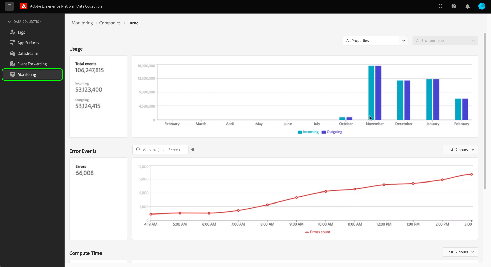
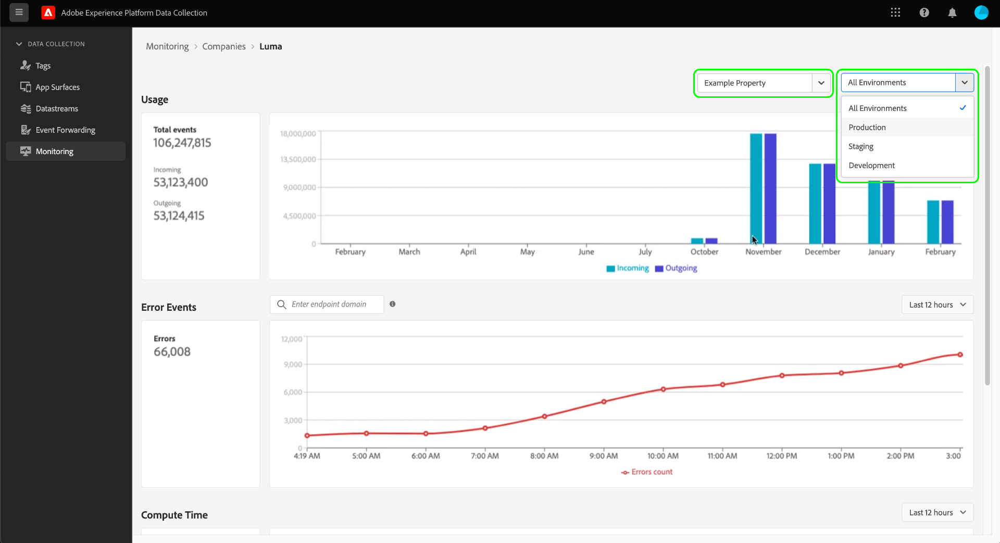
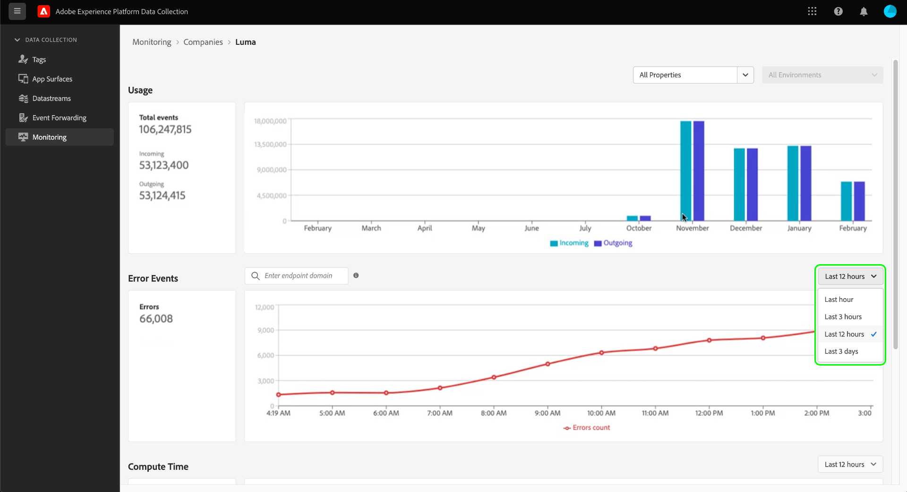

# Monitor activities in event forwarding (Beta)

>[!IMPORTANT]
>
>This feature is currently in beta and your organization may not have access to it yet. The functionality and documentation are subject to change.

The **[!UICONTROL Monitoring]** tab in the Data Collection UI allows you to monitor usage patterns, errors, and compute time of your event forwarding properties. This guide provides a high-level overview of how to view and understand the reports shown in the tab.

## Prerequisites

This guide assumes that you have purchased event forwarding and that you have a working understanding of how event forwarding works. See the [event forwarding overview](./overview.md) for more information.

## Video overview

Watch the following video for a high-level overview of the monitoring feature:

>[!VIDEO](https://video.tv.adobe.com/v/343999?quality=12&learn=on)

## Selecting properties and environments

You can view metrics within an individual environment and property, or across all properties and environments owned by your organization. 

To show metrics for a single property, select the property dropdown menu and choose the property of interest from the list. Once you have chosen a property, you can also use the environment dropdown to select an environment of interest.

## [!UICONTROL Usage]

>[!NOTE]
>
>Usage data is refreshed every month after the previous month ends.

The **[!UICONTROL Usage]** report shows incoming and outgoing calls for a given time period. Incoming calls represent data sent to event forwarding. Outgoing calls represents data sent from event forwarding. The **[!UICONTROL Total events]** number in the left pane is the sum of incoming and outgoing calls for the given time period.

## [!UICONTROL Error Events]

The **[!UICONTROL Error Events]** report shows errors in aggregate, and broken out by HTTP response code when you hover your cursor over the line chart. The displayed errors are from outgoing calls and the response codes are from the endpoint that event forwarding is interacting with.

The errors are shown for a given time period, which can be adjusted from the provided dropdown menu. 

The search box for the error event allows you to query event forwarding to understand errors for a given endpoint domain. You must enter the exact domain, as the search feature does not accept approximations or "fuzzy" matches. Once you provide an exact domain for which there is outgoing error data, hit Enter and the report refreshes to show outgoing errors for that domain. For example, to see errors from the Facebook Conversions API endpoint the domain should be written as `https://graph.facebook.com`.

## [!UICONTROL Compute Time]

The **[!UICONTROL Compute Time]** report shows the compute time of all rules on event forwarding servers.

>[!NOTE]
>
>The displayed times do not represent end-to-end latency. Event forwarding has a compute-time limitation of 50 milliseconds. If this limit is exceeded, the related data will be dropped.

The following factors affect compute time:

1. The number of rules
2. The complexity of the rules, usually driven by the amount of custom JavaScript being executed

For example, if an action in event forwarding hits an endpoint and that endpoint takes two seconds to respond, this two-second latency will not count against compute time because event forwarding is just waiting and not actively computing anything. The response time cannot be longer than 30 seconds, otherwise data will be dropped.
