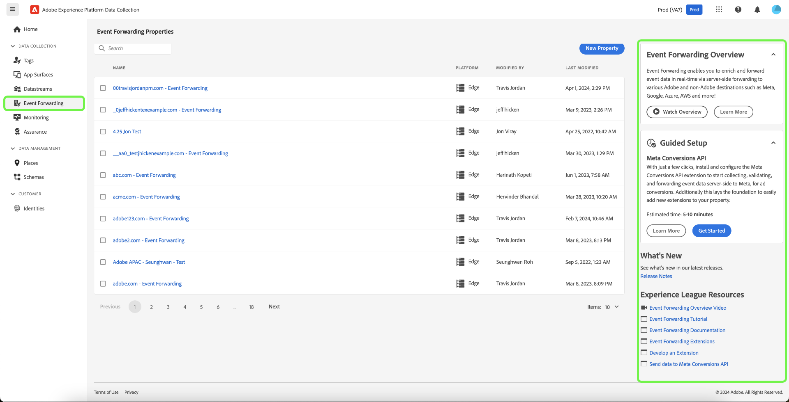
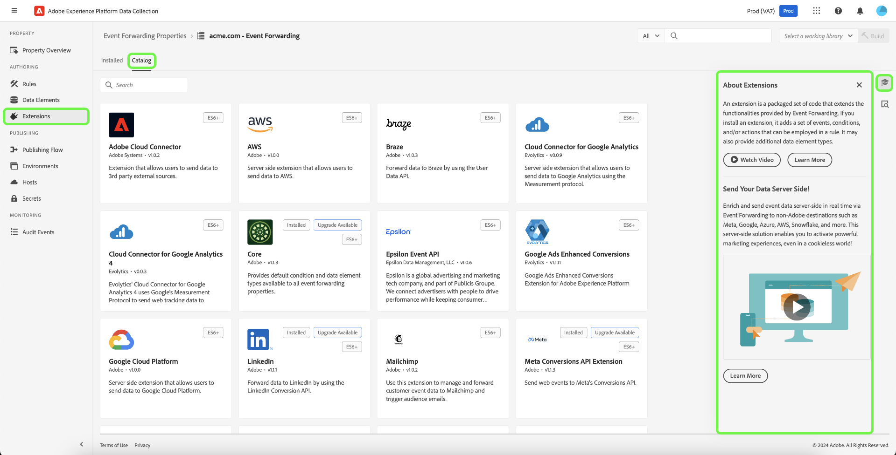
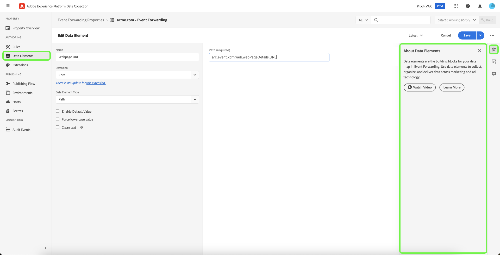
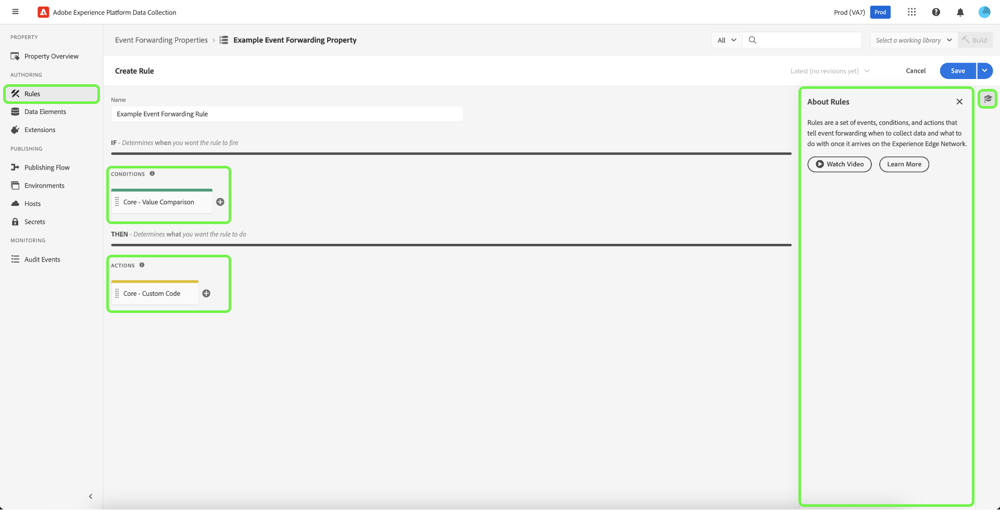
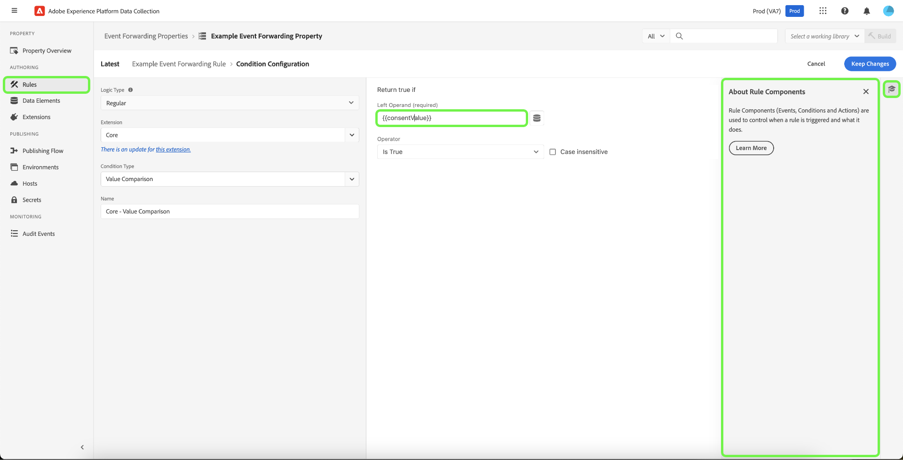

# Event forwarding overview

>[!NOTE]
>
>Event forwarding is a paid feature that is included as part of the Adobe Real-Time Customer Data Platform Connections, Prime, or Ultimate offerings.

>[!NOTE]
>
>Adobe Experience Platform Launch has been rebranded as a suite of data collection technologies in Adobe Experience Platform. Several terminology changes have rolled out across the product documentation as a result. Please refer to the following [document](../../term-updates.md) for a consolidated reference of the terminology changes.

Event forwarding in Adobe Experience Platform allows you to send collected event data to a destination for server-side processing. Event forwarding decreases web page and app weight by using Adobe Experience Platform Edge Network to execute tasks normally done on the client. Implemented in a similar manner to tags, event forwarding rules can transform and send data to new destinations, but instead of sending this data from a client application like a web browser, it is sent from Adobe's servers.

This document provides a high-level overview of event forwarding in Platform.

>[!NOTE]
>
>For information on how event forwarding fits within the data collection ecosystem in Platform, see the [data collection overview](../../../collection/home.md).

Event forwarding combined with the Adobe Experience Platform [Web SDK](../../../edge/home.md) and [Mobile SDK](https://experienceleague.adobe.com/docs/platform-learn/data-collection/mobile-sdk/overview.html) provides the following benefits:

**Performance**:

* Make a single call from a page that contains a payload of data which then federates on the server side to reduce client-side network traffic and deliver a faster experience for customers.
* Decrease the amount of time it takes for web pages to load to improve site performance.
* Decrease the number of required client-side technologies to deliver your experience and send data to many destinations.

**Data governance**:

* Increase transparency and control over which data is sent where across all properties.

## Differences between event forwarding and tags {#differences-from-tags}

In terms of configuration, event forwarding uses many of the same concepts as tags, such as [rules](../managing-resources/rules.md), [data elements](../managing-resources/data-elements.md), and [extensions](../managing-resources/extensions/overview.md). The main difference between the two can be summarized as follows: 

* Tags **collects** event data from a website or native mobile application and sends it to Platform Edge Network.
* Event forwarding **sends** incoming event data from Platform Edge Network to an endpoint which represents a final destination or an endpoint that provides data that you want to enrich the original payload with.

While tags collects event data directly from your site or native mobile application using the Platform Web and Mobile SDKs, event forwarding requires event data to already be sent through Platform Edge Network in order to forward it to destinations. In other words, you must implement the Platform Web or Mobile SDK on your digital property (either through tags or using raw code) in order to use event forwarding.

### Properties {#properties}

Event forwarding maintains its own store of properties separate from tags, which you can view in the Experience Platform UI or Data Collection UI by selecting **[!UICONTROL Event Forwarding]** in the left navigation.

All event forwarding properties list **[!UICONTROL Edge]** as their platform. They do not distinguish between web or mobile because they only process data received from Platform Edge Network, which itself can receive event data from both web and mobile platforms.

### Extensions {#extensions}

Event forwarding has its own catalog of compatible extensions, such as the [Core](../../extensions/server/core/overview.md) extension and [Adobe Cloud Connector](../../extensions/server/cloud-connector/overview.md) extension. You can view the available extensions for event forwarding properties in the UI by selecting **[!UICONTROL Extensions]** in the left navigation, followed by **[!UICONTROL Catalog]**.

### Data elements {#data-elements}

The types of data elements that are available in event forwarding are limited to the catalog of compatible [extensions](#extensions) that provide them.

While data elements themselves are created and configured the same way in event forwarding as they are for tags, there are some important syntax differences when it comes to how they reference data from Platform Edge Network.

#### Referencing data from Platform Edge Network {#data-element-path}
    
To reference data from Platform Edge Network, you must create a data element that provides a valid path to that data. When creating the data element in the UI, select **[!UICONTROL Core]** for the extension and **[!UICONTROL Path]** for the type.

The **[!UICONTROL Path]** value for the data element must follow the pattern `arc.event.{ELEMENT}` (for example: `arc.event.xdm.web.webPageDetails.URL`). This path must be specified correctly in order for data to be sent.

### Rules {#rules}

Creating rules in event forwarding properties works in a similar way to tags, with the key difference being that you cannot select events as rule components. Instead, an event forwarding rule processes all events it receives from the [datastream](../../../datastreams/overview.md) and forwards those events to destinations if certain conditions are satisfied.

In addition, there is a 30-second timeout that applies to a single event as it is processed across all rules (and hence all actions) within an event forwarding property. This means all rules and all actions for a single event must be completed in this time frame.

#### Data element tokenization {#tokenization}

In tag rules, data elements are tokenized with a `%` at the beginning and end of the data element name (for example: `%viewportHeight%`). In event forwarding rules, data elements are instead tokenized with `{{` at the beginning and `}}` at the end of the data element name (for example: `{{viewportHeight}}`).

#### Sequence of rule actions {#action-sequencing}

The [!UICONTROL Actions] section of an event forwarding rule is always executed sequentially. For example, if a rule has two actions, the second action will not begin execution until the previous action is complete (and in cases where a response is expected from an endpoint, that endpoint has responded). Make sure the order of actions is correct when you save a rule. This execution sequence cannot be executed asynchronously like it can with tag rules.

## Secrets {#secrets}

Event forwarding allows you to create, manage, and store secrets that can be used to authenticate to the servers that you are sending data to. See the guide on [secrets](./secrets.md) on the different kinds of available secret types and how they are implemented in the UI.

## Next steps

This document provided a high-level introduction to event forwarding. For more information on how to set up this feature for your organization, see the [getting started guide](./getting-started.md).
