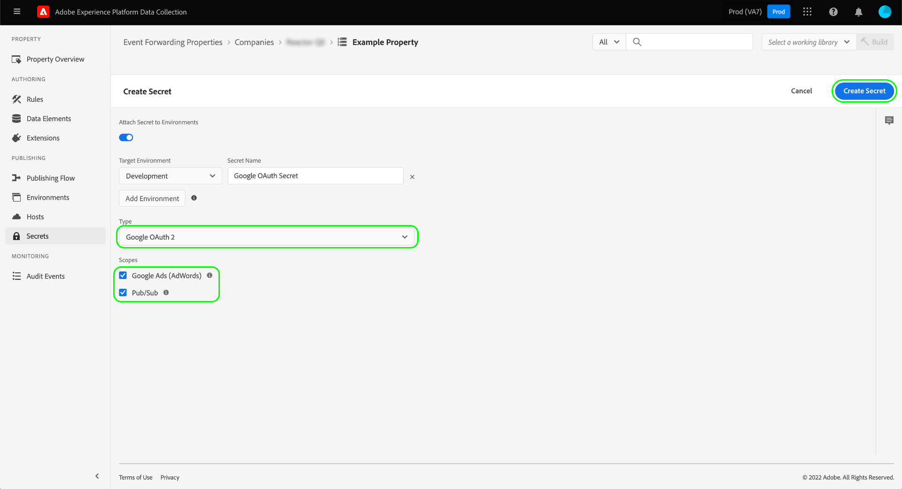

# Configuring secrets in event forwarding

In event forwarding, a secret is a resource that represents an authentication credential for another system, allowing for the secure exchange of data. Secrets can only be created within event forwarding properties.

There are currently three supported secret types:

| Secret type | Description |
| --- | --- |
| [!UICONTROL Token] | A single string of characters representing an authentication token value that is known and understood by both systems. |
| [!UICONTROL HTTP] | Contains two string attributes for a username and password, respectively. |
| [!UICONTROL OAuth 2] | Contains several attributes to support the [client credentials grant type](https://datatracker.ietf.org/doc/html/rfc6749#section-1.3.4) for the [OAuth 2.0](https://datatracker.ietf.org/doc/html/rfc6749) authentication spec. The system asks you for the required information, then handles the renewal of these tokens for you on a specified interval. |
| [!UICONTROL Google OAuth 2] | Contains several attributes to support the [OAuth 2.0](https://datatracker.ietf.org/doc/html/rfc6749) authentication spec for use in the [Google Ads API](https://developers.google.com/google-ads/api/docs/oauth/overview) and [Pub/Sub API](https://cloud.google.com/pubsub/docs/reference/service_apis_overview). The system asks you for the required information, then handles the renewal of these tokens for you on a specified interval. |

{style="table-layout:auto"}

This guide provides a high-level overview of how to configure secrets for an event forwarding ([!UICONTROL Edge]) property in the Experience Platform UI or Data Collection UI.

>[!NOTE]
>
>For detailed guidance on how to manage secrets in the Reactor API, including example JSON of a secret's structure, refer to the [secrets API guide](../../api/guides/secrets.md).

## Prerequisites

This guide assumes that you are already familiar with how to manage resources for tags and event forwarding in the UI, including how to create a data element and an event forwarding rule. See the guide on [managing resources](../managing-resources/overview.md) if you require an introduction.

You should also have a working understanding of the publishing flow for tags and event forwarding, including how to add resources to a library and install a build onto your website for testing. See the [publishing overview](../publishing/overview.md) for more details.

## Create a secret {#create}

To create a secret, select **[!UICONTROL Event Forwarding]** in the left navigation, then open the event forwarding property you want to add the secret under. Next, select **[!UICONTROL Secrets]** in the left navigation, followed by **[!UICONTROL Create New Secret]**.

The next screen allows you to configure the details of the secret. In order for a secret to be usable by event forwarding, it must be assigned to an existing environment. If you do not have any environments created for your event forwarding property, see the guide on [environments](../publishing/environments.md) for guidance on how to configure them before continuing.

>[!NOTE]
>
>If you still want to create and save the secret before adding it to an environment, disable the **[!UICONTROL Attach Secret to Environments]** toggle before filling in the rest of the information. Note that you will have to assign it to an environment later if you want to use the secret.
>
>

Under **[!UICONTROL Target Environment]**, use the dropdown menu to select the environment you want to assign the secret to. Under **[!UICONTROL Secret Name]**, provide a name for the secret in the context of the environment. This name must be unique across all secrets under the event forwarding property.

A secret can only be assigned to one environment at a time, but you can assign the same credentials to multiple secrets across different environments if you wish. Select **[!UICONTROL Add Environment]** to add another row to the list.

For each environment you add, you must provide another unique name for the associated secret. If you exhaust all available environments, the **[!UICONTROL Add Environment]** button will be unavailable.

From here, the steps to create the secret differ depending on the type of secret you are creating. Refer to the subsections below for details:

* [[!UICONTROL Token]](#token)
* [[!UICONTROL HTTP]](#http)
* [[!UICONTROL OAuth 2]](#oauth2)
* [[!UICONTROL Google OAuth 2]](#google-oauth2)

### [!UICONTROL Token] {#token}

To create a token secret, select **[!UICONTROL Token]** from the **[!UICONTROL Type]** dropdown. In the **[!UICONTROL Token]** field that appears, provide the credential string that is recognized by the system you are authenticating to. Select **[!UICONTROL Create Secret]** to save the secret.

### [!UICONTROL HTTP] {#http}

To create an HTTP secret, select **[!UICONTROL Simple HTTP]** from the **[!UICONTROL Type]** dropdown. In the fields that appear below, provide a username and password for the credential before selecting **[!UICONTROL Create Secret]** to save the secret.

>[!NOTE]
>
>Upon being saved, the credential is encoded using the ["Basic" HTTP authentication scheme](https://www.rfc-editor.org/rfc/rfc7617.html).

### [!UICONTROL OAuth 2] {#oauth2}

To create an OAuth 2 secret, select **[!UICONTROL OAuth 2]** from the **[!UICONTROL Type]** dropdown. In the fields that appear below, provide your [[!UICONTROL Client ID] and [!UICONTROL Client Secret]](https://www.oauth.com/oauth2-servers/client-registration/client-id-secret/), as well as your [[!UICONTROL Token URL]](https://www.oauth.com/oauth2-servers/access-tokens/client-credentials/) for your OAuth integration. The [!UICONTROL Token URL] field in the UI is a concatenation between the authorization server host and the token path.

Under **[!UICONTROL Credential Options]**, you can provide other credential options such as `scope` and `audience` in the form of key-value pairs. To add more key-value pairs, select **[!UICONTROL Add another]**.

Finally, you can configure the **[!UICONTROL Refresh Offset]** value for the secret. This represents the number of seconds before the token expiry that the system will perform an automatic refresh. The equivalent time in hours and minutes is displayed to the right of the field and updates automatically as you type.

For example, if the refresh offset is set to the default value of `14400` (four hours) and the access token has an `expires_in` value of `86400` (24 hours), the system will automatically refresh the secret in 20 hours.

>[!IMPORTANT]
>
>An OAuth secret requires at least four hours between refreshes and must also be valid for a minimum of eight hours. This restriction gives you a minimum of four hours to intervene if problems arise with the generated token.
>
>For example, if the offset is set to `28800` (eight hours) and the access token has an `expires_in` of `36000` (ten hours), the exchange would fail due to the resulting difference being less than four hours.

When finished, select **[!UICONTROL Create Secret]** to save the secret.

### [!UICONTROL Google OAuth 2] {#google-oauth2}

To create a Google OAuth 2 secret, select **[!UICONTROL Google OAuth 2]** from the **[!UICONTROL Type]** dropdown. Under **[!UICONTROL Scopes]**, select the Google APIs that you want to use this secret to grant access to. The following products are currently supported:

* [Google Ads API](https://developers.google.com/google-ads/api/docs/oauth/overview)
* [Pub/Sub API](https://cloud.google.com/pubsub/docs/reference/service_apis_overview)

When finished, select **[!UICONTROL Create Secret]**.

A popover appears informing you that the secret needs to be manually authorized through Google. Select **[!UICONTROL Create & Authorize]** to continue.

A dialog appears that allows you to enter the credentials for your Google account. Follow the prompts to grant event forwarding access to your data under the selected scope. Once the authorization process is complete, the secret is created.

>[!IMPORTANT]
>
>If your organization has a re-authentication policy set for Google Cloud applications, the created secrets will not be refreshed successfully after the authentication expires (between 1 and 24 hours depending on the policy configuration).
>
>To resolve this issue, sign in to the Google Admin console and navigate to the **[!DNL App access control]** page so you can mark the event forwarding app (Adobe Real-Time CDP Event Forwarding) as [!DNL Trusted]. Refer to the Google documentation on [setting session lengths for Google Cloud services](https://support.google.com/a/answer/9368756) for more information.

## Edit a secret

After you have created secrets for a property, you can find them listed in the **[!UICONTROL Secrets]** workspace. To edit the details of an existing secret, select its name from the list.

The next screen allows you to change the name and credentials for the secret.

>[!NOTE]
>
>If the secret is associated with an existing environment, you cannot reassign the secret to another environment. If you wish to use the same credentials on a different environment, you must [create a new secret](#create) instead. The only way to reassign the environment from this screen is if you never assigned the secret to an environment beforehand or if you deleted the environment that the secret was attached to.

### Retry a secret exchange

You can retry or refresh a secret exchange from the editing screen. This process varies depending on the type of secret being edited:

| Secret type | Retry protocol |
| --- | --- |
| [!UICONTROL Token] | Select **[!UICONTROL Exchange Secret]** to retry the secret exchange. This control is only available when there is an environment attached to the secret. |
| [!UICONTROL HTTP] | If there is no environment attached to the secret, select **[!UICONTROL Exchange Secret]** to exchange the credential to base64. If an environment is attached, select elect **[!UICONTROL Exchange and Deploy Secret]** to exchange to base64 and deploy the secret. |
| [!UICONTROL OAuth 2] | Select **[!UICONTROL Generate Token]** to exchange the credentials and return an access token from the authentication provider. |

## Delete a secret

To delete an existing secret in the  **[!UICONTROL Secrets]** workspace, select the checkbox next to its name before selecting **[!UICONTROL Delete]**.

## Using secrets in event forwarding

In order to make use of a secret in event forwarding, you must first create a [data element](../managing-resources/data-elements.md) that references the secret itself. After saving the data element, you can include it in event forwarding [rules](../managing-resources/rules.md) and add those rules to a [library](../publishing/libraries.md), which in turn can be deployed to Adobe's servers as a [build](../publishing/builds.md).

When creating the data element, select the **[!UICONTROL Core]** extension, then select **[!UICONTROL Secret]** for the data element type. The right panel updates and provides dropdown controls to assign up to three secrets to the data element: one for [!UICONTROL Development], [!UICONTROL Staging], and [!UICONTROL Production] respectively.

>[!NOTE]
>
>Only secrets attached to the development, staging, and production environments appear for their respective dropdowns.

By assigning multiple secrets to a single data element and including it a rule, you can have the value of the data element change depending on where the containing library is in the [publishing flow](../publishing/publishing-flow.md).

>[!NOTE]
>
>When creating the data element, a development environment must be assigned. Secrets for the staging and production environments are not required, but builds that try to transition to those environments will fail if their secret-type data elements do not have a secret selected for the environment in question.

## Next steps

This guide covered how to manage secrets in the UI. For information on how to interact with secrets using the Reactor API, see the [secrets endpoint guide](../../api/endpoints/secrets.md).
