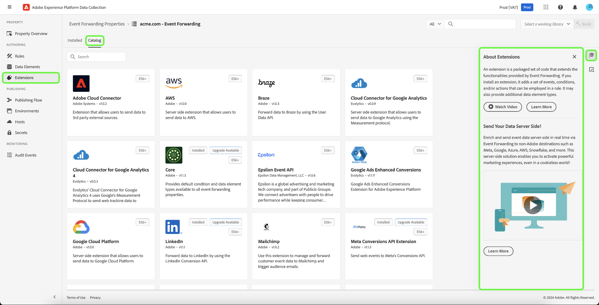

# Extensions

>[!NOTE]
>
>Adobe Experience Platform Launch has been rebranded as a suite of data collection technologies in Adobe Experience Platform. Several terminology changes have rolled out across the product documentation as a result. Please refer to the following [document](../../../term-updates.md) for a consolidated reference of the terminology changes.

An extension is a packaged set of code that extends the functionalities provided by tags or event forwarding.

Adding an extension adds new data elements and new options for creating rules.

Extensions determine the elements that are available when building properties, rules, and data elements. They provide:

* Events, conditions, and exceptions
* Data elements
* Client-side code

Use the links at the top of the Extensions list to view installed extensions, the extensions catalog, or updates.

Select an extension, then select [!UICONTROL Configure] to view and change the extension's settings. For more information, see the section on [adding a new extension](#add-a-new-extension) for information about extension options.

>[!IMPORTANT]
>
>Changes do not take effect until they are [published](../../publishing/overview.md).

By default, Adobe provides extensions that support common integrations. Extensions can be modified with custom configurations. Configurations are provided through the extensions. To create a configuration, select the extension card, then select **[!UICONTROL Add New Configuration]**.

## Extension catalog

Use the extension catalog to browse, configure, and deploy marketing and advertising technology built and maintained by independent software vendors, as well as extensions for Adobe solutions.

The Extensions page provides three views:

* Installed

  Shows all of your installed extensions.

* Catalog
* Shows all available extensions
* Updates

  Shows updates to installed extensions.

Select **[!UICONTROL Extensions]** to see all your installed extensions. You can also use the catalog to see a list of all available extensions and which extensions have updates available.

See [Extensions Reference](../../../extensions/client/overview.md) for details about the Adobe-owned extensions.

## Add a new extension {#add-a-new-extension}

Tags are highly extendible. Extensions add core functionality to tags. A common use of extensions is to create integrations with other applications.

1. From a property's overview page, open the **[!UICONTROL Extensions]** tab.
1. Select an extension.

   

   * If the extension exists, select it from the extensions catalog.
   * Mouse over an extension in your list to configure or disable it.
   * Add other extensions from the catalog if they are not currently in your list.

   The Core extension is the starting point for your new extension. The default extension provides:

   * Default event
   * Default conditions and exceptions
   * Default client-side code

   These defaults are the basis for the custom rules you'll build to create your extension.

When creating or editing elements, you can save and build to your [active library](../../publishing/libraries.md#active-library). This immediately saves your change to your library and executes a build. The status of the build is displayed. You can also create a new library from the Active Library drop down.

## Configure an extension

Mouse over an installed extension and select **[!UICONTROL Configure]**.

>[!NOTE]
>
>Some extensions do not require configuration and do not offer configuration options.

Each configurable extension has unique options. Refer to [Extensions Reference](../../../extensions/client/overview.md) for information about the options available for each Adobe extension.
