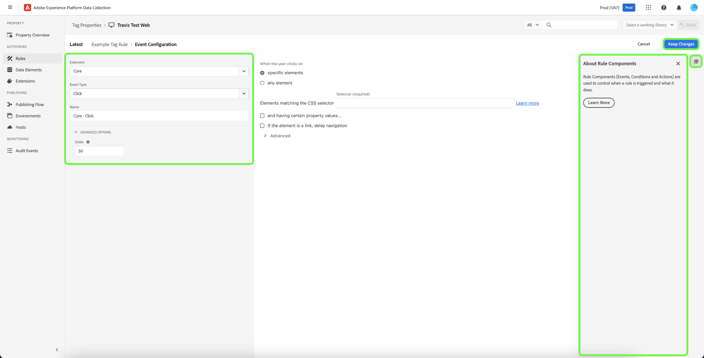
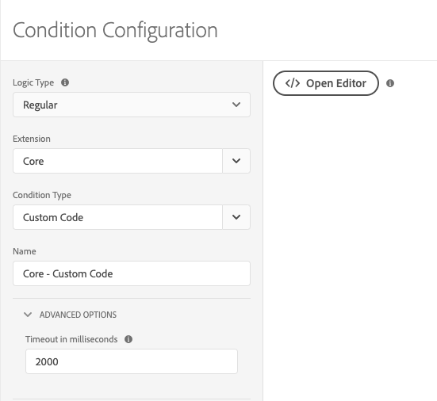
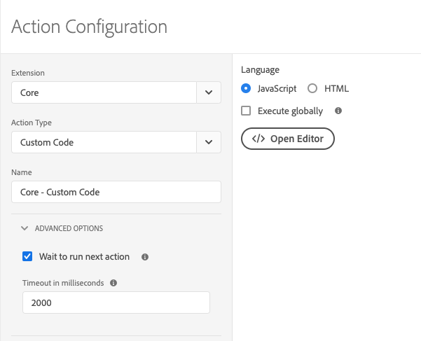

# Rules

>[!NOTE]
>
>Adobe Experience Platform Launch has been rebranded as a suite of data collection technologies in Adobe Experience Platform. Several terminology changes have rolled out across the product documentation as a result. Please refer to the following [document](../../term-updates.md) for a consolidated reference of the terminology changes.

Tags in Adobe Experience Platform follow a rule-based system. They look for user interaction  and associated data. When the criteria outlined in your rules are met, the rule triggers the extension, script, or client-side code you identified.

Build rules to integrate the data and functionality of marketing and ad tech that unifies disparate products into a single solution.

## Rule structure

**Events (If):** The event is what you want the rule to look for. This is defined by choosing an event, any applicable conditions, and any exceptions.

**Actions (Then):** Triggers occur after a rule's events take place and all conditions are satisfied. A tag rule can trigger as many discrete actions as you want, and you can control the order in which these actions occur. For example, a single rule for an e-commerce Thank You page can trigger your analytics tools and third-party tags from a single rule. There is no need to create separate rules for each extension or tag.

You can add more event types. Multiple events are joined with an OR, so the rule's conditions will be evaluated if any of the events are met.

>[!IMPORTANT]
>
>Changes do not take effect until they are [published](../publishing/overview.md).

### Events and conditions (if)

Events with any conditions are the *If* portion of a rule.

If a specified event occurs, the conditions are evaluated, then the specified actions take place if needed.

* **Events**: Specify one or more events that must take place to trigger the rule. Multiple events are joined by an OR. Any of the specified events will trigger the rule.

* **Conditions**: Narrow the event by configuring any conditions that must be true for an event to trigger the rule. An exception is defined as a NOT condition. Multiple conditions are joined by an AND.

The events that are available depend on which extensions are installed. For information about the events in the Core extension, see [Core extension event types](../../extensions/client/core/overview.md#core-extension-event-types).

### Actions (then)

Actions are the *Then* portion of a rule. They define what you want to happen when the rule runs. When an event is triggered, if conditions evaluate to true and exceptions evaluate to false, the actions are performed. You can drag and drop actions to order them as desired.

## Create a rule

Create a rule by specifying what actions occur if a condition is met.

1. Open the [!UICONTROL Rules] tab, then select **[!UICONTROL Create New Rule]**.

   

1. Name the rule.
1. Select the Events **[!UICONTROL Add]** icon.
1. Choose your extension and one of the event types available for that extension, then configure the settings for the event.

   

   Available event types depend on the extension you've selected. Event settings will differ based on the event type. Some events don't have any settings that need to be configured.

   >[!IMPORTANT]
   >
   >In a client-side rule, data elements are tokenized with a `%` at the beginning and end of the data element name. For example, `%viewportHeight%`. In an event-forwarding rule, data elements are tokenized with `{{` at the beginning and `}}` at the end of the data element name. For example, `{{viewportHeight}}`. 

   To reference data from the Edge network, the data element path must be `arc.event._<element>_`.
    
    `arc` stands for Adobe Response Context.

    For example: `arc.event.xdm.web.webPageDetails.URL`
    
    >[!IMPORTANT]
    >
    >If this path in specified incorrectly, data is not collected. 

1. Set the Order parameter, then select **[!UICONTROL Keep Changes]**.

   Default order for all rule components is 50. If you want one to run sooner, give it a number lower than 50.

   * Order of execution is order of numbers. 1 comes before 3. 3 comes before 10. 10 comes before 100, etc.
   * Rules that have the same order run in no particular order.
   * Rules are fired in order, but do not necessarily finish in the same order. If Rule A and Rule B share an event, and you assign order so that Rule A comes first, then if Rule A does something asynchronously, there's no guarantee that Rule A finishes before Rule B starts.

     If you want it to run later, give it a number higher than 50. For more information about ordering, see [Rule ordering](rules.md#rule-ordering).

1. Select the Conditions **[!UICONTROL Add]** icon, then choose a logic type, extension, condition type and configure the settings for your condition. Next, select **[!UICONTROL Keep Changes]**.

   

   Available condition types depend on the extension you've selected. Condition settings will differ based on the condition type.

   Logic type:

   * Regular logic type allows actions to be executed if the condition is met
   * Exception logic type prevents actions from being executed if the condition is met

   (Advanced) Timeout: This option is available when rule component sequencing is enabled on your property. This attribute defines the maximum amount of time allowed for the condition to run. If the timeout is reached, the condition fails and the remainder of the rule's conditions and actions will be removed from the processing queue. The default is 2000ms.

   You can add as many conditions as you'd like. Multiple conditions within the same rule are joined by AND.

1. Select the Actions **[!UICONTROL Add]** icon, then choose your extension and one of the action types available for that extension, configure the settings for the action, then select **[!UICONTROL Keep Changes]**.

   

   Available action types depend on the extension you've selected. Action settings will differ based on the action type.

   (Advanced) Wait to run next action: This option is available when rule component sequencing is enabled on your property. When checked, tags will not call the next action until this one is completed. When unchecked, the next action begins to execute immediately. The default is **[!UICONTROL Checked]**.

   (Advanced) Timeout: This option is available when rule component sequencing is enabled on your property. It defines the maximum amount of time allowed for the action to complete. If the timeout is reached, the action fails and any subsequent actions for this rule will be removed from the processing queue. The default is 2000ms.

1. Review your rule, then select **[!UICONTROL Save Rule]**.

   Later, when you [publish](../publishing/overview.md), you'll add this rule to a library and deploy it.

When creating or editing rules, you can save and build to your [active library](../publishing/libraries.md#active-library). This immediately saves your change to your library and executes a build. The status of the build is displayed.

## Rule ordering {#rule-ordering}

Rule ordering allows you to control the order of execution for rules that share an event. Each rule contains an integer that determines its order priority (the default value being 50). Rules that contain lower values for their order are executed before those with higher values.

Consider a set of five rules which all share an event and all have default priority:

* If there is a rule that you want to run last, you can edit that one rule component and give it a number higher than 50 (60 for example).
* If there is a rule that you want to run first, you can edit that one rule component and give it a number lower than 50 (40 for example).

>[!NOTE]
>
>Ultimately, the responsibility for executing actions in order lie with the extension developer of the event type that you are using. Adobe extension developers ensure their extensions work as intended. Adobe provides guidance to third-party extension developers to do this properly, but cannot guarantee how these guidelines are followed.

It is highly recommended that you order your rules with positive numbers between 1 and 100 (the default being 50). Since rule order has to be manually maintained, it is best practice to keep your ordering scheme as simple as possible. If there are edge cases where this restriction is too limiting, tags support rule order numbers between +/- 2,147,483,648.

### Client-side rule handling

The load order for rules depends on whether the rule action is configured with JavaScript, HTML, or other client-side code, and whether the rules uses a page bottom or top event, or a different type of event.

You can use `document.write` within your custom scripts regardless of the events configured for the rule.

You can order different custom code types among each other. For example, you can now have a JavaScript custom code action, then an HTML custom code action, then a JavaScript custom code action. Tags ensure that they are executed in that order.

## Rule bundling

Rule events and conditions are always bundled into the main tag library. Actions may be bundled in the main library or loaded late as sub-resources as needed. Whether the actions are bundled or not is determined by the rule's event type.

### Rules with "Core - Library Loaded" or "Core - Page Top" events 

These events need to be executed almost always (unless conditions evaluate to false), so for efficiency, they are bundled into the main library, the file referenced by your embed code.

* **Javascript:** The JavaScript is embedded in the main tag library. The custom script is wrapped in a script tag and written to the document using `document.write`. If the rule has multiple custom scripts, they're written in order.
   
* **HTML:** The HTML is embedded in the main tag library. `document.write` is used to write the HTML to the document. If the rule has multiple custom scripts, they're written in order.

### Rules with any other event

Adobe cannot guarantee that any other rules will actually be triggered and that their action code will be needed. For this reason, the actions for all event types that are not listed above are not packaged into the main library. Instead, they are stored as sub-resources and referenced by the main library as needed.

* **JavaScript:** The JavaScript is loaded from the server as regular text, wrapped in a script tag, and added to the document using Postscribe. If the rule has multiple JavaScript custom scripts, they are loaded in parallel from the server, but executed in the same order that was configured in the rule.
* **HTML:** The HTML is loaded from the server and added to the document using Postscribe. If the rule has multiple custom HTML scripts, they are loaded in parallel from the server, but executed in the same order that was configured in the rule.

## Rule component sequencing {#sequencing}

The runtime environment's behavior depends on whether **[!UICONTROL Run rule components in sequence]** is on or off for your property. This setting determines whether a rule's components can be evaluated in parallel (asynchronously) or if they must be evaluated in sequence.

>[!IMPORTANT]
>
>This setting only determines how conditions and actions are evaluated within each rule, and does not affect the sequence in which rules themselves are executed on your property. Refer to the previous section on [rule ordering](#rule-ordering) for more information on how to determine the execution order for multiple rules.
>
>In [event forwarding](../event-forwarding/overview.md) properties, rule actions are are always executed sequentially and this setting is not available. Make sure the order is correct when you create the rule. 

### Enabled

If the setting is enabled when an event is triggered at runtime, the rule's conditions and actions are added to a processing queue (based on the order you have defined) and processed one at a time on a "first in, first out" (FIFO) basis. The rule waits for the completion of the component before moving onto the next one.

If a condition evaluates as false or reaches its defined timeout, that rule's subsequent conditions and actions are removed from the queue.

If an action fails or reaches its defined timeout, that rule's subsequent actions are removed from the queue.

### Disabled

If disabled, when an event is triggered at runtime, the rule's conditions are immediately evaluated. Multiple conditions are evaluated in parallel.

If all conditions return true (and exceptions return false), the rule's actions are immediately executed. The actions are called in order, but tags do not wait for one to complete before calling the next. If your actions are synchronous, they are still executed in order. If one or more actions are asynchronous, some actions will run in parallel.
