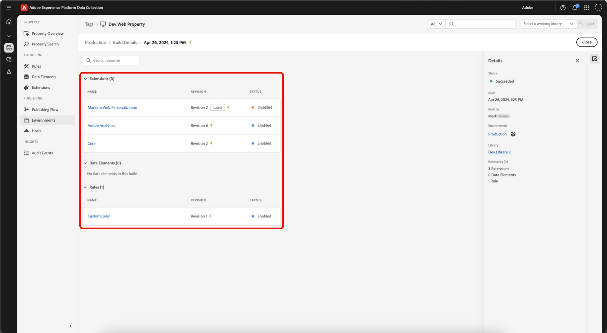

# Builds

A build is the set of files containing all the code that runs on the client device.

It is a composite of the changes you specified within your library, as well as everything that has been submitted, approved, or published before it.

The build consists of client-side code files that reference each other. These files are delivered to your hosting location using the environment and host that you have chosen for the library. The code that you deploy on your site points to this same location so the files can load when a user accesses your site or application.

## File contents {file-contents}

A library defines a discreet set of tag resources (extensions, rules, and data elements) that should be included within it.

A build contains all the module code (provided by the extension developers) and the configuration (entered by you) that is needed to power the resources contained within the library. For example, if an extension provides actions that are not used within your rules, then the code to perform those actions is not contained within the build.

Builds are divided into the main library file and potentially many smaller files. The main library file is referenced in your embed code and loaded onto the page at run-time. It contains:

* The rules engine
* All Extension configuration
* All Data Element code and configuration
* All Rule Event code and configuration
* All Condition code and configuration
* Event code and configuration for any rules that have Library Loaded or Page Bottom as the event (since we know we'll need that right away).

The smaller files contain code and configuration for individual Actions that are loaded onto the page as needed. When a Rule is triggered and its Conditions are evaluated such that the Actions need to be executed, the necessary code and configuration for that specific action are retrieved from one of the smaller files. This means that only the code needed to perform the necessary Actions is ever loaded onto the page, making the main library as small as possible.

## File format {file-format}

The default file format for builds is a package of files that contain all the required code for your extensions, data elements, and rules to run in the way that you want them to.

However, in certain cases, you might prefer a .zip archive of the files rather than the executable client-side code file. For example, you might want to create an archive if you host your build yourself and want to use the build in another deployment. If you provide anything in the self-hosted path to the library field, you can save your environment. Along with your new code, a link to the archived download becomes available. After the library is built you have the option to deploy a zip file to Akamai, and download it from `assets.adobedtm.com/...`.

>[!NOTE]
>
>Nothing exists in that location until you make a build.

Regardless of file format, the build is always delivered to the location specified by the Host.

To complete a build, select a library and select the Build option that is available at that level of the publishing process (Build for Development, Build for Staging, and so on.

## Minification {minification}

Minification lowers bandwidth costs and improves speed by stripping data that isn't required for execution from a file.

To increase performance, Experience Platform minifies everything, including:

* The main tag library
* Module code provided by extension developers as part of an extension
* Custom code provided by Experience Platform users

>[!NOTE]
>
>If your module code and custom code are already minified, Experience Platform minifies it again. This second minification doesn't provide additional benefits, but it doesn't cause any harm and it makes Experience Platform less complex and easier to maintain.

Any client-side code provided points to the minified version of code. This is seen in the file names which follow the standard naming convention for minified files:

`launch-%environment_id%.min.js`

If you want to see the un-minified code, remove .min from the file name:

`launch-%environment_id%.js`

If an extension developer provides minified code with their extension, Experience Platform does not provide un-minified code in the un-minified build. Similarly, if an Experience Platform user puts minified code into a custom code box, that code is still minified in un-minified builds. Experience Platform does not un-minify anything.

For more information about minification, see [this stackpath article](https://blog.stackpath.com/glossary/minification/).

When performing a build it will construct the un-minified library first, then minify the entire library all at once.

## View build details {build-details}

>[!IMPORTANT]
>
>A library stores revisions of your tag resources, but a **build** is a point-in-time snapshot of that library containing the files that are delivered to your site.

Build lists and build details can be accessed from a **library** or an **environment** to view current live builds, and inspect what a build contents (extensions, data elements, and rules).

### View builds details from a library

In your tags property, open the **[!UICONTROL Publishing Flow]** and select a library.

In the details panel, you can review the following:

* **[!UICONTROL Last Build Environment]** — Link to the environment that received the last build. Indicates whether this library is the current build for that environment (**Current** or **Not current**).
* **[!UICONTROL Current Builds]** — Builds that are currently live on their environments. For published libraries, the live production build is indicated by the lightning bolt icon in this section.
* For each build listed, you can view:
    * **[!UICONTROL Status]** - When the build was created. 
    * **[!UICONTROL Environment]** - The environment where the build was deployed. 
    * **[!UICONTROL User]** - User who created the build.

### View builds from an environment

A build is associated with an environment and the library that was built to that environment. The build is what actually contains the compiled resources.

Select the **[!UICONTROL Environment]** from the details panel. The Environment details panel shows a list of recent builds, the current live build, and related libraries.

Next, select a build to open its details. The build detail shows the **Extensions**, **Data Elements**, and **Rules** included in that build.

>[!NOTE]
>
>The build can include more than the resources listed on the library alone. **Extensions**, **Data Elements**, and **Rules** in the build can also include items from upstream dependencies.

Use the details panel to navigate back to the **[!UICONTROL Environment]** or **[!UICONTROL Library]**.
