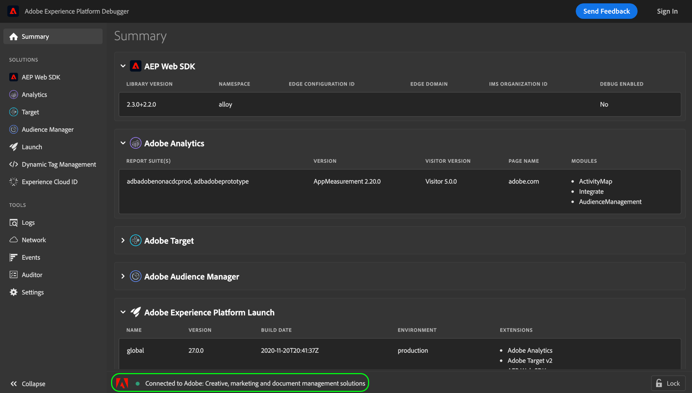
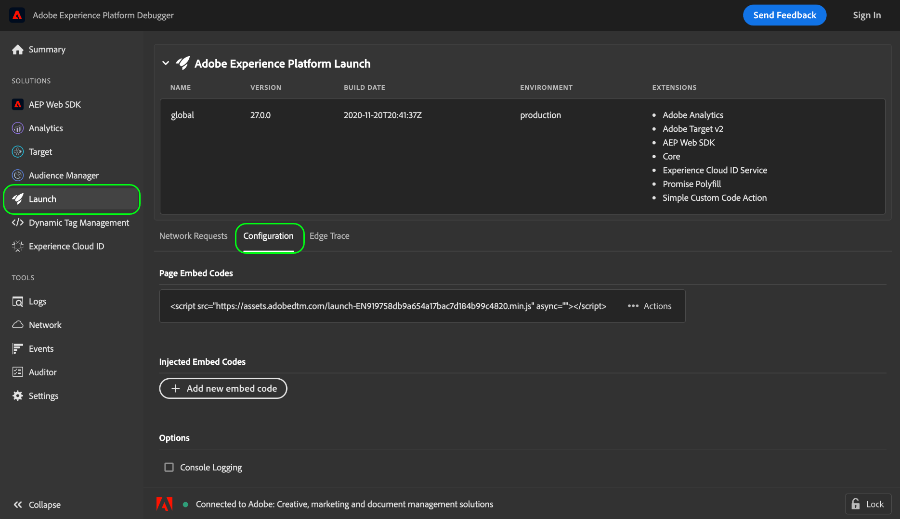
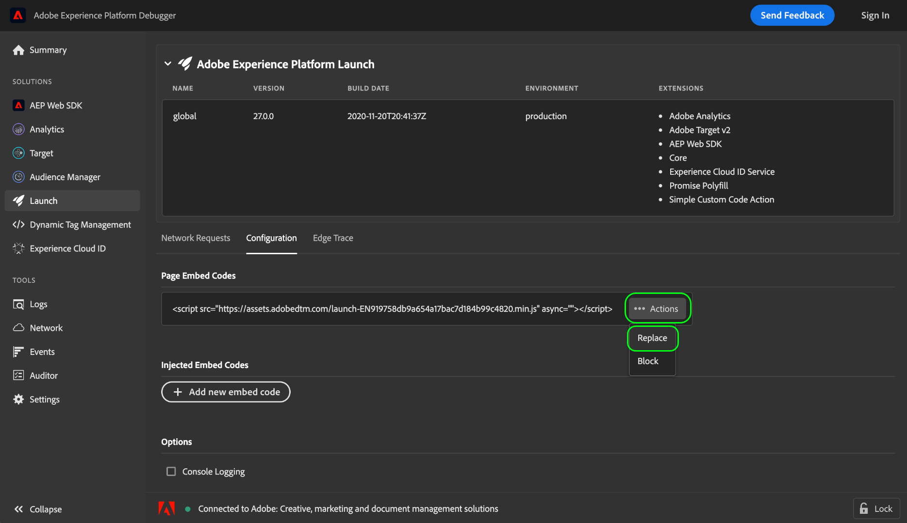
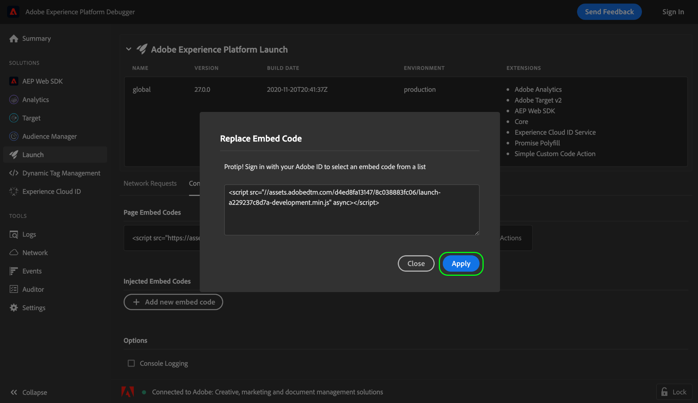
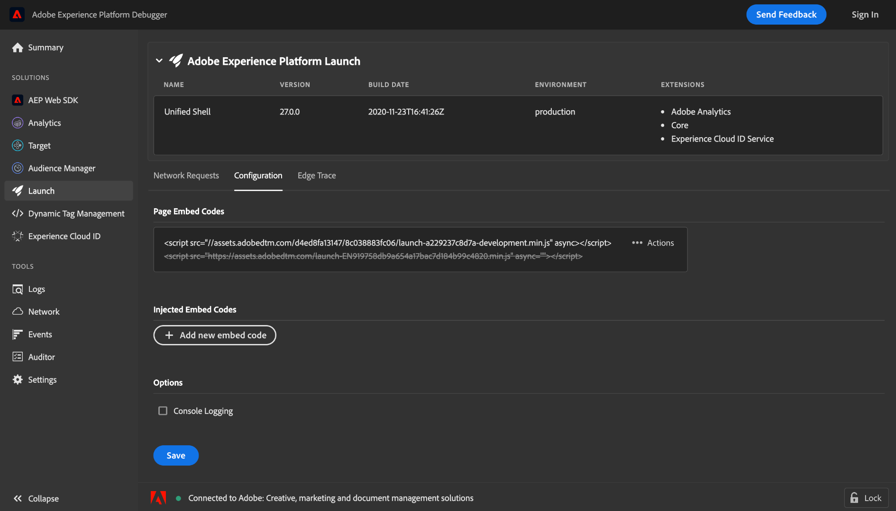

# Test embed codes using Adobe Experience Platform Debugger

As you make changes to your tag library builds in Adobe Experience Platform, you should test these changes before deploying the build to your production environment. If you do not have a dedicated staging or development environment for your website, you can use Adobe Experience Platform Debugger to locally test different embed codes within your site.

## Prerequisites

This tutorial requires a working understanding of the use of environments and embed codes for tags. See the [environments overview](./environments.md) for more information.

This tutorial also requires that you have the Experience Platform Debugger browser extension installed. Experience Platform Debugger is available for the Chrome browser. Use the following link to install the extension before starting the tutorial:

* [Experience Platform Debugger for Chrome](https://chrome.google.com/webstore/detail/adobe-experience-platform/bfnnokhpnncpkdmbokanobigaccjkpob)

## Open Experience Platform Debugger on your website

Using your browser of choice, navigate to your website and open the Experience Platform Debugger extension. The site that Experience Platform Debugger is currently connected to is displayed at the bottom of the window. If tags are currently running on your site, it will be listed in the [!UICONTROL Summary] tab.

>[!NOTE]
>
>If Experience Platform Debugger does not initially connect, you may need to reload the browser tab that is displaying your website before trying again.

## Replace embed codes

Once Experience Platform Debugger has connected to your site, select **[!UICONTROL Launch]** in the left navigation. Here you can see information about the library build currently being run on your site, including its environment and associated extensions. From here, select **[!UICONTROL Configuration]** to display controls for managing embed codes.

Under [!UICONTROL Page Embed Codes], the embed code that your site is currently using is displayed. Select **[!UICONTROL Actions]** on the right-hand side of the embed code, then select **[!UICONTROL Replace]**.

A popover appears, prompting you to provide an embed code to replace the current one with. Note that replacing the embed code using Experience Platform Debugger does not change the deployed embed code on your site. Rather, it only replaces the embed code running locally so you can test and debug its implementation.

Paste the embed code you want to test in the provided text box, then select **[!UICONTROL Apply]**.

The **[!UICONTROL Configuration]** tab reappears, showing that the live embed code has been replaced with the one you provided. You can now use the web browser to see if the embed code you are testing is working as expected.

## Next steps

This tutorial covered how to locally switch embed codes for testing purposes using Experience Platform Debugger. Refer to the [Experience Platform Debugger documentation](../../../debugger/home.md) for more information on its various capabilities.
