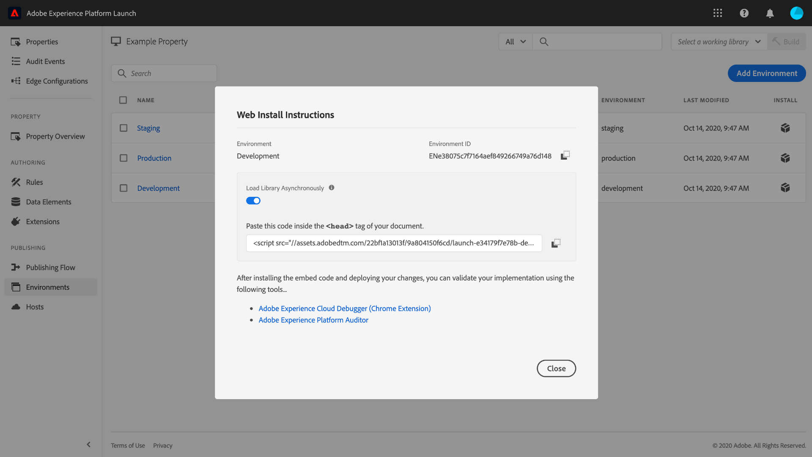

# Environments

>[!NOTE]
>
>Adobe Experience Platform Launch has been rebranded as a suite of data collection technologies in Adobe Experience Platform. Several terminology changes have rolled out across the product documentation as a result. Please refer to the following [document](../../term-updates.md) for a consolidated reference of the terminology changes.

Tag environments define several key aspects of the library builds you deploy on your website or app:

* The filename of the build.
* The domain and path of the build, depending on the environment's assigned host.
* The file format of the build, depending on the archive option chosen.

When you create a library build, you must assign it to an environment. The build's extensions, rules, and data elements are then compiled and placed into the assigned environment. Each environment provides a unique embed code that allows you to integrate its assigned build into your site.

Different artifacts can exist in each Environment. This allows you to test different Libraries in different environments as you push them through your Workflow.

This document provides steps on how to install, configure, and create different environments in the Data Collection user interface.

## Environment types

Tags support three different environment types, each corresponding to a different state in the [publishing workflow](./publishing-flow.md):

| Environment type | Description |
| --- | --- |
| Development | This environment corresponds with the **Development** column in the publishing workflow. |
| Staging | This environment corresponds with the **Submitted** and **Approved** columns in the publishing workflow. |
| Production | This environment corresponds with the **Published** column in the publishing workflow. |

Different artifacts can exist in each environment. This allows you to test different libraries in different environments as you push them through the publishing workflow.

>[!NOTE]
>
>Each environment can only be assigned one library build at a time. However, it is expected that a single environment will contain many different builds over time as you move them through the publishing workflow, reassigning builds between environments as necessary.

## Installation {#installation}

Each environment has a set of instructions used to connect it to your application. For web properties, these instructions provide embed codes. For mobile properties, these instructions provide the code necessary to instantiate the libraries you're using and retrieve the configuration at runtime.

>[!IMPORTANT]
>
>Each environment type has its own corresponding installation instructions. Depending on the environment you are using, you must ensure that you are using the correct corresponding embed codes and/or dependencies.
>
>For example, the production embed code for a web property supports browser caching, whereas the development and staging embed codes do not. As such, you should not use development or staging embed codes in high-traffic or production contexts.

To access the installation instructions for an environment, navigate to the **[!UICONTROL Environments]** tab for your property, and then select the **[!UICONTROL Install]** icon for that environment.

If using a web property, you are given an embed code to be used in the `<head>` tag of your document. You are also presented with the option to deploy library files synchronously or asynchronously at runtime. Depending on the setting you choose, the displayed install instructions will be different. Embed codes are explained in further detail later in this document.

If you are using a mobile property, you are given separate instructions for installing dependencies for Android (via [Gradle](https://gradle.org/)) and iOS (via [CocoaPods](https://cocoapods.org/)).

## Mobile configuration

For mobile properties, you can view the configuration options for an environment by selecting it from the list. From here, you can change the name of the environment. Mobile environments currently can only use Adobe-managed hosts.

See the overview on [hosts](./hosts/hosts-overview.md) for more information.

## Web configuration

The settings from the assigned environment determine the following for web properties:

* **Host**: The server location where you want your build to be deployed.
* **Archive setting**: Whether the system should output a deployable set of files or have them compressed in an archive format.
* **Embed code**: The `<script>` code to be embedded within the HTML of your website pages, used to deploy the library build at runtime.

In the [!UICONTROL Environments] tab, select a listed environment to display its configuration controls.

### Host {#host}

Select **[!UICONTROL Host]** to choose a pre-configured host for the environment from the dropdown menu.

When a build is created, that build is delivered to the location you specified for the assigned host. For information on how to create and configure tag hosts, refer to the [hosts overview](./hosts/hosts-overview.md).

### Archive setting {#archive}

Most builds consist of multiple files. Multi-file builds contain a main library file (linked in the embed code) that contains internal references to the other files which are pulled in as needed.

The **[!UICONTROL Create archive]** button allows you to toggle the environment's archive setting. By default, the archive option is switched off and the build is delivered in a format that executes as-is (JavaScript for web properties, and JSON for mobile properties).

If you choose to turn the archive setting on, additional configuration settings appear in the UI, enabling you to optionally encrypt the archive file and define a path to the library if you are using self-hosting.

The path can be either a full URL or a relative path that can be used across multiple domains. This is important because most builds have multiple files that contain internal references to each other.

If you use the archive option, all build files are delivered as a ZIP file instead. This can be useful if:

1. You are self-hosting the library but don't want to set up an SFTP host for delivery.
1. You need to run code analysis on the build prior to deployment.
1. You just want to look at the build contents to see what it contains.

### Embed code {#embed-code}

An embed code is a `<script>` tag that must be placed in the `<head>` sections of your website pages in order to load and execute the code you build. Each environment configuration automatically generates its own embed code, so you only need to copy and paste it into your site on the pages where you want tags to run.

When you view the installation instructions, you can choose to have the script load the library files synchronously or asynchronously. This setting is not persistent and does not reflect how you actually have implemented tags on your site. Rather, it is only meant to show the appropriate way to install the environment.

>[!WARNING]
>
>Depending on the contents of your tag library, the behavior of your rules and other elements can change between synchronous and asynchronous deployment. It is therefore important to thoroughly test any changes you make.

#### Asynchronous deployment

Asynchronous deployment allows the browser to continue loading the rest of the page while the library is being retrieved. There is only one embed code when using this setting, which must be placed in the document `<head>`.

For more information on this setting, see the guide on [asynchronous deployment](../client-side/asynchronous-deployment.md).

#### Synchronous deployment

When the browser reads an embed code using synchronous deployment, it retrieves the tag library and executes it before continuing to load the page.

Synchronous embed codes consist of two `<script>` tags that must be placed within the HTML of your website. One `<script>` tag must be placed in the document `<head>`, while the other must be placed just before the closing `</body>` tag.

#### Embed code updates

Since embed codes are generated based on your environment configurations, some configuration changes will automatically update the embed code for the environment in question. These changes include:

* Switching from an Adobe-managed host to an SFTP host, or vice versa.
* Changing the archive setting.
* Updating the path field if the archive setting is enabled.

>[!WARNING]
>
>When a tag environment's embed code changes, you must manually to update the embed codes in your HTML. To avoid costly maintenance, you should only update your embed code(s) when absolutely necessary.

## Create an environment

Three environments are automatically assigned to a property when that property is first created: development, staging, and production. This is enough to run the publishing workflow. However, you may add additional development environments if desired, as this can be useful on larger teams where multiple developers are working on different projects at the same time.

On the [!UICONTROL Environments] tab for your property, select **[!UICONTROL Add Environment]**.

On the next screen, select the **[!UICONTROL Development]** option.

The next screen allows you to name the new environment, select a host, and choose an archive setting. When finished, select **[!UICONTROL Save]** to create the environment.

The [!UICONTROL Environments] tab reappears, with the install instructions for the new environment displayed.

## Next steps

By reading this document, you should have a working understanding for configuring environments in the UI and installing them into your website or app. You are now ready to start publishing your library builds.

As you publish iterations of your library over time, you may find it necessary to track and archive previous builds for troubleshooting and rollback purposes. See the guide on [republishing older libraries](./republish.md) for more information.
