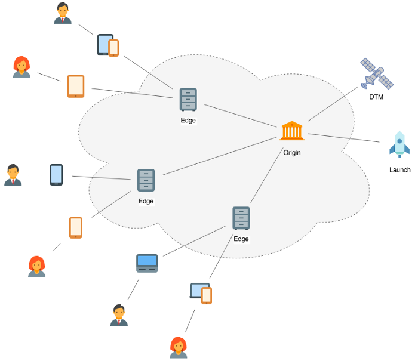

# Adobe-managed hosts overview

>[!NOTE]
>
>Adobe Experience Platform Launch has been rebranded as a suite of data collection technologies in Adobe Experience Platform. Several terminology changes have rolled out across the product documentation as a result. Please refer to the following [document](../../../term-updates.md) for a consolidated reference of the terminology changes.

Adobe-managed hosts are the default host setting for deploying your tag library builds in Adobe Experience Platform. When you create a new property through the Data Collection user interface, a default Adobe-managed host is created for you. 

With Adobe-managed hosts, library builds are delivered to a third-party content delivery network (CDN) that Adobe has contracted with. These CDNs operate independently from Adobe, so even when Platform is undergoing maintenance or is otherwise down, your deployed code will continue to function as normal on your sites and applications. The embed code for an Adobe-managed host references the main library file on the CDN so a client device can retrieve the files at runtime.

This document provides an overview of Adobe-managed hosts in Platform and provides steps on how to create a new Adobe-managed host in the UI.

## Akamai

Currently, the primary CDN provider for Adobe is [Akamai](https://www.akamai.com/). Akamai's robust CDN is built to serve content to a global, high-volume audience of web visitors. The CDN runs redundant networks of load-balanced, geo-optimized nodes in order to serve content as quickly as possible to visitors located throughout the world.

Specifically, Akamai runs more than 137,000 servers in 87 countries within more than 1,150 networks. In terms of redundancy, the CDN not only routes from one server to another but can also route from one node of servers to another node of servers as needed. In other words, each node consists of multiple servers, so that one server going down never becomes an issue as the other servers on the same node can take over.

If an entire node goes down, Akamai serves from the next closest node with the same cached content. Nodes are dynamically selected based on visitor location, traffic load, and other factors so that content is consistently served from the best local node for each visitor.

Files hosted on Akamai have a domain of `assets.adobedtm.com`. This can be referenced securely or not (`http://` or `https://`) based on how it is called within in your embedded `<script>` code.

>[!WARNING]
>
>If your library is unavailable from the Akamai network, Platform is unable to prevent any errors that may arise because of it.

## Library build caching

When using Adobe-managed hosts, your library builds are cached in two locations:

* [Edge caching](#edge)
* [Browser caching](#browser)

### Edge caching {#edge}

The primary purpose of a CDN is to intelligently distribute content to servers that are geographically closer to end-users so that the content can be retrieved more quickly by client devices. CDNs achieve this by making copies of the content available on geographically distributed servers around the world ("edge nodes").

Once your build has been deployed to the Adobe-managed host, the CDN distributes the build on several centralized servers ("origins"), who then send copies of the build to many different edge nodes around the world for caching. The cached versions of the build stored on these edge nodes are then ultimately served to client devices.

>[!NOTE]
>
>For Adobe-managed hosts, the very first published library to any new environment can take up to five minutes to propagate out to the global CDN. 

When an edge node receives a request for a specific file (such as your library build), the node first checks the expiration time on the file. If the time has not expired, the edge node serves the cached version. If the time has expired, then the edge node requests a new copy from the nearest origin, serves that refreshed copy, and then caches the refreshed copy with a new expiration time.

>[!NOTE]
>
>In addition to edge node caching, there may also be intermediate networks (such as corporate or mobile networks) that perform their own caching. If your builds are not caching as expected, these networks may be the underlying cause.

#### Edge cache invalidation {#invalidation}

When you upload a new library build, the caches on all applicable edge nodes are invalidated. This means that each node considers its cached version to be invalid, regardless of how recently it retrieved a fresh copy. The next time an edge node receives a request for that file, the node retrieves a fresh copy from the origin.

Because Akamai has multiple origin servers that replicate files between each other, and because there is no way of knowing which origin received your file first, these node requests can hit an origin that does not have the latest version. It would then cache the older version again. To prevent this from occurring, multiple cache invalidations are performed for each new build on the following intervals:

* Immediately after upload
* 5 minutes after upload
* 60 minutes after upload

These staggered cache invalidations give the origin server groups time to replicate the latest version of the file between themselves so they all have the latest version when the file is retrieved.

### Browser caching {#browser}

Library builds are also cached on the browser through the use of the `cache-control` HTTP header. When using Adobe-managed hosts, you do not have control over the headers returned in API responses, so the Adobe default for caching is used. In other words, you cannot utilize custom headers for Adobe-managed hosts. If you require a custom `cache-control` header, you may want to consider [self-hosting](self-hosting-libraries.md) instead.

The expiration time for your browser-cached library build (determined by the `cache-control` header) will vary depending on the tag environment you are using:

| Environment | `cache-control` value |
| --- | --- |
| Development | `max-age=0, no-cache, no-store` |
| Staging | `max-age=0, no-cache, no-store` |
| Production | `max-age=3600` |

As the table above indicates, browser caching is not supported on development and staging environments. As such, you should not use the development or staging embed codes in high-traffic or production contexts.

Cache-control headers are only applied for the main library build. Any sub-resources below the main library are always considered net-new, and therefore there is no need to cache them on the browser.

## Using Adobe-managed hosting in the UI

When you first create a property in the Platform UI or Data Collection UI, an Adobe-managed host is automatically created for you. All available environments that have immediately usable properties are also assigned to the Adobe-managed host by default.

>[!NOTE]
>
>If the default Adobe-managed host is unassigned from all environments, the host can be deleted. If you want to switch back to an Adobe-managed host after doing this, you can create a new host through the following steps:
>
>1. Select the **[!UICONTROL Hosts]** tab on your property, then select **[!UICONTROL Add Host]**.
>1. Provide a name for the host, select **[!UICONTROL Managed by Adobe]** as the host type, then select **[!UICONTROL Save]**.
>
>You can then re-assign your environments to the Adobe-managed host as desired.

## Next steps

This document provided an overview of Adobe-managed hosting for tag libraries in Adobe Experience Platform. For information on other hosting options, refer to the following documentation:

* [SFTP hosting](./sftp-host.md)
* [Self-hosting libraries](./self-hosting-libraries.md)

For details on how to manage hosts for your environments, see the [environments guide](../environments.md).
