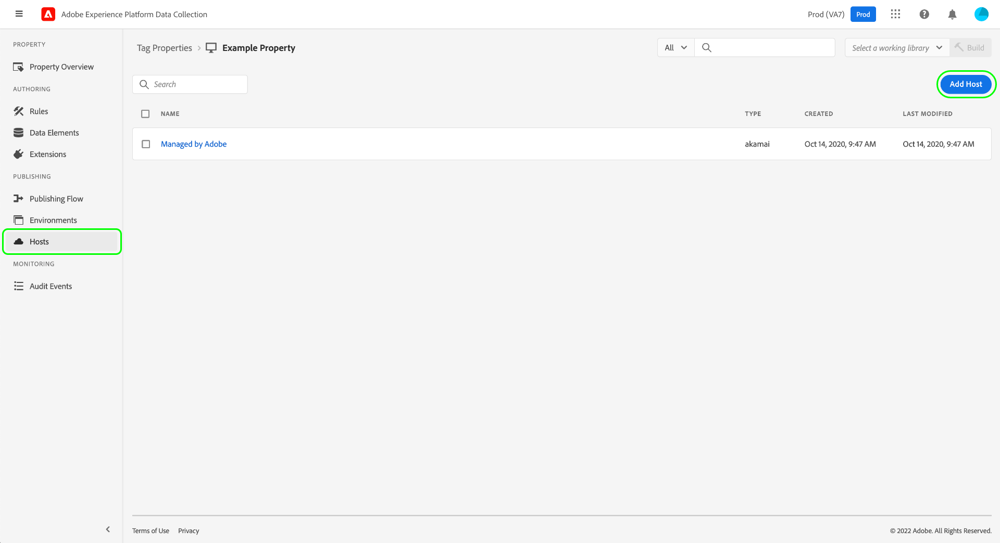
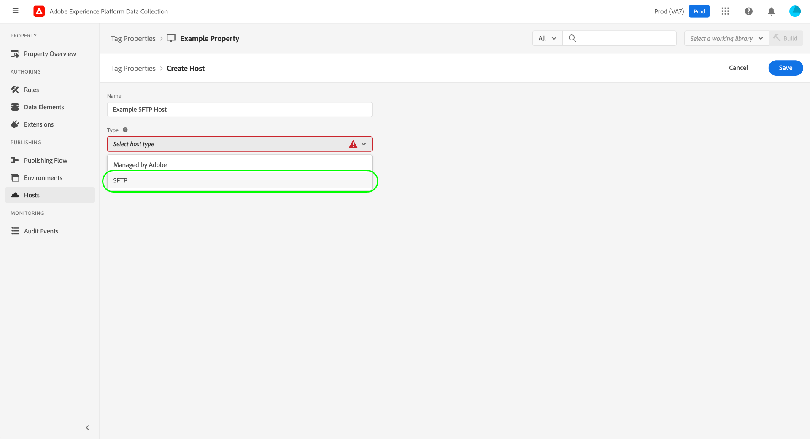
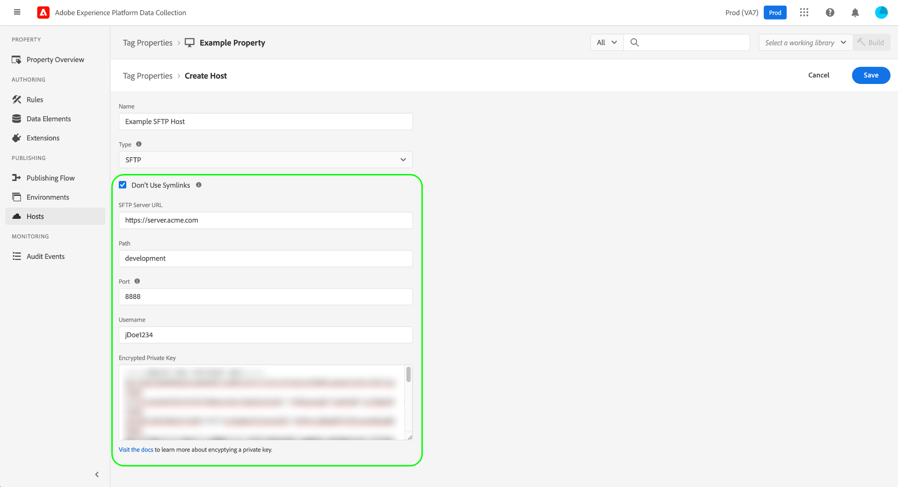
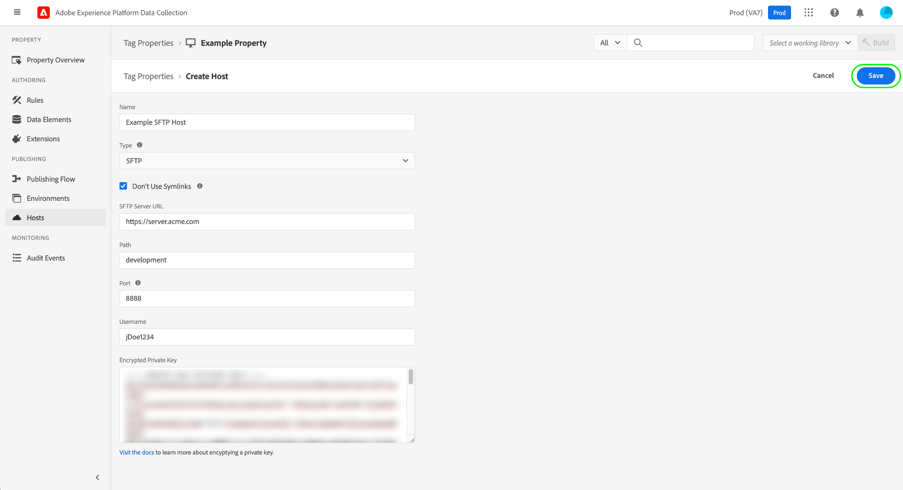

# SFTP hosts

>[!NOTE]
>
>Adobe Experience Platform Launch has been rebranded as a suite of data collection technologies in Adobe Experience Platform. Several terminology changes have rolled out across the product documentation as a result. Please refer to the following [document](../../../term-updates.md) for a consolidated reference of the terminology changes.

Adobe Experience Platform allows you to deliver tag library builds to a secured SFTP server that you host, giving you greater control over how your builds are stored and managed. This guide covers how to set up an SFTP host for a tag property in the Experience Platform UI or Data Collection UI.

>[!NOTE]
>
>You can also opt to use a host that is managed by Adobe instead. See the guide on [Adobe-managed hosts](./managed-by-adobe-host.md) for more information.
>
>For information on the benefits and limitations of self-hosting libraries, see the [self-hosting guide](./self-hosting-libraries.md).

## Set up an access key for your server {#access-key}

Platform connects to your SFTP site using an encrypted key. There are a few steps to set this up correctly:

### Create a public/private key pair

You must have a public/private key pair installed on your SFTP server. You can generate these keys on your server or generate them somewhere else and install them on your server. See the GitHub documentation regarding [how to generate SSH keys](https://help.github.com/articles/generating-a-new-ssh-key-and-adding-it-to-the-ssh-agent/#generating-a-new-ssh-key) for more information.

### Encrypt your keys

The private key is used to encrypt the public key. You will need to provide your private key during the SFTP host creation process. See the section on [encrypting values](../../../api/guides/encrypting-values.md) in the Reactor API guide for instructions on encrypting public keys. Use the Production Environment's GPG key unless you know you need a specific one. Finally, you can encrypt your private key from any machine, so you do not need to install GPG on your server to complete this step.

### Allowlist Platform IP addresses

You may need to approve a set of IP addresses to be used within your company firewall to allow Platform to reach your SFTP server and connect to it. These IP Addresses are:

* `184.72.239.68`
* `23.20.85.113`
* `54.226.193.184`

>[!NOTE]
>
>The structure of tag builds has changed over time. They use symbolic links (symlinks) internally to maintain backward compatibility so that previous embed codes will continue to work with the latest build structure. Your SFTP server must support the usage of symlinks in order to serve as a valid destination for tag builds.

For more detailed information, refer to the following Medium article on [how to set up SFTP servers to deliver a build](https://medium.com/launch-by-adobe/configuring-an-sftp-server-for-use-with-adobe-launch-bc626027e5a6).

## Create an SFTP host {#create}

Select **[!UICONTROL Hosts]** in the left navigation, followed by **[!UICONTROL Add Host]**.

The host creation dialog appears. Provide a name for the host, and under **[!UICONTROL Type]**, select **[!UICONTROL SFTP]**.

### Configure the SFTP host {#configure}

The dialog expands to include additional configuration options for the SFTP host. These are explained below.

| Configuration field | Description |
| --- | --- |
| [!UICONTROL Don't Use Symlinks] | By default, all SFTP hosts use symbolic links (symlinks) to reference library [builds](../builds.md) that are saved to the server. However, not all servers support the use of symlinks. When this option is selected, the host uses a copy operation to update the build assets directly instead of using symlinks. |
| [!UICONTROL SFTP Server URL] | The URL base path for your server. |
| [!UICONTROL Path] | The path to append to the base server URL for this host. |
| [!UICONTROL Port] | The port must be one of the following:<ul><li>`21`</li><li>`22`</li><li>`80`</li><li>`200-299`</li><li>`443`</li><li>`2000-2999`</li><li>`4343`</li><li>`8080`</li><li>`8888`</li></ul>As a security best practice, Adobe limits the number of ports that can be used for outgoing traffic. The selected ports are commonly allowed through corporate firewalls and include some ranges for flexibility. |
| [!UICONTROL Username] | The username to be used when accessing the server. |
| [!UICONTROL Encrypted Private Key] | The encrypted private key that you created in a [previous step](#access-key). |

Select **[!UICONTROL Save]** to create the host with the selected configuration.

When you select **[!UICONTROL Save]**, the connection and ability to deliver the files to your SFTP server is tested. Platform creates a folder, writes a file within that folder, checks to make sure the file is there, and then cleans up after itself. If the user account on your SFTP server (the one attached to the secure certificate you provided to Platform) does not have the necessary permissions to perform this action, then the host goes into a "Failed" status.

## Next steps

This guide covered how to set up a self-hosted SFTP server for use in tags. Once the host has been established, you can associate it with one or more of your [environments](../environments.md) for publishing tag libraries. For more information on the high-level process of activating tag functionalities on your web or mobile properties, see the [publishing overview](../overview.md).
