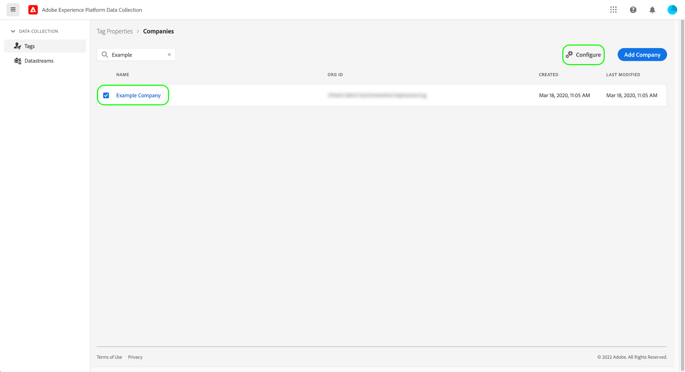
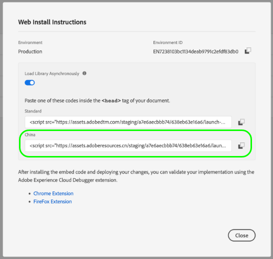

# Premium CDN support for tags (Beta)

>[!IMPORTANT]
>
>The premium CDN feature for tags is currently in beta and your organization may not have access to it yet. This documentation is subject to change.

When you use an [Adobe-managed host](./hosts/managed-by-adobe-host.md) to deliver your Adobe Experience Platform tags assets on your website, these assets are distributed amongst various content delivery networks (CDNs) around the world to deliver the quickest download speed. However, there are certain regions that require all website assets to be replicated and hosted on a server within that region.

To account for this, tags in Experience Platform provides a premium CDN feature which allows you to deliver content to these special regions.

Premium CDN support is a paid feature, and must be purchased by your organization in order to enable and use it. This guide covers how to configure and use this feature in the Data Collection UI after it has been purchased.

## Enable premium CDN for a company

Premium CDN is enabled at the company level, meaning that you must have company edit permissions to enable the feature.

In the Data Collection UI, navigate to **[!UICONTROL Tags]** > **[!UICONTROL Companies]**. From here, select the company that you want to enable the feature for, then select **[!UICONTROL Configure]** .

In the configuration dialog that appears, select the option for **[!UICONTROL Premium CDN Enabled]** before selecting **[!UICONTROL Save]** to confirm your changes.

## Rebuild and install tag libraries with updated embed codes

Enabling the premium CDN feature does not mean that your tag assets are immediately replicated and ready to use within the new regions. It only means that you can now choose when to opt in to this functionality.

>[!IMPORTANT]
>
>Libraries built before enabling premium CDN will continue to operate as-is exactly as they do today. This also applies to libraries not managed by Adobe, since [archived environments](./environments.md#archive) only use relative URLs for their asset paths. Please note that after you have enabled premium CDN, any library you build that is not managed by Adobe will behave as if the premium CDN feature is not enabled.

Once you have enabled premium CDN and rebuilt any libraries that you wish to use from the new hosting regions, you can retrieve the new hosting region embed codes to add to your websites. 

Visit the **[!UICONTROL Environments]** page  or view the environment install instructions from the library edit screen to find the new embed codes. Each new supported hosting region appears after the [!UICONTROL Standard] hosting region (used for areas in the world that are supported without premium CDN). The screenshot below shows an embed code for the China region, which uses `.cn` as its top-level domain (TLD).

>[!NOTE]
>
>The library embed code that is listed under Standard will continue to work as-is, as well as any Page Top or Page Bottom embed codes already on your websites.

Choose the appropriate embed code for the webpage, and paste it within the `<head>` tag of your document. For more information using embed codes to install tag libraries, please refer to the [environments UI guide](./environments.md#installation).

## Next steps

This guide covered how to enable and install the premium CDN feature for your tags implementation. For more information on installing and testing tag libraries on your web and mobile properties, refer to the [publishing overview](./overview.md).
