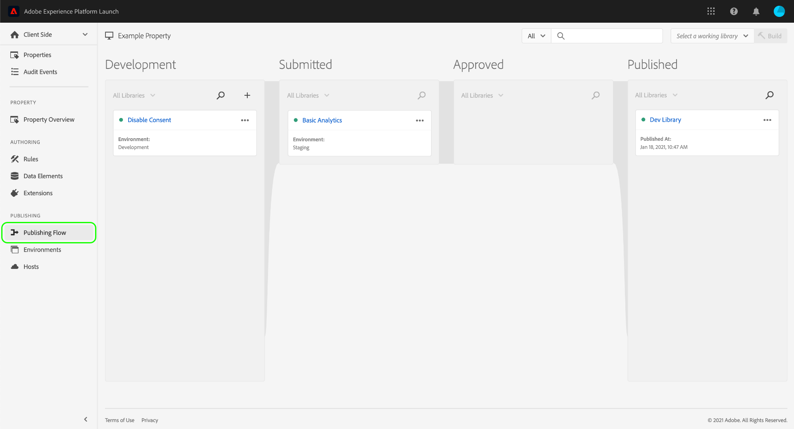
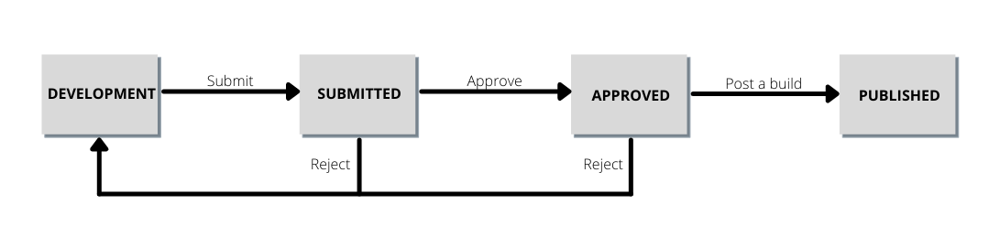
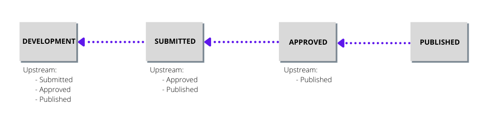
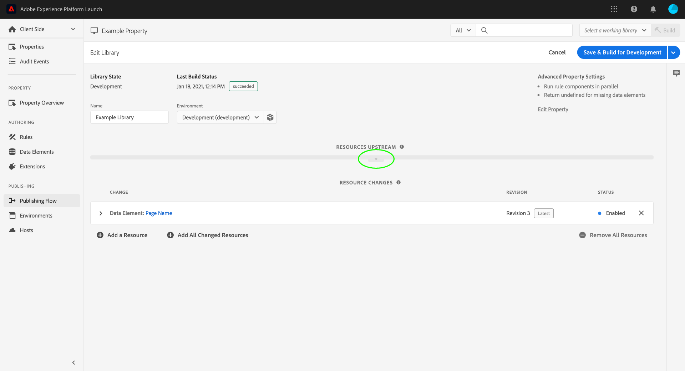
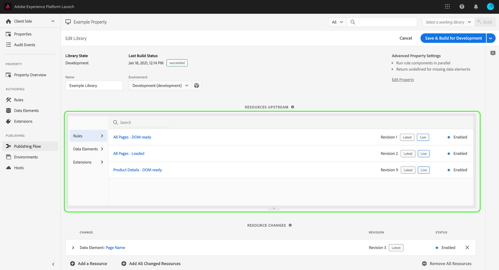

# Publishing flow

>[!NOTE]
>
>Adobe Experience Platform Launch has been rebranded as a suite of data collection technologies in Adobe Experience Platform. Several terminology changes have rolled out across the product documentation as a result. Please refer to the following [document](../../term-updates.md) for a consolidated reference of the terminology changes.

The tags publishing flow in Adobe Experience Platform refers to the process of creating libraries, testing builds, and approving them for production.

The available actions that you can make on a library depend on the library's state and the level of permission you have. In addition, a library's state also affects the resources it contains (rules, data elements, and extensions) depending on what is upstream in the publishing flow.

The sections below cover the details about permissions, library state, and the upstream as they pertain to the publishing flow.

## Permissions {#permissions}

There are different levels of user permissions that are important for the publishing flow; specifically, the [!UICONTROL Develop], [!UICONTROL Approve], and [!UICONTROL Publish] property rights:

* **[!UICONTROL Develop]**: Includes the ability to create libraries, build for development, and submit for approval.
* **[!UICONTROL Approve]**: Includes the ability to build for staging and approve staged builds.
* **[!UICONTROL Publish]**: Includes the ability to publish an approved library.

These rights are not inclusive. For a single person to perform the workflow from start to finish, that person must be granted all three rights within a given property.

See the [user permissions guide](../administration/user-permissions.md) for more information on managing permissions for tags.

## Library state {#state}

When it comes to the publishing flow, there are four basic states that a library can be in:

* [[!UICONTROL Development]](#development)
* [[!UICONTROL Submitted]](#submitted)
* [[!UICONTROL Approved]](#approved)
* [[!UICONTROL Published]](#published)

These four states are represented as columns within the **[!UICONTROL Publishing Flow]** tab.

Specific actions must be taken to move a library between these states. The following diagram outlines each action that moves a library between states:

### [!UICONTROL Development] {#development}

When new libraries are created, they start in the [!UICONTROL Development] state. Any changes to a library must be made while the library is in [!UICONTROL Development]. When development and testing are completed, the library can be submitted for approval.

The following table outlines the available actions for a library in the [!UICONTROL Development] state:

| Action | Description |
| --- | --- |
| [!UICONTROL Edit] | Use the [!UICONTROL Edit Library] screen to add or remove components from the library. |
| [!UICONTROL Build to Development] | Create a build for the library. The build is compiled and deployed to the environment that the library is assigned to. This step fails if the library has not been assigned to an environment, or contains a change that is already defined in the upstream. |
| [!UICONTROL Submit for Approval] | Unassign the library from the development environment, and move the library to the [!UICONTROL Submitted] column for a user with approval permissions to work on. The most recent build for the library must be successful in order for this option to be enabled. |
| [!UICONTROL Submit & Build to Staging] | This can only be performed by a user with both the Develop and Approve rights. This action unassigns the library from the development environment, moves the library to the [!UICONTROL Submitted] state, and builds the library to the staging environment. The most recent build for the library must be successful in order for this option to be enabled. |
| [!UICONTROL Approve for Publishing] | This can only be performed by a user with both the Develop and Approve rights. This action unassigns the library from the development environment and moves it to the [!UICONTROL Approved] state - skipping the staging environment and the [!UICONTROL Submitted] state entirely. The most recent build for the library must be successful in order for this option to be enabled. |
| [!UICONTROL Approve & Publish to Production] | This can only be performed by a user with the Develop, Approve, and Publish rights. This action unassigns the library from the development environment, moves it to the [!UICONTROL Approved] state, and publishes to production. Upon completion of the production build, the library will move to the [!UICONTROL Published] state. The most recent build for the library must be successful in order for this option to be enabled. |
| [!UICONTROL Delete] | Remove the library from the system. This does not remove the build from the environment. |

### [!UICONTROL Submitted] {#submitted}

When a library is in the [!UICONTROL Submitted] state, a user with approval permissions can test the library in the staging environment. When testing is completed, the library can be approved or rejected. Rejected builds go back to [!UICONTROL Development] so additional changes can be made before restarting the publishing flow.

The following table outlines the available actions for a library in the [!UICONTROL Submitted] state:

| Action | Description |
| --- | --- |
| [!UICONTROL Open] | View the contents of the library. Changes are not allowed for libraries outside of the [!UICONTROL Development] column. If changes are needed, the library should be rejected so changes can be made in [!UICONTROL Development]. |
| [!UICONTROL Build for Staging] | Build the library in the staging environment for deployment. |
| [!UICONTROL Approve for Publishing] | Move the library to the [!UICONTROL Approved] column for a user with publishing permissions to work on. |
| [!UICONTROL Approve & Publish to Production] | This can only be performed by a user with both Approve and Publish rights. This action unassigns the library from the staging environment, moves it to the [!UICONTROL Approved] state, and publishes to production. Upon completion of the production build, the library will move to the [!UICONTROL Published] state. This can be performed with our without a successful build in the staging environment. |
| [!UICONTROL Reject] | Unassign the library from the staging environment and move the library back to the [!UICONTROL Development] column for further changes. |

### [!UICONTROL Approved] {#approved}

Once a library has been approved, a user with publishing permissions can publish or reject the library. Rejected builds go back to [!UICONTROL Development] so that further changes can be made before the publishing flow begins again.

The following table outlines the available actions for a library in the [!UICONTROL Approved] state:

| Action | Description |
| --- | --- |
| [!UICONTROL Open] | View the contents of the library. Changes are not allowed for libraries outside of the [!UICONTROL Development] column. If changes are needed, the library should be rejected so changes can be made in [!UICONTROL Development]. |
| [!UICONTROL Build and Publish to Production] | Unassign the library from the staging environment, assign the library to the production environment, and deploy it.  **Important**: When this option is selected, your library becomes live in your production environment. Ensure that the library contains the changes you want before you select this option. |
| [!UICONTROL Reject] | Unassign the library from the staging environment and move the library to the [!UICONTROL Development] column for further changes. |

### [!UICONTROL Published] {#published}

The [!UICONTROL Published] column shows which libraries have been published and their publish dates. The currently published library will show with a green dot next to it. Unless you have performed a republish on a previous library, this will always be the library at the top of the column.

| Action | Description |
| --- | --- |
| [!UICONTROL Open] | View the contents of the library. Changes are not allowed for libraries outside of the [!UICONTROL Development] column. If you want to change what is in your production environment, you must create a new library and move it through the complete publishing process. |
| [!UICONTROL Republish] | This action is only available on the five most recently published libraries, and only if the production environment is (A) configured with the Archive option off and (b) uses a [!UICONTROL Managed by Adobe] host at the time of the build. |
| [!UICONTROL Download] | This action is only available on the five most recently published libraries, and only if the production environment is (A) configured with the Archive option on and (b) uses a [!UICONTROL Managed by Adobe] host at the time of the build. |

## Upstream {#upstream}

After you have published your first library, it becomes important to understand the role of the upstream as you move newer libraries through the publishing flow.

If a library is currently in the [!UICONTROL Development], [!UICONTROL Submitted], or [!UICONTROL Approved] stage, that library will inherit the rules, data elements, and extensions of any libraries that are upstream. These inherited resources constitute a "baseline" for each library as they move through the publishing flow. Essentially, you can think of each new library simply as a series of changes to the baseline that is established by the upstream. This ensures that nothing gets unexpectedly overwritten from a previous library when a new iteration is published.

What is included in the upstream depends on the current stage of the library. For example, libraries in the [!UICONTROL Approved] column only inherit resources from the [!UICONTROL Published] library, whereas libraries under [!UICONTROL Development] inherit resources from all other columns.

When editing a library in the UI, all resources that are inherited from the upstream are represented in the **[!UICONTROL Resources Upstream]** section. To view these resources, select the expand tab below the section heading.

The section expands to show the individual resources that are inherited from the upstream. You can use the left rail to filter between [!UICONTROL Rules], [!UICONTROL Data Elements], and [!UICONTROL Extensions], or use the search bar to look up a specific resource by name.

## Next steps

This guide provided a high-level overview of the publishing flow for libraries in Adobe Experience Platform. To learn more about how to publish your libraries, refer to the [publishing overview](./overview.md).
