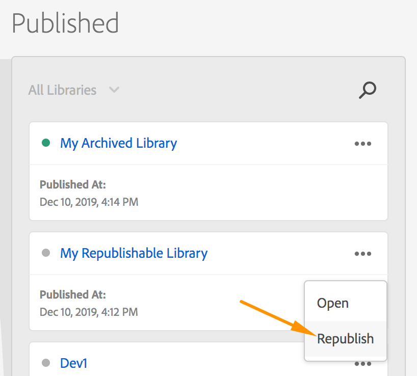

# Republish a library

>[!NOTE]
>
>Adobe Experience Platform Launch has been rebranded as a suite of data collection technologies in Adobe Experience Platform. Several terminology changes have rolled out across the product documentation as a result. Please refer to the following [document](../../term-updates.md) for a consolidated reference of the terminology changes.

The five most recent libraries that have been published to your production environment on a Web property are available for later retrieval. This feature is helpful when you find a bug in your production library and need to rollback to a known good state immediately.

The retrieval process depends on your environment settings at the time the library was originally published. This is important because retrieving an archived library does not change anything on your live site, while retrieving a regular library would.

The following options are available:

* **Host: Managed by Adobe, Archive: Off:** If you are using the Managed by Adobe host and you are not archiving your library, you can republish these older libraries.

* **Host: Managed by Adobe, Archive: On:** If you are using the Managed by Adobe host and you are archiving your library, then you can download these older libraries.

* **Host: SFTP, Archive: On or Off:** If you are using the SFTP host, it is assumed that you have your own archival strategies in place and no retrieval options are available.

Retrieval options for mobile properties are not yet available.

## Republishing

Each tag environment provides a link to a library file. Any library that you build in that environment can be referenced with that link.

When you build to a development or staging environment, the old build is cleaned up and the new build is deployed. For your production environment, this link is updated to point to the latest build, but the five most recent builds are kept around before they are cleaned up.

These five most recent builds in your production environment are the ones that are available for retrieval.

When you republish an older library, Platform updates the environment link to point to one of these older builds that hasn't been cleaned up yet.  Platform also issues a purge request to the CDN edge nodes cache to indicate that the library has been updated and a fresh copy should be retrieved from the origin.

This means that when you republish an older library:

* No changes are made to any of the resources (or historical revisions) in your tag property

* The way that development and staging environments calculate what is upstream does not change

Consider the scenario when you roll back because of a problem with a specific rule. The rule revision that is now in production might, for example, be three revisions old.  When you view that rule in the UI to fix it, it still reflects the latest changes saved rather than what is currently in production.

For this reason, Platform notifies you that a property is in a republished state as a reminder that what you're seeing in the Data Collection user interface is a little farther removed from Production than usual. This notification is dismissible and appears once per browser session the first time you view the property.

### How to Republish an older library

From the Publishing screen:

1. Find the library in the Published column that you'd like to republish.
1. Select the ellipsis (`...`) in the upper-right corner of the Library card.
1. Select **[!UICONTROL Republish]**.

## Download

Downloading an Archived library is more straightforward. You aren't directly referencing these .zip files anywhere, so you can simply download the older library to your computer and run your usual process.

### How to Download an older library

From the Publishing screen:

1. Find the library in the Published column that you'd like to download.
1. Select the ellipsis (`...`) in the upper-right corner of the Library card.
1. Select **[!UICONTROL Download]**.
