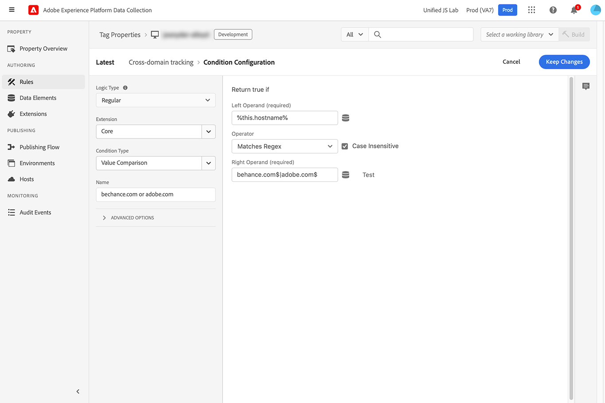

# `appendIdentityToUrl`

The `appendIdentityToUrl` command allows you to add a user identifier to the URL as a query string. This action allows you to carry a visitor's identity between domains, preventing duplicate visitor counts for datasets that include both domains or channels. It is available on Web SDK versions 2.11.0 or later.

The query string generated and appended to the URL is `adobe_mc`. If the Web SDK cannot find an ECID, it calls the `/acquire` endpoint to generate one.

>[!NOTE]
>
>If consent has not been provided, the URL from this method is returned unchanged. This command runs immediately; it does not wait for a consent update.

## Append identity to URL using the Web SDK extension

Appending an identity to a URL is performed as an action within a rule in the Adobe Experience Platform Data Collection tags interface.

1. Log in to [experience.adobe.com](https://experience.adobe.com) using your Adobe ID credentials.
1. Navigate to **[!UICONTROL Data Collection]** > **[!UICONTROL Tags]**.
1. Select the desired tag property.
1. Navigate to **[!UICONTROL Rules]**, then select the desired rule.
1. Under [!UICONTROL Actions], select an existing action or create an action.
1. Set the [!UICONTROL Extension] dropdown field to **[!UICONTROL Adobe Experience Platform Web SDK]**, and set the [!UICONTROL Action Type] to **[!UICONTROL Redirect with identity]**.
1. Click **[!UICONTROL Keep Changes]**, then run your publishing workflow.

This command is typically used with a specific rule that listens for clicks and checks desired domains.

+++Rule event criteria

Triggers when an anchor tag with an `href` property is clicked.

* **[!UICONTROL Extension]**: Core
* **[!UICONTROL Event type]**: Click
* **[!UICONTROL When the user clicks on]**: Specific elements
* **[!UICONTROL Elements matching the CSS selector]**: `a[href]`


+++

+++Rule condition

Triggers only on desired domains.

* **[!UICONTROL Logic type]**: Regular
* **[!UICONTROL Extension]**: Core
* **[!UICONTROL Condition Type]**: Value Comparison
* **[!UICONTROL Left Operand]**: `%this.hostname%`
* **[!UICONTROL Operator]**: Matches Regex
* **[!UICONTROL Right Operand]**: A regular expression that matches the desired domains. For example, `adobe.com$|behance.com$`



+++

+++Rule action

Append the identity to the URL.

* **[!UICONTROL Extension]**: Adobe Experience Platform Web SDK
* **[!UICONTROL Action Type]**: Redirect with identity


+++

## Append identity to URL using the Web SDK JavaScript library

Run the `appendIdentityToUrl` command with a URL as a parameter. The method returns a URL with the identifier appended as a query string.

```js
alloy("appendIdentityToUrl",document.location);
```

You can add an event listener for all clicks received on the page and check to see if the URL matches any desired domains. If it does, append the identity to the URL and redirect the user.

```js
document.addEventListener("click", event => {
  // Check if the click was a link
  const anchor = event.target.closest("a");
  if (!anchor || !anchor.href) return;

  // Check if the link points to the desired domain
  const url = new URL(anchor.href);
  if (!url.hostname.endsWith(".adobe.com") && !url.hostname.endsWith(".behance.com")) return;

  // Append the identity to the URL, then direct the user to the URL
  event.preventDefault();
  alloy("appendIdentityToUrl", {url: anchor.href}).then(result => {document.location = result.url;});
});
```

## Response object

If you decide to [handle responses](command-responses.md) with this command, the response object contains **`url`**, the new URL with identity information added as a query string parameter.
