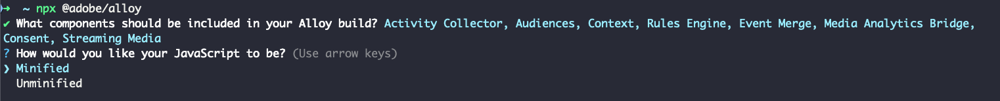

# Create a custom Web SDK build

The Experience Platform Web SDK library contains multiple modules which enable the various Web SDK features, such as personalization, identity, link tracking, and more. Depending on your use cases, you might need only specific Web SDK functionality instead of the entire library. This is where custom Web SDK builds come in handy.

When you create a custom Web SDK build, you select only the modules that you need for your specific implementation. This reduces the size of the Web SDK library and increases performance.

## Use case {#use-case}

The main use case of creating your own custom Web SDK build is aimed towards reducing the size of the library and increasing performance.

For instance, let's consider you want to deploy Web SDK on your website, but you have no media for which to collect data.

By creating a custom Web SDK build, you can exclude the [!DNL Media Analytics] and the [!DNL Streaming Media] modules from the build, which can decrease the size of your Web SDK build by up to 50% and increase loading speed.

## Prerequisites {#prerequisites}

Custom Web SDK build creation is supported by the Web SDK NPM package. See the documentation on how to [install the Web SDK using the NPM package](npm.md) for more details.

Before you can use the NPM package, make sure you have [Node.js](https://nodejs.org/en/download/package-manager/all) installed on your machine.

## Components and dependencies {#components-dependencies}

Before you create a custom Web SDK build for your integration, make sure you clearly define what Web SDK components and commands you are planning to use.

Some Web SDK commands depend on certain modules being included in the build.

The table below shows the correspondence between Web SDK modules and the commands they include.

| Module dependency | Configuration parameters | Commands |
|---------|----------|---------|
| Activity Collector | [`clickCollectionEnabled`](../commands/configure/clickcollectionenabled.md) | N/A |
| Audiences | N/A | N/A |
| Context | [`context`](../commands/configure/context.md) | M/A |
| Rules Engine | `personalizationStorageEnabled` | <ul><li>`evaluateRulesets`</li><li>[`subscribeRulesetItems`](../commands/subscriberulesetitems.md)</li></ul> |
| Event Merge | N/A | `createEventMergeId` |
| Media Analytics Bridge | N/A | [`getMediaAnalyticsTracker`](../commands/getmediaanalyticstracker.md) |
| Personalization | <ul><li>[`prehidingStyle`](../commands/configure/prehidingstyle.md)</li><li>[`targetMigrationEnabled`](../commands/configure/targetmigrationenabled.md)</li><li>[`autoTrackPropositionInteractions`](../commands/configure/autotrackpropositioninteractionsenabled.md)</li></ul>  | N/A |
| Consent | [`defaultConsent`](../commands/configure/defaultconsent.md) | [`setConsent`](../commands/setconsent.md) |
| Streaming Media | [`streamingMedia`](../commands/configure/streamingmedia.md) | <ul><li>[`createMediaSession`](../commands/createmediasession.md)</li><li>[`sendMediaEvent`](../commands/sendmediaevent.md)</li></ul> |

## Create a custom Web SDK build using the NPM package {#create-custom-build}

1. Open your terminal and run `npx @adobe/alloy`. You are asked to select the Web SDK components that you would like your custom build to include.

    

    Use your arrow keys to move up and down in the modules list.

    * Press **Space** to enable or disable the selected module.
    * Press `A` to enable or disable all modules.
    * Press `I` to invert your selection.
    * Press `Enter` to confirm your selection and go to the next step.

1. After you have selected the modules to include in your custom build, you can choose between saving a minified or unminified version of your custom Web SDK library build. Select your desired option and press `Enter`.

    

1. Next, you are asked where you want to save the build on your local machine. Press `Enter` to confirm the preselected location or enter a new location.

    

1. Once you confirm the location, your custom build is generated and saved.

    

