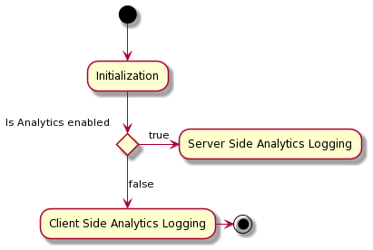

# Adobe Analytics for Target (A4T) logging in the Platform Web SDK

When using Adobe Target for personalization, you can choose which system you want to use for performance measurement. Each [Target activity](https://experienceleague.adobe.com/docs/target/using/activities/target-activities-guide.html) allows you to select between Target reporting and Adobe Analytics reporting. 

If you are using Analytics reporting, Adobe Target has to communicate the following to Analytics:

* Which Adobe Target activity your visitors have entered
* Which experience they have seen
* Which conversion has been reached

The Adobe Experience Platform Web SDK supports two types of Analytics logging for Analytics for Target (A4T) use cases:

| Logging method | Description |
| --- | --- |
| Server-side Analytics logging | All Analytics hits sent through the Edge Network are augmented with Target details on the server side, without having to go through the hit stitching process.  | 
| Client-side Analytics logging | Target data is returned on the client side, allowing you to manually augment and send data to Analytics using the [Data Insertion API](https://experienceleague.adobe.com/docs/analytics/import/c-data-insertion-api.html).| 

The logging method is determined by whether you have Adobe Analytics enabled on your configured [datastream](../../../../datastreams/overview.md):

## Next steps

This document provided a brief introduction to the different logging methods for A4T data in the Web SDK. For more detailed information on each of these methods, refer to the following documentation:

* [Server-side logging for A4T data in the Platform Web SDK](./server-side.md)
* [Client-side logging for A4T data in the Platform Web SDK](./client-side.md)
