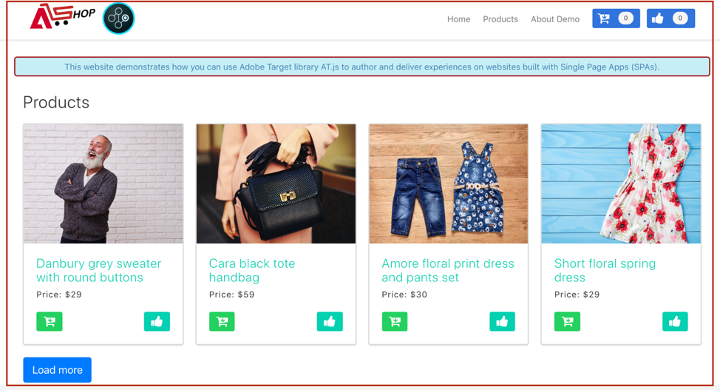
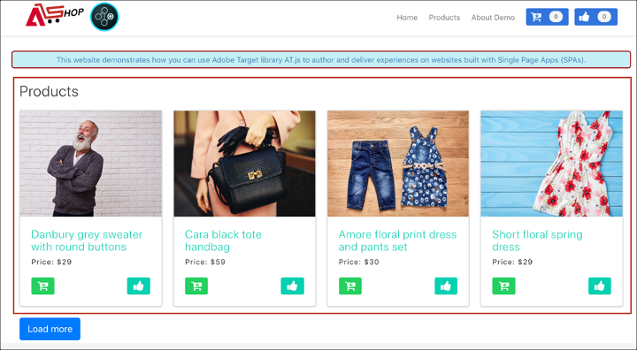
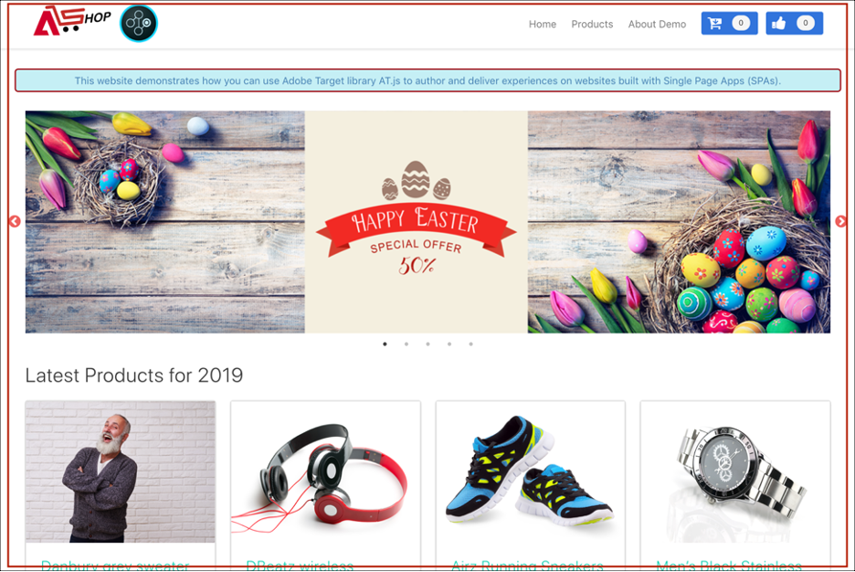
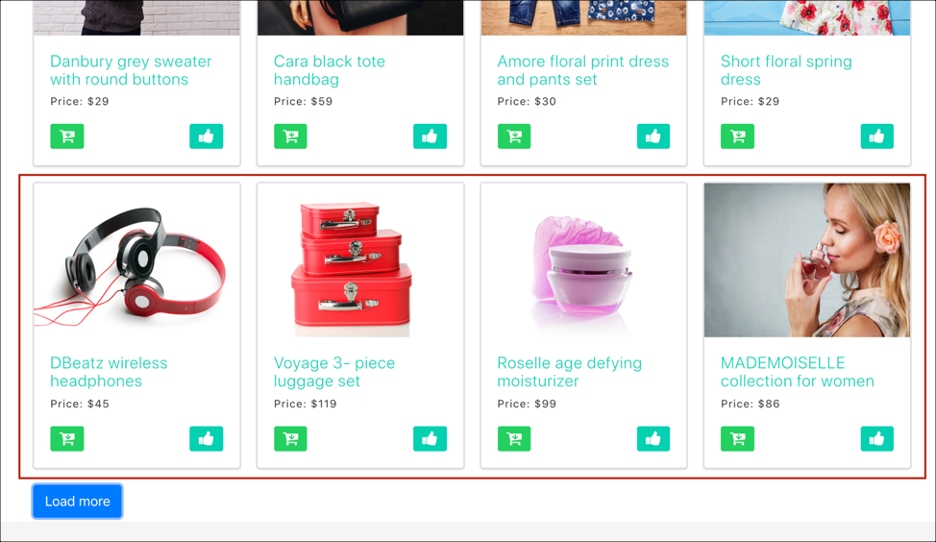
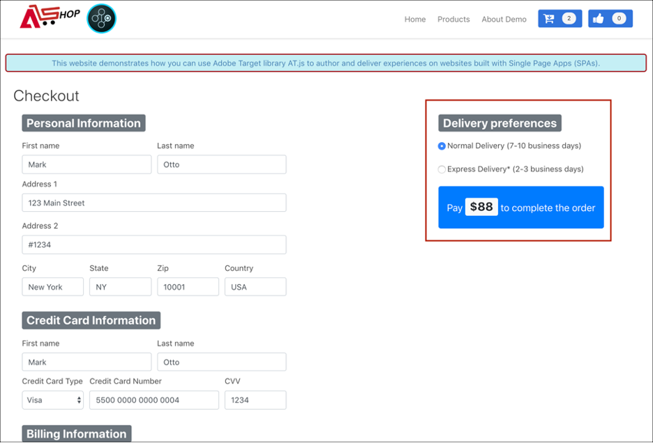
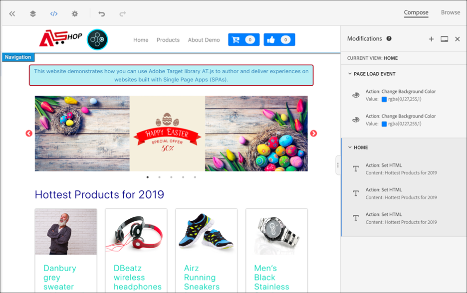
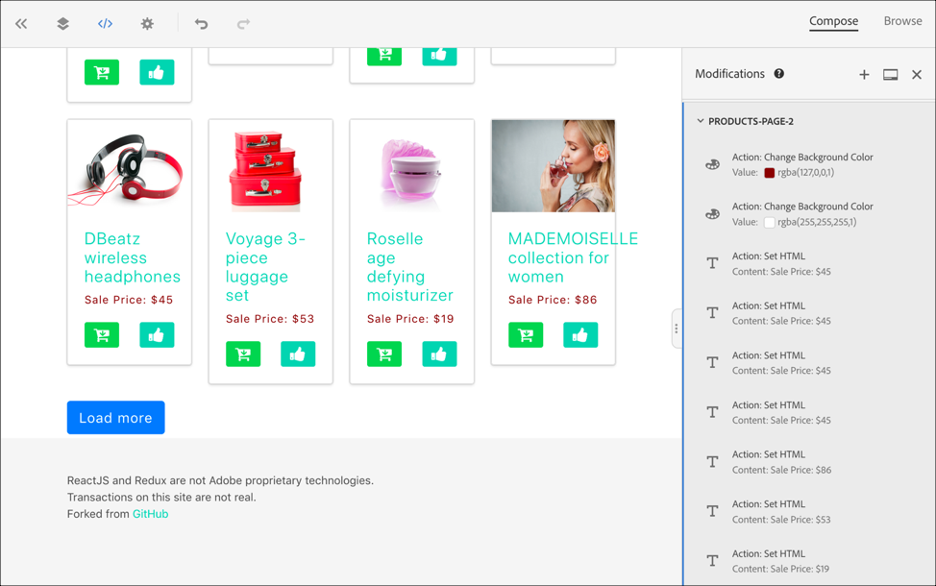
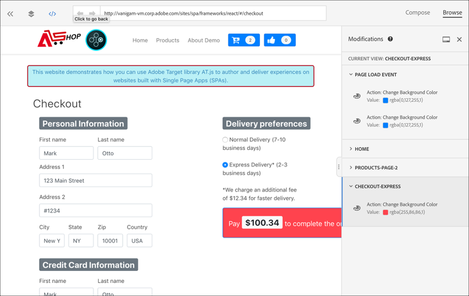

# Single-page application implementation 

Adobe Experience Platform Web SDK provides rich features that equip your business to execute personalization on next-generation, client-side technologies such as single-page applications (SPAs).

Traditional websites worked on "Page-to-Page" navigation models, otherwise known as Multi Page Applications, where website designs were tightly coupled to URLs and transitions from one webpage to another required a page load. 

Modern web applications, such as single-page applications, have instead adopted a model that propels rapid use of browser UI rendering, which is often independent of page reloads. These experiences can be triggered by customer interactions, such as scrolls, clicks, and cursor movements. As the paradigms of the modern web have evolved, the relevance of traditional generic events, such as a page load, to deploy personalization and experimentation no longer work.   


## Benefits of Platform Web SDK for SPAs

Here are some benefits to using Adobe Experience Platform Web SDK for your single-page applications: 

* Ability to cache all offers on page-load to reduce multiple server calls to a single server call. 
* Tremendously improve the user experience on your site because offers are shown immediately via the cache without lag time introduced by traditional server calls. 
* A single line of code and one-time developer setup enables marketers to create and run A/B and Experience Targeting (XT) activities via the Visual Experience Composer (VEC) on your SPA. 

## XDM Views and single-page applications 

The Adobe Target VEC for SPAs takes advantage of a concept called Views: a logical group of visual elements that together make up an SPA experience. A single-page application can, therefore, be considered as transitioning through Views, instead of URLs, based on user interactions. A View can typically represent a whole site or grouped visual elements within a site. 

To further explain what Views are, the following example uses a hypothetical online e-commerce site implemented in React to explore example Views.  

After navigating to the home site, a hero image promotes an Easter sale as well as the newest products available on the site. In this case, a View could be defined for the entire home screen. This View could simply be called "home".


As the customer becomes more interested in the products that the business is selling, they decide to click the **Products** link. Similar to the home site, the entirety of the products site can be defined as a View. This View could be named "products-all". 



Since a View can be defined as a whole site or a group of visual elements on a site, the four products shown on the products site could be grouped and considered as a View. This view could be named "products." 



When the customer decides to click the **Load More** button to explore more products on the site, the website URL does not change in this case, but a View can be created here to represent only the second row of products that are shown. The View name could be "products-page-2". 


The customer decides to purchase a few products from the site and proceeds to the checkout screen. On the checkout site the customer is given options to choose normal delivery or express delivery. A View can be any group of visual elements on a site, so a View could be created for delivery preferences and be called, "Delivery Preferences". 


The concept of Views can be extended much further than this. These are just a few examples of Views that can be defined on a site.

## Implementing XDM Views 

XDM Views can be leveraged in Adobe Target to empower marketers to run A/B and XT tests on SPAs via the Visual Experience Composer. This requires performing the following steps in order to complete a one-time developer setup: 

1. Install [Adobe Experience Platform Web SDK](/help/web-sdk/install/overview.md)
2. Determine all XDM Views in your single-page application that you want to personalize.  
3. After defining the XDM Views, in order to deliver AB or XT VEC activities, implement the `sendEvent()` function with `renderDecisions` set to `true` and the corresponding XDM View in your Single Page Application. The XDM View must be passed in `xdm.web.webPageDetails.viewName`. This step allows marketers to leverage the Visual Experience Composer to launch A/B and XT tests for those XDM.  

    ```javascript
    alloy("sendEvent", { 
      "renderDecisions": true, 
      "xdm": { 
        "web": { 
          "webPageDetails": { 
          "viewName":"home" 
          }
        } 
      } 
    });
    ```
 
>[!NOTE] 
>
>On the first `sendEvent()` call, all XDM Views that should be rendered to the end-user will be fetched and cached. Subsequent `sendEvent()` calls with XDM Views passed in will be read from the cache and rendered without a server call. 
 
## `sendEvent()` function examples

This section outlines three examples showing how to invoke the `sendEvent()` function in React for a hypothetical e-commerce SPA. 

### Example 1: A/B test home page

The marketing team want to run A/B tests on the entire home page.



To run A/B tests on the whole home site, `sendEvent()` must be invoked with the XDM `viewName` set to `home`: 

```jsx
function onViewChange() { 
  
  var viewName = window.location.hash; // or use window.location.pathName if router works on path and not hash 

  viewName = viewName || 'home'; // view name cannot be empty 

  // Sanitize viewName to get rid of any trailing symbols derived from URL 

  if (viewName.startsWith('#') || viewName.startsWith('/')) { 
    viewName = viewName.substr(1); 
  }
   
  alloy("sendEvent", { 
    "renderDecisions": true, 
    "xdm": { 
      "web": { 
        "webPageDetails": { 
          "viewName":"home" 
        } 
      } 
    }
  }); 
} 

// react router v4 

const history = syncHistoryWithStore(createBrowserHistory(), store); 

history.listen(onViewChange); 

// react router v3 

<Router history={hashHistory} onUpdate={onViewChange} > 
```

### Example 2: Personalized products

The marketing team want to personalize the second row of products by changing the price label color to red after a user clicks **Load More**. 



```jsx
function onViewChange(viewName) { 

  alloy("sendEvent", { 
    "renderDecisions": true, 
    "xdm": { 
      "web": { 
        "webPageDetails": { 
          "viewName": viewName
        }
      } 
    } 
  }); 
} 

class Products extends Component { 
  
  render() { 
    return ( 
      <button type="button" onClick={this.handleLoadMoreClicked}>Load more</button> 
    ); 
  } 

  handleLoadMoreClicked() { 
    var page = this.state.page + 1; // assuming page number is derived from component's state 
    this.setState({page: page}); 
    onViewChange('PRODUCTS-PAGE-' + page); 
  } 

} 
```

### Example 3: A/B test delivery preferences

The marketing team want to run an A/B test to see whether changing the color of the button from blue to red when **Express Delivery** is selected can boost conversions (as opposed to keeping the button color blue for both delivery options). 
 


To personalize content on the site depending on which delivery preference is selected, a View can be created for each delivery preference. When **Normal Delivery** is selected, the View can be named "checkout-normal". If **Express Delivery** is selected, the View can be named "checkout-express". 

```jsx
function onViewChange(viewName) { 
  alloy("sendEvent", { 
    "renderDecisions": true, 
    "xdm": { 
      "web": { 
        "webPageDetails": { 
          "viewName": viewName 
        }
      }
    }
  }); 
} 

class Checkout extends Component { 

  render() { 
    return ( 
      <div onChange={this.onDeliveryPreferenceChanged}> 
        <label> 
          <input type="radio" id="normal" name="deliveryPreference" value={"Normal Delivery"} defaultChecked={true}/> 
          <span> Normal Delivery (7-10 business days)</span> 
        </label> 
        <label> 
          <input type="radio" id="express" name="deliveryPreference" value={"Express Delivery"}/> 
          <span> Express Delivery* (2-3 business days)</span> 
        </label> 
      </div> 
    ); 
  } 

  onDeliveryPreferenceChanged(evt) { 
    var selectedPreferenceValue = evt.target.value; 
    onViewChange(selectedPreferenceValue); 
  } 

} 
```

## Using the Visual Experience Composer for a SPA 

When you have finished defining your XDM Views and implemented `sendEvent()` with those XDM Views passed in, the VEC will be able to detect these Views and allow users to create actions and modifications for A/B or XT activities. 

>[!NOTE]
>
>To use the VEC for your SPA, you must install and activate either the [Firefox](https://addons.mozilla.org/en-US/firefox/addon/adobe-target-vec-helper/) or [Chrome](https://chrome.google.com/webstore/detail/adobe-target-vec-helper/ggjpideecfnbipkacplkhhaflkdjagak) VEC Helper Extension. 

### Modifications Panel 

The Modifications panel captures the actions created for a particular View. All actions for a View are grouped under that View. 


### Actions 

Clicking an action highlights the element on the site where this action will be applied. Each VEC action created under a View has the following icons: **Information**, **Edit**, **Clone**, **Move**, and **Delete**. These icons are explained in more detail in the table that follows.

 

|Icon|Description|
|---|---|
|Information|Displays the details of the action.|
|Edit |Allows you to edit the properties of the action directly. |
|Clone|Clone the action to one or more Views that exist on the Modifications panel or to one or more Views that you have browsed and navigated to in the VEC. The action doesn't have to necessarily exist in the Modifications panel.<br/><br/>**Note:** After a clone operation is made, you must navigate to the View in the VEC via Browse to see whether the cloned action was a valid operation. If the action cannot be applied to the View, you will see an error.| 
|Move |Moves the action to a Page Load Event or any other View that already exists in the modifications panel.<br/><br/>**Page Load Event:** Any actions corresponding to the page load event are applied on the initial page load of your web application. <br/><br/>**Note:** After a move operation is made, you must navigate to the View in the VEC via Browse to see whether the move was a valid operation. If the action cannot be applied to the View, you will see an error.|
|Delete |Deletes the action.|

## Using the VEC for SPAs examples

This section outlines three examples for using the Visual Experience Composer to create actions and modifications for A/B or XT activities.

### Example 1: Update "home" View

Earlier in this document a View named "home" was defined for the entire home site. Now the marketing team want to update the "home" view in the following ways:

* Change the **Add to Cart** and **Like** buttons to a lighter share of blue. This should happen during page load because it involves changing components of the header.
* Change the **Latest Products for 2019** label to **Hottest Products for 2019** and change the text color to purple. 

To make these updates in the VEC, select **Compose** and apply those changes to the "home" view. 



### Example 2: Change product labels

For the "products-page-2" View, the marketing team would like to change the **Price** label to **Sale Price** and change the label color to red. 

To make these updates in the VEC, the following steps are required:

1. Select **Browse** in the VEC.
2. Select **Products** in the top navigation of the site.
3. Select **Load More** once to view the second row of products. 
4. Select **Compose** in the VEC. 
5. Apply actions to change the text label to **Sale Price** and the color to red. 



### Example 3: Personalize delivery preference styling

Views can be defined at a granular level, such as a state or an option from a radio button. Earlier in this document Views were defined for delivery preferences, "checkout-normal" and "checkout-express". The marketing team wants to change the button color to red for the "checkout-express" View. 

To make these updates in the VEC, the following steps are required: 

1. Select **Browse** in the VEC. 
2. Add products to the cart on the site. 
3. Select the cart icon in the top right corner of the site. 
4. Select **Checkout your Order**. 
5. Select the **Express Delivery** radio button under **Delivery Preferences**. 
6. Select **Compose** in the VEC. 
7. Change the **Pay** button color to red. 

>[!NOTE]
>
>The "checkout-express" View does not appear in the Modifications panel until the **Express Delivery** radio button is selected. This is because the `sendEvent()` function is executed when the **Express Delivery** radio button is selected, therefore the VEC is not aware of the "checkout-express" View until the radio button is selected.


