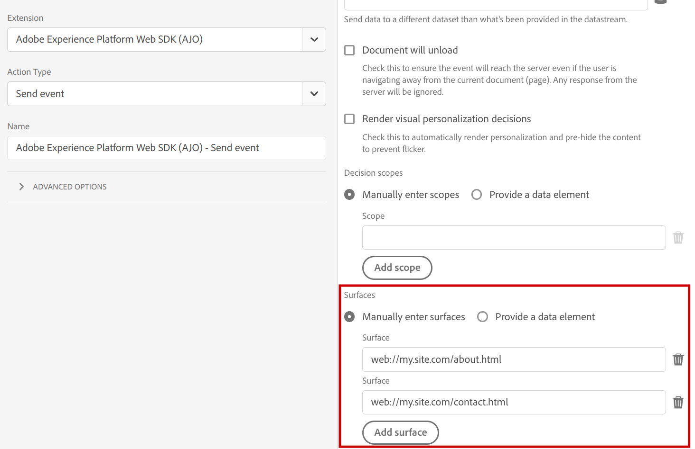
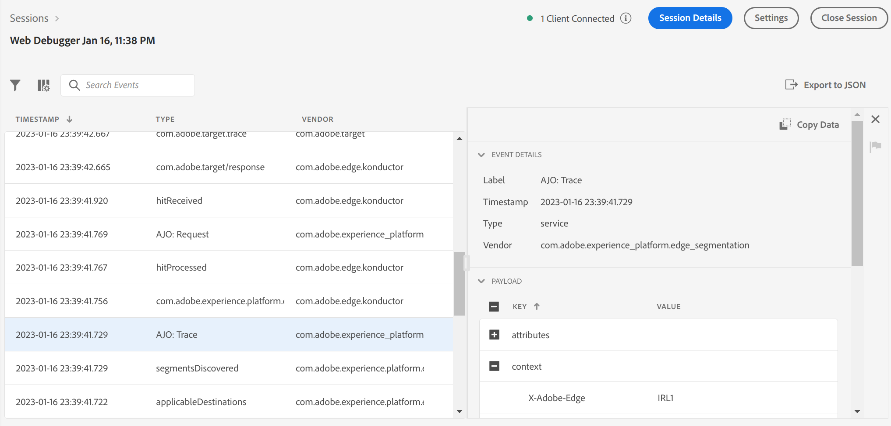

# Using [!DNL Adobe Journey Optimizer] with the [!DNL Platform Web SDK]

[!DNL Adobe Experience Platform] [!DNL Web SDK] can deliver and render personalized experiences managed in [!DNL Adobe Journey Optimizer] to the web channel. You can use a WYSIWYG editor, [!DNL Adobe Journey Optimizer] [Web Channel](https://experienceleague.adobe.com/docs/journey-optimizer/using/web/create-web.html), or a non-visual interface, the [Code-based Experience Channel](https://experienceleague.adobe.com/en/docs/journey-optimizer/using/code-based-experience/get-started-code-based) to create, activate, and deliver your [!DNL Journey Optimizer Web] campaigns and personalization experiences.

>[!IMPORTANT]
>
>Read the [Adobe Journey Optimizer Web Channel documentation](https://experienceleague.adobe.com/docs/journey-optimizer/using/web/get-started-web.html) for information on getting started with [!DNL Journey Optimizer Web] experience authoring and reporting. 

## Terminology {#terminology}

**[!UICONTROL Surface]**: A web surface is a web page or location on a page identified by a URI where the [!DNL Adobe Journey Optimizer] experience content will be delivered.

**[!UICONTROL Propositions]**: In [!DNL Adobe Journey Optimizer], propositions correlate to the experience selected from a [!DNL Journey Optimizer Campaign].

## Enabling [!DNL Adobe Journey Optimizer] {#enable-ajo}

To start using [!DNL Adobe Journey Optimizer], follow the steps below.

1. Go through the [prerequisites](https://experienceleague.adobe.com/docs/journey-optimizer/using/web/create-web.html#prerequesites) from the [!DNL Adobe Journey Optimizer] [Web Experiences Guide](https://experienceleague.adobe.com/docs/journey-optimizer/using/web/create-web.html), specifically:
   * Set up [!DNL Adobe Experience Cloud Visual Editing Helper].
   * Enable [!DNL Adobe Journey Optimizer] in your [datastream](../../../datastreams/overview.md).
   * Enable the [!UICONTROL Active-On-Edge Merge Policy] option.

2. Add the `renderDecisions` option to your events. Set `renderDecisions` to `true` for automatic rendering of delivered Journey Optimizer content propositions on your web page surfaces.

    ```javascript
    alloy("sendEvent", {
        ...,
        "renderDecisions": true
    })
    ```

3. Optionally, specify additional surfaces in your events. By default, the Web SDK will automatically generate the web surface for the current web page and include it in the request to the Edge Network. If required, additional surfaces can be included in the request by specifying these in the `personalization.surfaces` option of the `sendEvent` command, or in the corresponding **[!UICONTROL Surfaces]** [[!UICONTROL Send event] action](../../../tags/extensions/client/web-sdk/action-types.md#send-event) configuration of the Web SDK Extension.

    ```javascript
    alloy("sendEvent", {
        ...
        "personalization": {
            "surfaces": [ "web://my.site.com/about.html", "web://my.site.com/contact.html" ]
        }
    })
    ```

    

    Event surfaces are included in the `query.personalization.surfaces` request field:

    ```json
    {
    "events": [
        {
            "query": {
                "personalization": {
                "schemas": [
                    ...
                ],
                "decisionScopes": [
                    "__view__"
                ],
                "surfaces": [
                    "web://ajostage.weebly.com/"
                ]
                }
            },
            ...
        }
    ]
    }
    ```

4. Similar to other personalization features, you can add a **[prehiding snippet](../manage-flicker.md)** to hide only certain portions of the page while fetching experiences.

## Creating Adobe Journey Optimizer Web experiences {#create-ajo-web-experiences}

Follow the [web campaign authoring](https://experienceleague.adobe.com/docs/journey-optimizer/using/web/create-web.html#create-web-campaign) instructions from the [!DNL Adobe Journey Optimizer] [Web Experiences Guide](https://experienceleague.adobe.com/docs/journey-optimizer/using/web/create-web.html) to create [!DNL Journey Optimizer Web] campaigns and experiences.

## Rendering personalized content {#rendering-personalized-content}

See the documentation on [rendering personalization content](../rendering-personalization-content.md) for more information.

Adobe Journey Optimizer propositions for web surfaces are processed in a similar manner to the `__view__` decision scope propositions. Specifically, when `renderDecisions` option is set to `true` in the `sendEvent` command these will be automatically rendered by the Web SDK.

Sample Journey Optimizer content proposition:

```json
{
    "scope": "web://ajostage.weebly.com/",
    "scopeDetails": {
        "correlationID": "ccfaf19c-6360-4aea-b464-0cf924db5da7",
        "characteristics": {
            "eventToken": "eyJtZXNzYWdlRXhlY3V0aW9uIjp7Im1lc3NhZ2VFeGVjdXRpb25JRCI6ImEzNDYxYTMzLTc5MjktNGQyNS1hNmMxLTVkYzM2YWY1NzRmMyIsIm1lc3NhZ2VJRCI6ImNjZmFmMTljLTYzNjAtNGFlYS1iNDY0LTBjZjkyNGRiNWRhNyIsIm1lc3NhZ2VUeXBlIjoibWFya2V0aW5nIiwiY2FtcGFpZ25JRCI6IjEzN2JmMzllLWM1ODgtNGI1My1iODQxLTJiMWZiZDYxM2JkYiIsImNhbXBhaWduVmVyc2lvbklEIjoiMTA1NzY1MmEtZWYwNS00YjE3LWExMmUtY2FlOTQyOTFhMWFjIiwiY2FtcGFpZ25BY3Rpb25JRCI6ImViNTlmODQ4LTk5ZDYtNGE1OC05YmU4LTk4MjIxODU0NmYzNiIsIm1lc3NhZ2VQdWJsaWNhdGlvbklEIjoiYzg2NzFjZmItNDdjYS00YTVjLTg4Y2YtNzYwZDFlZjU1MzQyIn0sIm1lc3NhZ2VQcm9maWxlIjp7ImNoYW5uZWwiOnsiX2lkIjoiaHR0cHM6Ly9ucy5hZG9iZS5jb20veGRtL2NoYW5uZWxzL3dlYiIsIl90eXBlIjoiaHR0cHM6Ly9ucy5hZG9iZS5jb20veGRtL2NoYW5uZWwtdHlwZXMvd2ViIn0sIm1lc3NhZ2VQcm9maWxlSUQiOiI2YTViY2I3ZC02MmYxLTQ5NDItODRkMC02MzE5ZjM5Zjk1ZGUifX0="
        },
        "decisionProvider": "AJO",
        "activity": {
            "id": "137bf39e-c588-4b53-b841-2b1fbd613bdb#eb59f848-99d6-4a58-9be8-982218546f36"
        }
    },
    "id": "002321c0-dff5-4153-b171-a9dfb70b9750",
    "items": [
        {
            "schema": "https://ns.adobe.com/personalization/dom-action",
            "data": {
                "uiData": {
                    "tagType": "Text",
                    "actionType": "changed"
                },
                "content": "Welcome AJO!",
                "prehidingSelector": "#wsite-content > DIV:nth-of-type(2) > DIV:nth-of-type(1) > DIV:nth-of-type(1) > DIV:nth-of-type(1) > DIV:nth-of-type(1) > DIV:nth-of-type(3) > FONT:nth-of-type(1) > SPAN:nth-of-type(1)",
                "type": "setHtml",
                "selector": "#wsite-content > DIV.wsite-section-wrap:eq(1) > DIV.wsite-section:eq(0) > DIV.wsite-section-content:eq(0) > DIV.container:eq(0) > DIV.wsite-section-elements:eq(0) > DIV.paragraph:eq(0) > FONT:nth-of-type(1) > SPAN:nth-of-type(1)"
            },
            "id": "0a522f66-9e6a-4ded-b1d0-e9167f103290"
        },
        {
            "schema": "https://ns.adobe.com/personalization/dom-action",
            "data": {
                "uiData": {
                    "tagType": "Text",
                    "actionType": "changed"
                },
                "content": {
                    "font-weight": "bold"
                },
                "prehidingSelector": "#wsite-content > DIV:nth-of-type(2) > DIV:nth-of-type(1) > DIV:nth-of-type(1) > DIV:nth-of-type(1) > DIV:nth-of-type(1) > DIV:nth-of-type(3) > FONT:nth-of-type(1) > SPAN:nth-of-type(1)",
                "type": "setStyle",
                "selector": "#wsite-content > DIV.wsite-section-wrap:eq(1) > DIV.wsite-section:eq(0) > DIV.wsite-section-content:eq(0) > DIV.container:eq(0) > DIV.wsite-section-elements:eq(0) > DIV.paragraph:eq(0) > FONT:nth-of-type(1) > SPAN:nth-of-type(1)"
            },
            "id": "66216ca5-5d0f-4239-a8c8-6bc4a5a7cbdb"
        }
    ]
}

```

## Debugging {#debugging}

To debug Adobe Journey Optimizer personalization implementations, use [Web SDK debugging](/help/web-sdk/use-cases/debugging.md). [!DNL Adobe Journey Optimizer] debug traces are available when troubleshooting using [[!DNL Adobe Experience Platform Assurance]](https://developer.adobe.com/client-sdks/documentation/platform-assurance/). Check for events with the `AJO:` prefix.


