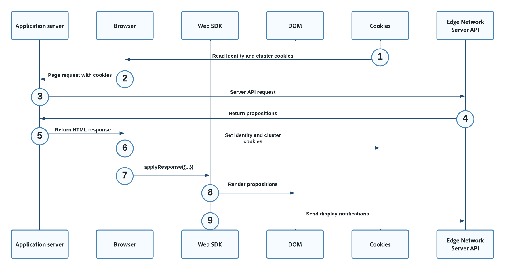

# Hybrid personalization using Web SDK and Edge Network Server API

## Overview {#overview}

Hybdrid personalization describes the process of retrieving personalization content server-side, using the [Edge Network Server API](../../server-api/overview.md), and rendering it client-side, using the [Web SDK](../home.md).

You can use hybrid personalization with personalization solutions like Adobe Target, Adobe Journey Optimizer, or Offer Decisioning, the difference being the contents of the [!UICONTROL Server API] payload.

## Prerequisites {#prerequisites}

Before implementing hybrid personalization on your web properties, make sure you meet the following conditions:

* You have decided what personalization solution you want to use. This will have an impact on the contents of the [!UICONTROL Server API] payload.
* You have access to an application server which you can use to make the [!UICONTROL Server API] calls.
* You have access to the [Edge Network Server API](../../server-api/authentication.md).
* You have correctly [configured](/help/web-sdk/commands/configure/overview.md) and deployed the Web SDK on the pages that you want to personalize.

## Flow diagram {#flow-diagram}

The flow diagram below describes the order of the steps taken to deliver hybrid personalization.



1. Any existing cookies previously stored by the browser, prefixed with `kndctr_`, are included in the browser request.
1. The client web browser requests the web page from your application server. 
1. When the application server receives the page request, it makes a `POST` request to the [Server API interactive data collection endpoint](../../server-api/interactive-data-collection.md) to fetch personalization content. The `POST` request contains an `event` and a `query`. The cookies from the previous step, if available, are included in the `meta>state>entries` array.
1. The Server API returns the personalization content to your application server.
1. The application server returns an HTML response to the client browser, containing the [identity and cluster cookies](#cookies).
1. On the client page, the [!DNL Web SDK] `applyResponse` command is called, passing in the headers and body of the [!UICONTROL Server API] response from the previous step.
1. The [!DNL Web SDK] renders Target [[!DNL Visual Experience Composer (VEC)]](https://experienceleague.adobe.com/docs/target/using/experiences/vec/visual-experience-composer.html) offers and Journey Optimizer Web Channel items automatically, because the `renderDecisions` flag is set to `true`.
1. Target form-based [!DNL HTML]/[!DNL JSON] offers and Journey Optimizer code-based experiences are manually applied through the `applyProposition` method, to update the [!DNL DOM] based on the personalization content in the proposition.
1. For Target form-based [!DNL HTML]/[!DNL JSON] offers and Journey Optimizer code-based experiences, display events must manually be sent, to indicate when the returned content has been displayed. This is done via the `sendEvent` command.

## Cookies {#cookies}

Cookies are used to persist user identity and cluster information.  When using a hybrid implementation, the Web application server handles the storing and sending of these cookies during the request lifecycle.

| Cookie | Purpose | Stored by | Sent by |
|---|---|---|---|
| `kndctr_AdobeOrg_identity` | Contains user identity details. | Application server | Application server |
| `kndctr_AdobeOrg_cluster`  | Indicates which Edge Network cluster should be used to fulfill the requests. | Application server | Application server |

## Request placement {#request-placement}

Server API requests are required to get propositions and send a display notification. When using a hybrid implementation, the application server makes these requests to the Server API.

| Request | Made by | 
|---|---|
| Interact request to retrieve propositions | Application server |
| Interact request to send display notifications | Application server |

## Analytics implications {#analytics}

When implementing hybrid personalization, you must pay special attention so that page hits are not counted multiple times in Analytics.

When you [configure a datastream](../../datastreams/overview.md) for Analytics, events are automatically forwarded so that page hits are captured. 

The sample from this implementation uses two different datastreams:

* A datastream configured for Analytics. This datastream is used for Web SDK interactions.
* A second datastream without an Analytics configuration. This datastream is used for Server API requests. You must configure this datastream with the same destination configuration as the datastream that you configured for Analytics.

This way, the server-side request do not register any Analytics events, but the client-side requests do. This leads to Analytics requests being accurately counted.


## Server-side request {#server-side-request}

The sample request below illustrates a Server API request that your application server could use to retrieve the personalization content.

>[!IMPORTANT]
>
>This sample request uses Adobe Target as a personalization solution. Your request might vary according to your chosen personalization solution.


**API format**

```http
POST /ee/v2/interact
```

### Request {#request}

```shell
curl -X POST "https://edge.adobedc.net/ee/v2/interact?dataStreamId={DATASTREAM_ID}" 
-H "Content-Type: text/plain" 
-d '{
   "event":{
      "xdm":{
         "web":{
            "webPageDetails":{
               "URL":"http://localhost/"
            },
            "webReferrer":{
               "URL":""
            }
         },
         "identityMap":{
            "FPID":[
               {
                  "id":"xyz",
                  "authenticatedState":"ambiguous",
                  "primary":true
               }
            ]
         },
         "timestamp":"2022-06-23T22:21:00.878Z"
      },
      "data":{
         
      }
   },
   "query":{
      "identity":{
         "fetch":[
            "ECID"
         ]
      },
      "personalization":{
         "schemas":[
            "https://ns.adobe.com/personalization/default-content-item",
            "https://ns.adobe.com/personalization/html-content-item",
            "https://ns.adobe.com/personalization/json-content-item",
            "https://ns.adobe.com/personalization/redirect-item",
            "https://ns.adobe.com/personalization/dom-action"
         ],
         "decisionScopes":[
            "__view__",
            "sample-json-offer"
         ]
      }
   },
   "meta":{
      "state":{
         "domain":"localhost",
         "cookiesEnabled":true,
         "entries":[
            {
               "key":"kndctr_XXX_AdobeOrg_identity",
               "value":"abc123"
            },
            {
               "key":"kndctr_XXX_AdobeOrg_cluster",
               "value":"or2"
            }
         ]
      }
   }
}'
```

| Parameter | Type | Required | Description |
| --- | --- | --- | --- |
| `dataStreamId` | `String` | Yes. | The ID of the datastream that you use to pass the interactions to the Edge Network. See the [datastreams overview](../../datastreams/overview.md) to learn how to configure a datastream. |
| `requestId` | `String` | No | A random ID for correlating internal server requests. If none is provided, the Edge Network will generate one and return it in the response.|

### Server-side response {#server-response}

The sample response below shows what the Server API response might look like.


```json
{
   "requestId":"5c539bd0-33bf-43b6-a054-2924ac58038b",
   "handle":[
      {
         "payload":[
            {
               "id":"XXX",
               "namespace":{
                  "code":"ECID"
               }
            }
         ],
         "type":"identity:result"
      },
      {
         "payload":[
            {
               "..."
            },
            {
               "..."
            }
         ],
         "type":"personalization:decisions",
         "eventIndex":0
      }
   ]
}
```

## Client-side request {#client-request}

On the client page, the [!DNL Web SDK] `applyResponse` command is called, passing in the headers and body of the server-side response.

```js
   alloy("applyResponse", {
      "renderDecisions": true,
      "responseHeaders": {
         "cache-control": "no-cache, no-store, max-age=0, no-transform, private",
         "connection": "close",
         "content-encoding": "deflate",
         "content-type": "application/json;charset=utf-8",
         "date": "Mon, 11 Jul 2022 19:42:01 GMT",
         "server": "jag",
         "strict-transport-security": "max-age=31536000; includeSubDomains",
         "transfer-encoding": "chunked",
         "vary": "Origin",
         "x-adobe-edge": "OR2;9",
         "x-content-type-options": "nosniff",
         "x-konductor": "22.6.78-BLACKOUTSERVERDOMAINS:7fa23f82",
         "x-rate-limit-remaining": "599",
         "x-request-id": "5c539bd0-33bf-43b6-a054-2924ac58038b",
         "x-xss-protection": "1; mode=block"
      },
      "responseBody": {
         "requestId": "5c539bd0-33bf-43b6-a054-2924ac58038b",
         "handle": [
         {
            "payload": [
               {
               "id": "XXX",
               "namespace": {
                  "code": "ECID"
               }
               }
            ],
            "type": "identity:result"
         },
         {
            "payload": [
               {...}, 
               {...}
            ],
            "type": "personalization:decisions",
            "eventIndex": 0
         }
         ]
      }
   }
   ).then(applyPersonalization("sample-json-offer"));
```

Form-based [!DNL JSON] offers are manually applied through the `applyPersonalization` method, to update the [!DNL DOM] based on the personalization offer. For form-based activities, display events must manually be sent, to indicate when the offer has been displayed. This is done via the `sendEvent` command.

```js
function sendDisplayEvent(decision) {
    const { id, scope, scopeDetails = {} } = decision;

    alloy("sendEvent", {
        xdm: {
            eventType: "decisioning.propositionDisplay",
            _experience: {
                decisioning: {
                    propositions: [
                        {
                            id: id,
                            scope: scope,
                            scopeDetails: scopeDetails,
                        },
                    ],
                },
            },
        },
    });
}
```

## Sample application {#sample-app}

To help you experiment and learn more about this type of personalization, we provide a sample application which you can download and use for testing. You can download the application, along with detailed instructions on how to use it, from this [GitHub repository](https://github.com/adobe/alloy-samples).
