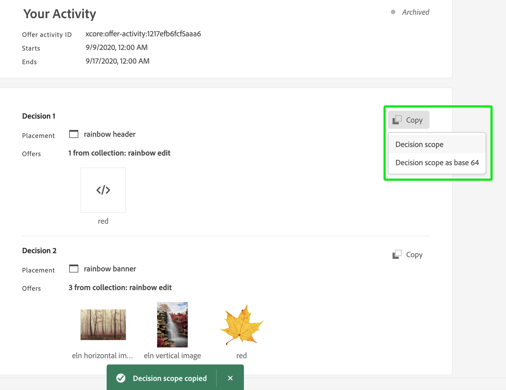
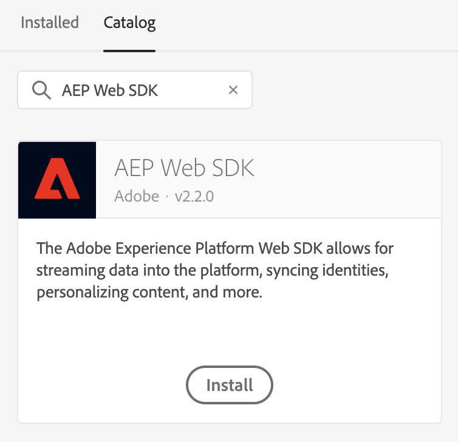
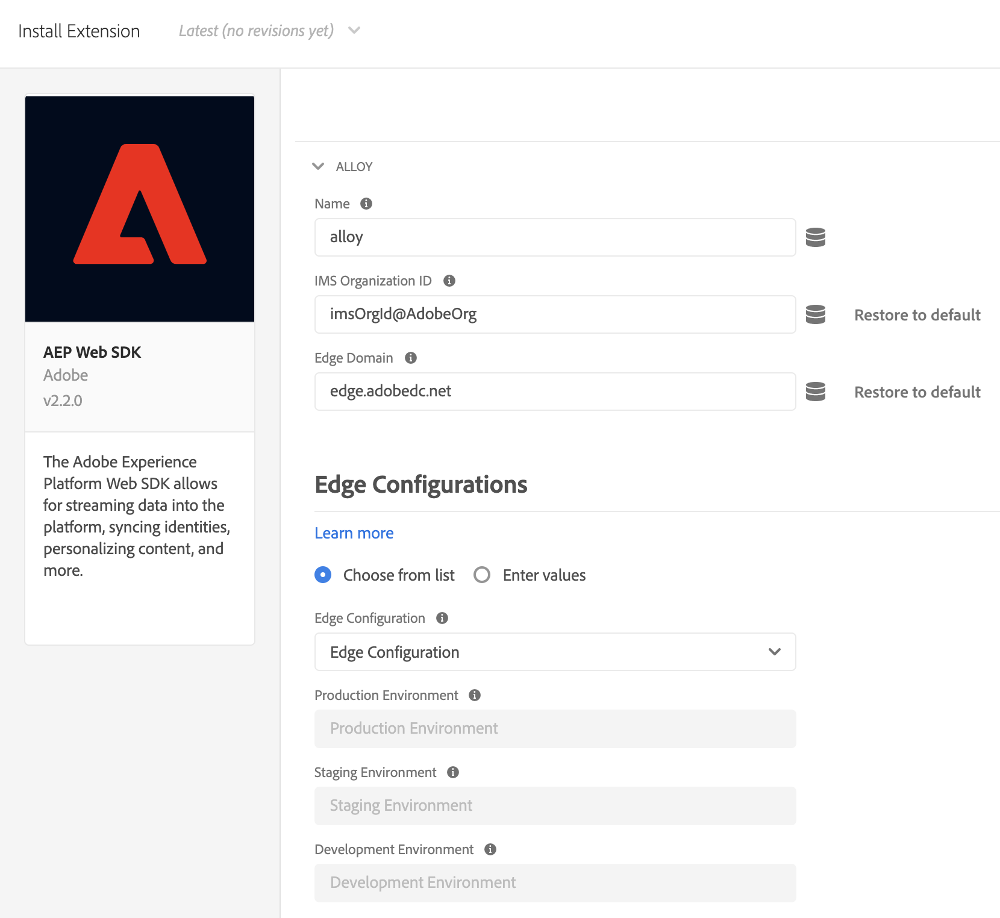
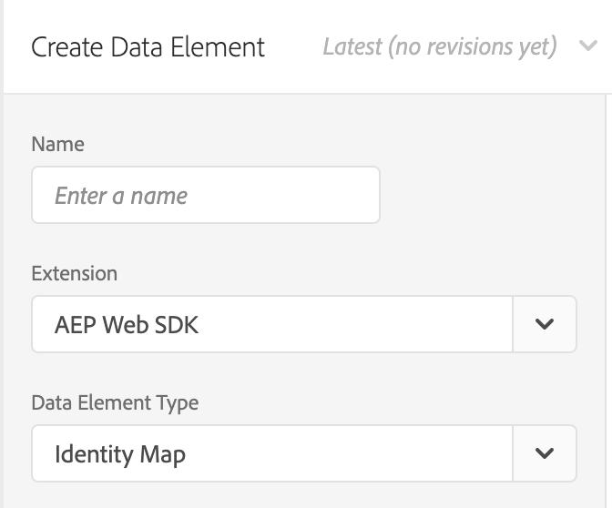
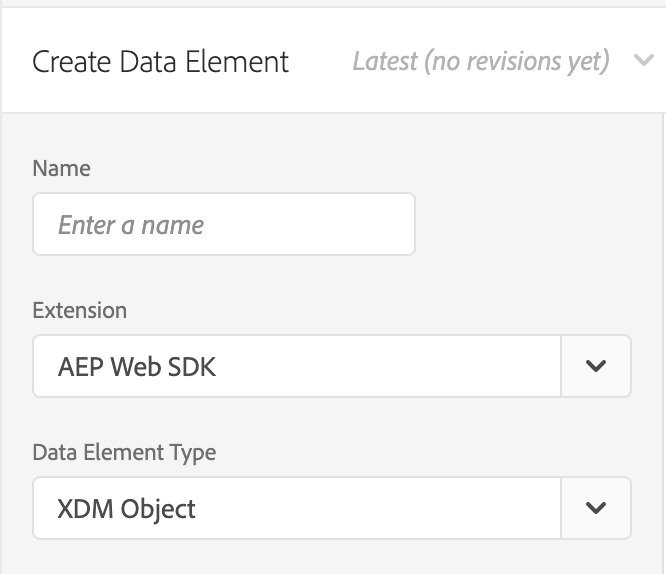
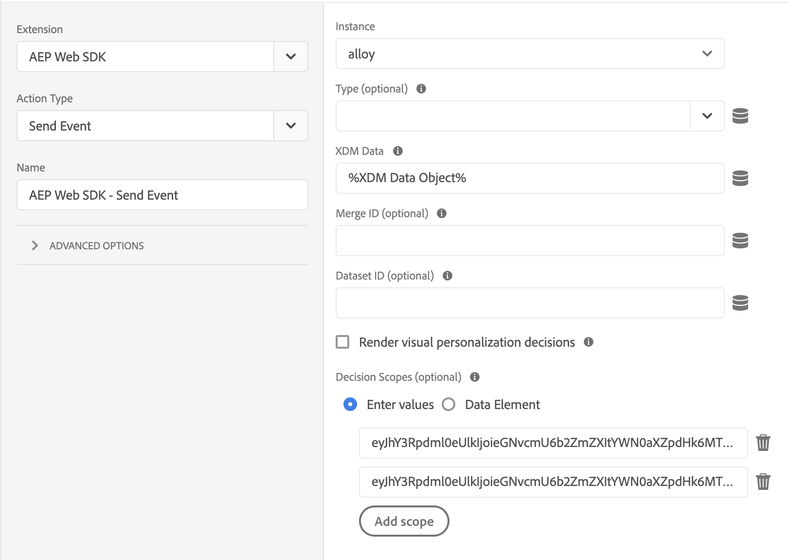

# Using Offer Decisioning with the Platform Web SDK

>[!NOTE]
>
>The use of Offer Decisioning in Adobe Experience Platform Web SDK is available in early access to select users. This functionality is not available to all organizations.

Adobe Experience Platform [!DNL Web SDK] can deliver and render personalized offers that are managed in Offer Decisioning. You can create your offers and other related objects using the Offer Decisioning user interface (UI) or APIs.

## Prerequisites

* Organization is enabled for edge decisioning
* Offers, Activities created
* Datastream is published

## Terminology

It is important to understand the following terminology when working with Offer Decisioning. For more information and to view additional terms, please visit the [Offer Decisioning glossary](https://experienceleague.adobe.com/docs/offer-decisioning/using/get-started/glossary.html).

* **Decision Scopes:** For Offer Decisioning, decision scopes are the Base64 encoded strings of JSON containing the activity and placement IDs you want the offer decisioning service to use to propose offers.

  *Decision scope JSON:*

  ```json
  {
    "activityId":"xcore:offer-activity:11cfb1fa93381aca",
    "placementId":"xcore:offer-placement:1175009612b0100c"
  }
  ```

  *Decision scope Base64 encoded string:*

  ```json
  "eyJhY3Rpdml0eUlkIjoieGNvcmU6b2ZmZXItYWN0aXZpdHk6MTFjZmIxZmE5MzM4MWFjYSIsInBsYWNlbWVudElkIjoieGNvcmU6b2ZmZXItcGxhY2VtZW50OjExNzUwMDk2MTJiMDEwMGMifQ=="
  ```

  >[!TIP]
  >
  >You can copy the decision scope value from the **Activity Overview** page in the UI.

  

* **Datastreams:** For more information, please read the [datastreams](/help/datastreams/overview.md) documentation.

* **Identity**: For more information, please read this documentation outlining how [Platform Web SDK uses Identity Service](../../identity/overview.md).

## Enabling Offer Decisioning

To enable Offer Decisioning, perform the following steps:

1. Enabled Adobe Experience Platform in your [datastream](/help/datastreams/overview.md) and check the "Offer Decisioning" box

   

1. Follow the instructions to [install the SDK](/help/web-sdk/install/overview.md) (The SDK can be installed standalone or through the UI. See the [tags quick start guide](/help/tags/quick-start/quick-start.md)) for more information.
1. Configure the SDK for Offer Decisioning using `personalization.decisionScopes`. Additional Offer Decisioning specific steps are provided below.

   * Install the standalone SDK

     1. Configure the "sendEvent" action with `personalization.decisionScopes`

      ```javascript
      alloy("sendEvent", {
        ...
        "personalization": {
          "decisionScopes": [
            "eyJhY3Rpdml0eUlkIjoieGNvcmU6b2ZmZXItYWN0aXZpdHk6MTIxYWIwOWMxM2JkZDIyNCIsInBsYWNlbWVudElkIjoieGNvcmU6b2ZmZXItcGxhY2VtZW50OjEyMWFiMDZhODRkMDViMTEifQ==",
            "eyJhY3Rpdml0eUlkIjoieGNvcmU6b2ZmZXItYWN0aXZpdHk6MTIxYWIyNWI5NTUwNWIxZiIsInBsYWNlbWVudElkIjoieGNvcmU6b2ZmZXItcGxhY2VtZW50OjEyMWFiMjFmOTQzMDE0MmIifQ=="
          ]
        }
      });
      ```

   * Install the SDK through tags

     1. [Create a tag property](/help/tags/ui/administration/companies-and-properties.md)
     1. [Add the embed code](https://experienceleague.adobe.com/docs/core-services-learn/implementing-in-websites-with-launch/configure-launch/launch-add-embed.html)
     1. Install and configure the Platform Web SDK extension with the Datastream you created by selecting the configuration from the "Datastream" dropdown. See the documentation on [extensions](/help/tags/ui/managing-resources/extensions/overview.md).

        
      
        
      
     1. Create the necessary [Data Elements](/help/tags/ui/managing-resources/data-elements.md). At the bare minimum, you must create a Platform Web SDK Identity Map and a Platform Web SDK XDM Object data element.

        
      
        
      
     1. Create your [Rules](/help/tags/ui/managing-resources/rules.md).

        * Add a Platform Web SDK Send Event action and add the relevant `decisionScopes` to that action's configuration

        
      
     1. [Create and publish a library](/help/tags/ui/publishing/libraries.md) containing all the relevant Rules, Data Elements, and Extensions you have configured

## Sample requests and responses

### One `decisionScopes` value

**Request**

```json
{
  "events": [
    {
      "xdm": {
        "identityMap": {
          "ECID": [
            {
              "id": "91133425615229052182584359620783097099"
            }
          ]
        }
      },
      "query": {
        "personalization": {
          "decisionScopes": [
            "eyJhY3Rpdml0eUlkIjoieGNvcmU6b2ZmZXItYWN0aXZpdHk6MTFjZmIxZmE5MzM4MWFjYSIsInBsYWNlbWVudElkIjoieGNvcmU6b2ZmZXItcGxhY2VtZW50OjExNzUwMDk2MTJiMDEwMGMifQ=="
          ]
        }
      }
    }
  ]
}
```

| Property | Required | Description | Limits | Example |
|---|---|---|---|---|
| `identityMap`| Yes | Refer to this [Identity Service documentation](../../identity/overview.md).| One identity per request.| `{ "identityMap": { "ECID": [ { "id": "91133425615229052182584359620783097099" } ] } }`. <br><br> Note: Users don't need to include the `ECID` parameter in the API call. This parameter is automatically added to the call if needed. |
| `decisionScopes` | Yes | An array of Base64 encoded strings of JSON containing the activity and placement IDs. | Maximum 30 `decisionScopes` per request. | `"decisionScopes": ["eyJhY3Rpdml0eUlkIjoieGNvcmU6b2ZmZXItYWN0aXZpdHk6MTFjZmIxZmE5MzM4MWFjYSIsInBsYWNlbWVudElkIjoieGNvcmU6b2ZmZXItcGxhY2VtZW50OjExNzUwMDk2MTJiMDEwMGMifQ=="]` |

**Response**

```json
{
  "requestId": "94c4f2f1-9218-43ce-afd3-eb0d853c5174",
  "handle": [
    {
      "payload": [
        {
          "id": "2862bb89-5df2-4bc6-85c2-d8f7e1a091de",
          "scope": "eyJhY3Rpdml0eUlkIjoieGNvcmU6b2ZmZXItYWN0aXZpdHk6MTFjZmIxZmE5MzM4MWFjYSIsInBsYWNlbWVudElkIjoieGNvcmU6b2ZmZXItcGxhY2VtZW50OjExNzUwMDk2MTJiMDEwMGMifQ==",
          "activity": {
            "id": "xcore:offer-activity:11cfb1fa93381aca",
            "etag": "2"
          },
          "placement": {
            "id": "xcore:offer-placement:1175009612b0100c",
            "etag": "1"
          },
          "items": [
            {
              "id": "xcore:personalized-offer:124cc332095cfa74",
              "schema": "https://ns.adobe.com/experience/offer-management/content-component-html",
              "etag": "1",
              "data": {
                "id": "xcore:personalized-offer:124cc332095cfa74",
                "format": "text/html",
                "language": [
                  "en-US"
                ],
                "content": "<p>20% Off on shipping</p>",
                "characteristics": {
                  "foo": "bar",
                  "foo1": "bar1"
                }
              }
            }
          ]
        }
      ],
      "type": "personalization:decisions",
      "eventIndex": 0
    }
  ]
}
```

|Property | Description | Example |
|---|---|---|
| `scope`| The decision scope that resulted in the proposed offers. | `"scope": "eyJhY3Rpdml0eUlkIjoieGNvcmU6b2ZmZXItYWN0aXZpdHk6MTFjZmIxZmE5MzM4MWFjYSIsInBsYWNlbWVudElkIjoieGNvcmU6b2ZmZXItcGxhY2VtZW50OjExNzUwMDk2MTJiMDEwMGMifQ=="` |
| `activity.id` | The unique ID of the offer activity. | `"id": "xcore:offer-activity:11cfb1fa93381aca"` |
| `placement.id` | The unique ID of the offer placement. | `"id": "xcore:offer-placement:1175009612b0100c"` |
| `items.id`| The ID of the proposed offer.| `"id": "xcore:personalized-offer:124cc332095cfa74"`|
| `schema`| The schema of the content associated with the proposed offer.| `"schema": "https://ns.adobe.com/experience/offer-management/content-component-html"`|
| `data.id`| The ID of the proposed offer.|`"id": "xcore:personalized-offer:124cc332095cfa74"`|
| `format`| The format of the content associated with the proposed offer. | `"format": "text/html"`|
| `language`| An array of languages associated with the content from the proposed offer. | `"language": [ "en-US" ]`|
| `content` | Content associated with the proposed offer in the format of a string. | `"content": "<p style="color:red;">20% Off on shipping</p>"`|
| `deliveryUrl`| Image content associated with the proposed offer in the format of a URL. | `"deliveryURL": "https://image.jpeg"`|
| `characteristics` | Characteristics associated with the proposed offer in the format of a JSON object. | `"characteristics": { "foo": "bar", "foo1": "bar1" }`|

### Multiple `decisionScopes` values

**Request**

```json
{
  "events": [
    {
      "xdm": {
        "identityMap": {
          "ECID": [
            {
              "id": "91133425615229052182584359620783097099"
            }
          ]
        }
      },
      "query": {
        "personalization": {
          "decisionScopes": [
            "eyJhY3Rpdml0eUlkIjoieGNvcmU6b2ZmZXItYWN0aXZpdHk6MTFjZmIxZmE5MzM4MWFjYSIsInBsYWNlbWVudElkIjoieGNvcmU6b2ZmZXItcGxhY2VtZW50OjExNzUwMDk2MTJiMDEwMGMifQ==",
            "eyJhY3Rpdml0eUlkIjoieGNvcmU6b2ZmZXItYWN0aXZpdHk6MTIyMjA4YjNhODc0MDU1OCIsInBsYWNlbWVudElkIjoieGNvcmU6b2ZmZXItcGxhY2VtZW50OjEyMjIwNDUyOTUxNGEyYzAifQ==",
            "eyJhY3Rpdml0eUlkIjoieGNvcmU6b2ZmZXItYWN0aXZpdHk6MTIyYzkxMzg1Mjc2MDE4YyIsInBsYWNlbWVudElkIjoieGNvcmU6b2ZmZXItcGxhY2VtZW50OjEyMzMxZjU2MTYyYWEyZjcifQ=="
          ]
        }
      }
    }
  ]
}
```

| Property | Required | Description | Limits | Example |
|---|---|---|---|---|
| `identityMap`| Yes | Refer to this [Identity Service documentation](../../identity/overview.md).| One identity per request.| `{ "identityMap": { "ECID": [ { "id": "91133425615229052182584359620783097099" } ] } }`. <br><br> Note: Users don't need to include the `ECID` parameter in the API call. This parameter is automatically added to the call if needed. |
| `decisionScopes` | Yes | An array of Base64 encoded strings of JSON containing the activity and placement IDs. | Maximum 30 `decisionScopes` per request. | `"decisionScopes":["eyJhY3Rpdml0eUlkIjoieGNvcmU6b2ZmZXItYWN0aXZpdHk6MTFjZmIxZmE5MzM4MWFjYSIsInBsYWNlbWVudElkIjoieGNvcmU6b2ZmZXItcGxhY2VtZW50OjExNzUwMDk2MTJiMDEwMGMifQ==", "eyJhY3Rpdml0eUlkIjoieGNvcmU6b2ZmZXItYWN0aXZpdHk6MTIyMjA4YjNhODc0MDU1OCIsInBsYWNlbWVudElkIjoieGNvcmU6b2ZmZXItcGxhY2VtZW50OjEyMjIwNDUyOTUxNGEyYzAifQ=="`|

**Response**

```json
{
  "requestId": "94c4f2f1-9218-43ce-afd3-eb0d853c5174",
  "handle": [
    {
      "payload": [
        {
          "id": "a2804dfb-a0ec-4df9-8311-59d3ecdeb642",
          "scope": "eyJhY3Rpdml0eUlkIjoieGNvcmU6b2ZmZXItYWN0aXZpdHk6MTFjZmIxZmE5MzM4MTEyMyIsInBsYWNlbWVudElkIjoieGNvcmU6b2ZmZXItcGxhY2VtZW50OjExNzUwMDk2MTJiMDExMjMifQ==",
          "activity": {
            "id": "xcore:offer-activity:11cfb1fa93381123",
            "etag": "1"
          },
          "placement": {
            "id": "xcore:offer-placement:1175009612b01123",
            "etag": "3"
          },
          "items": [
            {
              "id": "xcore:personalized-offer:11e36d4a22954123",
              "schema": "https://ns.adobe.com/experience/offer-management/content-component-text",
              "etag": "2",
              "data": {
                "id": "xcore:personalized-offer:11e36d4a22954123",
                "format": "text/text",
                "language": [
                  "en"
                ],
                "content": "20% Off on shipping",
                "characteristics": {
                  "foo2": "bar2"
                }
              }
            }
          ]
        },
        {
          "id": "a2804dfb-a0ec-4df9-8311-59d3ecdeb642",
          "scope": "eyJhY3Rpdml0eUlkIjoieGNvcmU6b2ZmZXItYWN0aXZpdHk6MTFjZmIxZmE5MzM4MWFjYSIsInBsYWNlbWVudElkIjoieGNvcmU6b2ZmZXItcGxhY2VtZW50OjExNzUwMDk2MTJiMDEwMGMifQ==",
          "activity": {
            "id": "xcore:offer-activity:11cfb1fa93381aca",
            "etag": "2"
          },
          "placement": {
            "id": "xcore:offer-placement:1175009612b0100c",
            "etag": "1"
          },
          "items": [
            {
              "id": "xcore:personalized-offer:11e36d4a2295415d",
              "schema": "https://ns.adobe.com/experience/offer-management/content-component-imagelink",
              "etag": "1",
              "data": {
                "id": "xcore:personalized-offer:11e36d4a2295415d",
                "format": "image/png",
                "language": [
                  "en"
                ],
                "deliveryURL": "https://image.jpeg",
                "characteristics": {
                  "foo": "bar",
                  "foo1": "bar1"
                }
              }
            }
          ]
        }
      ],
      "type": "personalization:decisions",
      "eventIndex": 0
    }
  ]
}
```

|Property | Description | Example |
|---|---|---|
| `scope`| The decision scope that resulted in the proposed offers. | `"scope": "eyJhY3Rpdml0eUlkIjoieGNvcmU6b2ZmZXItYWN0aXZpdHk6MTFjZmIxZmE5MzM4MWFjYSIsInBsYWNlbWVudElkIjoieGNvcmU6b2ZmZXItcGxhY2VtZW50OjExNzUwMDk2MTJiMDEwMGMifQ=="` |
| `activity.id` | The unique ID of the offer activity. | `"id": "xcore:offer-activity:11cfb1fa93381123"` |
| `placement.id` | The unique ID of the offer placement. | `"xcore:offer-placement:1175009612b01123"` |
| `items.id`| The ID of the proposed offer.| `"id": "xcore:personalized-offer:11e36d4a22954123"`|
| `schema`| The schema of the content associated with the proposed offer.| `"schema": "https://ns.adobe.com/experience/offer-management/content-component-text"`|
| `data.id`| The ID of the proposed offer.|`"id": "xcore:personalized-offer:11e36d4a22954123"`|
| `format`| The format of the content associated with the proposed offer. | `"format": "text/text"`|
| `language`| An array of languages associated with the content from the proposed offer. | `"language": [ "en-US" ]`|
| `content` | Content associated with the proposed offer in the format of a string. | `"content": "<p style="color:red;">20% Off on shipping</p>"`|
| `deliveryUrl`| Image content associated with the proposed offer in the format of a URL. | `"deliveryURL": "https://image.jpeg"`|
| `characteristics` | Characteristics associated with the proposed offer in the format of a JSON object. | `"characteristics": { "foo": "bar", "foo1": "bar1" }`|

## Limitations

Some offer constraints are currently not supported with the mobile Edge Network workflows, for example Capping. The Capping field value specifies the number of times an offer can be presented across all users. For more details, see [Offer eligibility rules and constraints documentation](https://experienceleague.adobe.com/docs/offer-decisioning/using/managing-offers-in-the-offer-library/creating-personalized-offers.html#eligibility).
