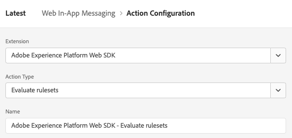

# Configure Web In-app Messaging support in Web SDK

In-app messages are notifications which you can send to users within your web application, guiding them to specific points of interest. 

You can use these notifications for different purposes, such as promoting new features, presenting special offers, or facilitating user onboarding.

By using in-app messages, you can effectively engage with your audience and steer them towards important aspects of your application.

>[!IMPORTANT]
>
>Web In-App Messaging is an [Adobe Journey Optimizer](https://experienceleague.adobe.com/docs/journey-optimizer/using/ajo-home.html) feature, which uses the Web SDK to deliver the personalized content.
>
>For detailed instructions on how to configure your Web In-App Messaging campaign, see the [Adobe Journey Optimizer documentation](https://experienceleague.adobe.com/docs/journey-optimizer/using/in-app/create-in-app-web.html).


## Prerequisites {#prerequisites}

### Web SDK tag extension version {#extension-version}

The Web In-app messaging functionality requires the latest version of the Web SDK tag extension.

### Configure a CSP for Web In-app Messaging {#csp}

When you configure [Web In-App Messaging](../personalization/web-in-app-messaging.md), you must inclde the following directive in your CSP:

```
default-src  blob:;
```

For more information about configuring a CSP, see the [dedicated documentation](../use-cases/configuring-a-csp.md).

## Configure Web In-App Messaging using the Web SDK tag extension {#tag-extension}

Refer to the [Web SDK tag extension configuration page](../../tags/extensions/client/web-sdk/web-sdk-extension-configuration.md) to understand where you can find the settings described below.

After you have [installed](../../tags/extensions/client/web-sdk/web-sdk-extension-configuration.md#install-the-web-sdk-tag-extension) the Web SDK tag extension, follow the steps below to configure the extension for Web In-app Messaging.

In the **[!UICONTROL Personalization]** section, check the **[!UICONTROL Enable personalization storage]** option. This option allows the Web SDK to keep track of which experiences have been seen by the user across page loads.


Web In-app Messaging supports two types of triggers:

* [Sending data to Platform](#send-data-platform)
* [Manually triggering the messages](#manual-trigger)

Refer to the following sections to configure the Web SDK tag extension according to the triggers you want to use.

### Configuration steps for the **[!UICONTROL Send data to Platform]** trigger {#send-data-platform}

Select the tag property which contains your Web SDK extension, and [create a new rule](../../tags/ui/managing-resources/rules.md##create-a-rule) with the following settings:

1. **[!UICONTROL Extension]**: [!UICONTROL Core]
2. **[!UICONTROL Event Type]**: [!UICONTROL Library Loaded (Page Top)]

    

3. Select **[!UICONTROL Keep Changes]** to save the event configuration.

Next, you must add an action to the rule that you created.

1. In the [!DNL Actions] section, select **[!UICONTROL Add]**.
    

2. Use the following **[!UICONTROL Action]** settings:
    * **[!UICONTROL Extension]**: [!UICONTROL Adobe Experience Platform Web SDK]
    * **[!UICONTROL Action Type]**: [!UICONTROL Send event]

        

3. On the right side of the screen, in the **[!UICONTROL Personalization]** section, enable the **[!UICONTROL Render visual personalization decisions]** option.
    

4. On the right side of the screen, in the **[!UICONTROL Decision context]** section, define the **[!UICONTROL Key]**/**[!UICONTROL Value]** pairs which you used in your campaign configuration, to qualify for the in-app message.
    

5. Select **[!UICONTROL Keep Changes]** to save your configuration.


Next, you must add the newly created rule to the tag property library. To do this, go to **[!UICONTROL Publishing Flow]** and select the rule that you previously created.


After you have added the rule to the library, select **[!UICONTROL Save & Build to Development]**.


The configuration process is now completed and your message is ready to be shown to your users.

### Configuration steps for using manual triggers {#manual-trigger}

Select the tag property which contains your Web SDK extension, and [create a new rule](../../tags/ui/managing-resources/rules.md##create-a-rule) with the following settings:

1. **[!UICONTROL Extension]**: [!UICONTROL Core]
2. **[!UICONTROL Event Type]**: [!UICONTROL Click]
3. Set the trigger for a specific element on the page, identifier by a CSS selector of your choosing.

    


Next, you must add an action to the rule that you created.

1. In the [!DNL Actions] section, select **[!UICONTROL Add]**.
    

2. Use the following **[!UICONTROL Action]** settings:
    * **[!UICONTROL Extension]**: [!UICONTROL Adobe Experience Platform Web SDK]
    * **[!UICONTROL Action Type]**: [!UICONTROL Evaluate rulesets]

        

3. On the right side of the screen, enable the **[!UICONTROL Render visual personalization decisions]** option.
    


4. On the right side of the screen, in the **[!UICONTROL Decision context]** section, define the **[!UICONTROL Key]**/**[!UICONTROL Value]** pairs which you used in your campaign configuration, to qualify for the in-app message.
    

5. Select **[!UICONTROL Keep Changes]** to save your configuration.

Next, you must add the newly created rule to the tag property library. To do this, go to **[!UICONTROL Publishing Flow]** and select the rule that you previously created.


After you have added the rule to the library, select **[!UICONTROL Save & Build to Development]**.


The configuration process is now completed and your message is ready to be shown to your users.

## Configure Web In-App Messaging using the Web SDK JavaScript library {#js-library}

As an alternative to using the Web SDK tag extension, you can also configure Web In-App Messaging directly from the Web SDK JavaScript library.


You can display web in-app messages from Adobe Journey Optimizer in two ways.

### Method 1: Automatically fetch the personalization content {#automatic}

To have Web SDK automatically fetch the personalization content on page load, use the `sendEvent` command, as shown in the example below.

```js
  alloy("sendEvent", {
      renderDecisions: true,
      personalization: {
          surfaces: ['#welcome']
      }
  });
```

### Method 2: Manually fetch the personalization content based on user action {#manual}

To show the personalization content only after the user performs a specific action, use the `evaluateRulesets` command as shown in the example below.

In this example, the personalization content is displayed when a user clicks the **[!UICONTROL Buy Now]** button on your website.

```js
 alloy("evaluateRulesets", {
     renderDecisions: true,
     personalization: {
         decisionContext: {
             "userAction": "buy_now"
         }
     }
 });
```

### Configure personalization storage {#personalization-storage}

You can choose to show in-app messages to users for a set number of times, or every time they visit a page, through the `personalizationStorageEnabled` configuration option.

In the [Web SDK configuration](../commands/configure/overview.md) set the `personalizationStorageEnabled` option according to your needs:

* `personalizationStorageEnabled: true` triggers the in-app message with the frequency you defined in the [Adobe Journey Optimizer campaign](https://experienceleague.adobe.com/docs/journey-optimizer/using/in-app/create-in-app-web.html#configure-inapp).
* `personalizationStorageEnabled: false` triggers the in-app message on every page load.