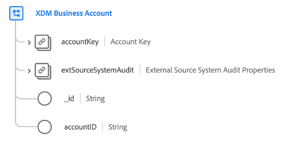

# [!UICONTROL XDM Business Account] class (Beta)

>[!IMPORTANT]
>
>This class is available as part of Real-time Customer Data Platform B2B Edition, which is currently in beta. The documentation and functionality are subject to change.

[!UICONTROL XDM Business Account] is a standard Experience Data Model (XDM) class that captures the minimum required properties of a business account.

| Property | Data type |  Description |
| --- | --- | --- |
| `accountKey` | [[!UICONTROL B2B Source]](../../data-types/b2b-source.md) | A composite identifier for the account entity. |
| `extSourceSystemAudit` | [[!UICONTROL External Source System Audit Attributes]](../../data-types/external-source-system-audit-attributes.md) | If the account comes from an external source system, this object captures audit attributes for that system. |
| `_id` | String  | A unique identifier for the record. This is a system-generated value that is separate from the `accountID`. |
| `accountID` | String  | A unique identifier for the account entity. |

See the guide on [schema relationships in Real-time CDP B2B Edition](../../tutorials/relationship-b2b.md) to learn how this class conceptually relates to the other B2B classes and how you can establish these relationships in the Adobe Experience Platform UI.
