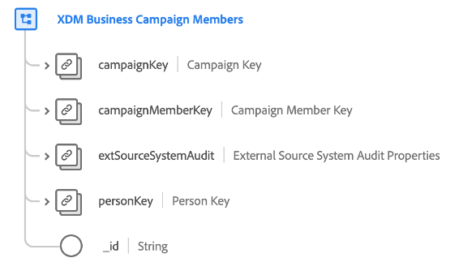

# [!UICONTROL XDM Business Campaign Members] class

>[!IMPORTANT]
>
>This class is intended to be used by organizations with access to [Adobe Real-Time Customer Data Platform B2B Edition](../../../rtcdp/b2b-overview.md). You must have access to Real-Time CDP B2B Edition in order for this class to participate in [Real-Time Customer Profile](../../../profile/home.md).

[!UICONTROL XDM Business Campaign Members] is a standard Experience Data Model (XDM) class that describes a contact or lead associated with a business campaign.

| Property | Data type |  Description |
| --- | --- | --- |
| `campaignKey` | [[!UICONTROL B2B Source]](../../data-types/b2b-source.md) | A composite identifier for the associated campaign. |
| `campaignMemberKey` | [[!UICONTROL B2B Source]](../../data-types/b2b-source.md) | A composite identifier for the campaign membership entity. |
| `extSourceSystemAudit` | [[!UICONTROL External Source System Audit Attributes]](../../data-types/external-source-system-audit-attributes.md) | If the campaign membership comes from an external source system, this object captures audit attributes for that system. |
| `personKey` | [[!UICONTROL B2B Source]](../../data-types/b2b-source.md) | A composite identifier for the person who is a member of the associated campaign. |
| `_id` | String  | A unique identifier for the record. This is a system-generated value that is separate from the `campaignMemberID`. |

{style="table-layout:auto"}

To learn how this class conceptually relates to the other B2B classes and how you can establish these relationships in the Adobe Experience Platform UI, see the guide on [schema relationships in Real-Time CDP B2B Edition](../../tutorials/relationship-b2b.md) 

For additional fields that are compatible with this class, see the field group reference for [[!UICONTROL XDM Business Campaign Member Details]](../../field-groups/b2b-campaign-members/details.md).
