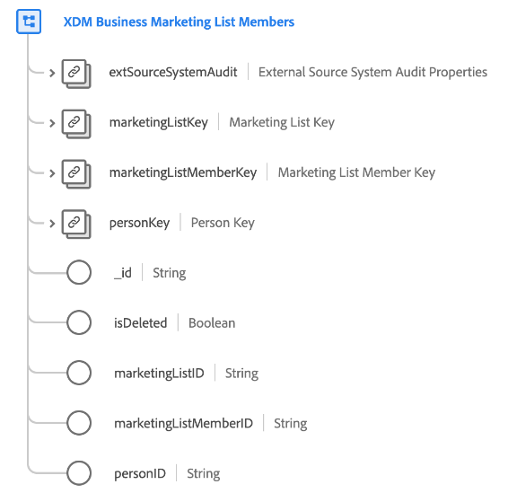

# [!UICONTROL XDM Business Marketing List Members] class

>[!IMPORTANT]
>
>This class is intended to be used by organizations with access to [Real-time Customer Data Platform B2B Edition](../../../rtcdp/b2b-overview.md). You must have access to Real-time CDP B2B Edition in order for this class to participate in [Real-time Customer Profile](../../../profile/home.md).

[!UICONTROL XDM Business Marketing List Members] is a standard Experience Data Model (XDM) class that describes members, persons, or contacts associated with a marketing list.

| Property | Data type |  Description |
| --- | --- | --- |
| `extSourceSystemAudit` | [[!UICONTROL External Source System Audit Attributes]](../../data-types/external-source-system-audit-attributes.md) | If the marketing list membership comes from an external source system, this object captures audit attributes for that system. |
| `marketingListKey` | [[!UICONTROL B2B Source]](../../data-types/b2b-source.md) | A composite identifier for the marketing list that the person is a member of. |
| `marketingListMemberKey` | [[!UICONTROL B2B Source]](../../data-types/b2b-source.md) | A composite identifier for the marketing list membership entity. |
| `personKey` | [[!UICONTROL B2B Source]](../../data-types/b2b-source.md) | A composite identifier for the person who is a member of the marketing list. |
| `_id` | String  | A unique identifier for the record. This is a system-generated value that is separate from the `marketingListMemberID`. |
| `marketingListID` | String  | A unique ID for the marketing list. |
| `marketingListMemberID` | String  | A unique ID for the marketing list membership entity. |
| `personId` | String  | A unique ID for the person. |

{style="table-layout:auto"}

See the guide on [schema relationships in Real-time CDP B2B Edition](../../tutorials/relationship-b2b.md) to learn how this class conceptually relates to the other B2B classes and how you can establish these relationships in the Adobe Experience Platform UI.
