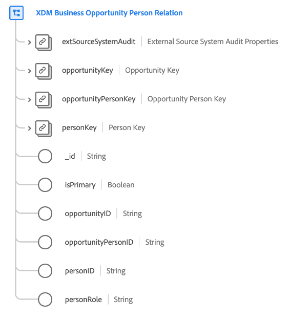

# [!UICONTROL XDM Business Opportunity Person Relation] class

>[!IMPORTANT]
>
>This class is intended to be used by organizations with access to [Adobe Real-Time Customer Data Platform B2B Edition](../../../rtcdp/b2b-overview.md). You must have access to Real-Time CDP B2B Edition in order for this class to participate in [Real-time Customer Profile](../../../profile/home.md).

[!UICONTROL XDM Business Opportunity Person Relation] is a standard Experience Data Model (XDM) class that captures the minimum required properties of a person that is associated with a business opportunity.

| Property | Data type | Description |
| --- | --- | --- |
| `extSourceSystemAudit` | [[!UICONTROL External Source System Audit Attributes]](../../data-types/external-source-system-audit-attributes.md) | If the business person relation comes from an external source system, this object captures audit attributes for that system. |
| `opportunityKey` | [[!UICONTROL B2B Source]](../../data-types/b2b-source.md) | A composite identifier for the opportunity in the opportunity-person relationship. |
| `opportunityPersonKey` | [[!UICONTROL B2B Source]](../../data-types/b2b-source.md) | A composite identifier for the opportunity-person relation entity. |
| `personKey` | [[!UICONTROL B2B Source]](../../data-types/b2b-source.md) | A composite identifier for the person in the opportunity-person relationship. |
| `_id` | String | A unique identifier for the record. This is a system-generated value that is separate from the other ID fields captured by the class. |
| `isDeleted` | Boolean  | Indicates whether this marketing list entity has been deleted in Marketo Engage.  When using the [Marketo source connector](../../../sources/connectors/adobe-applications/marketo/marketo.md), any records that are deleted in Marketo are automatically reflected in Real-time Customer Profile. However, records relating to these profiles may still persist in the Data Lake. By setting `isDeleted` to `true`, you can use the field to filter out which records have been deleted from your sources when querying the Data Lake. |
| `isPrimary` | Boolean | Indicates whether the person is the primary contact for this opportunity. |
| `opportunityID` | String | A unique identifier for the opportunity in the opportunity-person relationship. |
| `opportunityPersonID` | String | A unique identifier for the opportunity-person relation entity |
| `personID` | String | A unique identifier for the person in the opportunity-person relationship. |
| `personRole` | String | The role for the person in the opportunity-person relationship. |

{style="table-layout:auto"}

See the guide on [schema relationships in Real-Time CDP B2B Edition](../../tutorials/relationship-b2b.md) to learn how this class conceptually relates to the other B2B classes and how you can establish these relationships in the Adobe Experience Platform UI.
