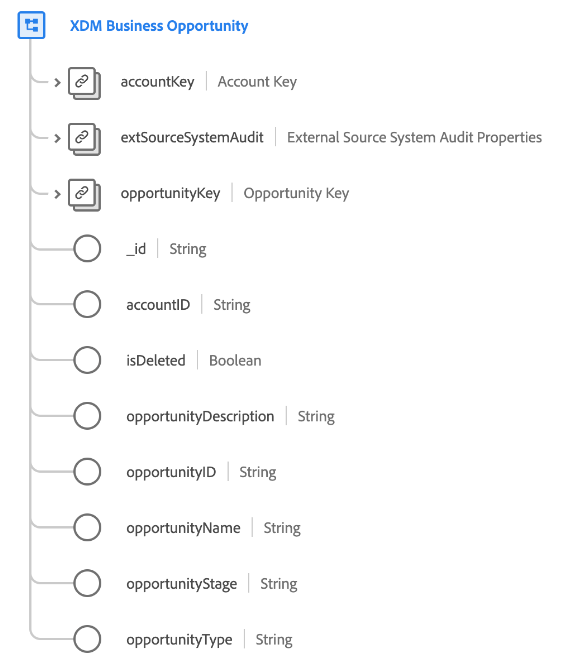

# [!UICONTROL XDM Business Opportunity] class

>[!IMPORTANT]
>
>This class is intended to be used by organizations with access to [Adobe Real-Time Customer Data Platform B2B Edition](../../../rtcdp/b2b-overview.md). You must have access to Real-Time CDP B2B Edition in order for this class to participate in [Real-Time Customer Profile](../../../profile/home.md).

[!UICONTROL XDM Business Opportunity] is a standard Experience Data Model (XDM) class that captures the minimum required properties of a business opportunity.

| Property | Data type |  Description |
| --- | --- | --- |
| `accountKey` | [[!UICONTROL B2B Source]](../../data-types/b2b-source.md) | A composite identifier for the account this opportunity is associated with. |
| `extSourceSystemAudit` | [[!UICONTROL External Source System Audit Attributes]](../../data-types/external-source-system-audit-attributes.md) | If the opportunity comes from an external source system, this object captures audit attributes for that system. |
| `opportunityKey` | [[!UICONTROL B2B Source]](../../data-types/b2b-source.md) | A composite identifier for the opportunity entity. |
| `_id` | String  | A unique identifier for the record. This is a system-generated value that is separate from the `opportunityID`. |
| `accountID` | String  | A unique ID for the account this opportunity is associated with. |
| `isDeleted` | Boolean  | Indicates whether this marketing list entity has been deleted in Marketo Engage.  When using the [Marketo source connector](../../../sources/connectors/adobe-applications/marketo/marketo.md), any records that are deleted in Marketo are automatically reflected in Real-Time Customer Profile. However, records relating to these profiles may still persist in the Data Lake. By setting `isDeleted` to `true`, you can use the field to filter out which records have been deleted from your sources when querying the Data Lake. |
| `opportunityDescription` | String  | A description for the opportunity. |
| `opportunityID` | String  | A unique ID for the opportunity entity. |
| `opportunityName` | String  | The name of the opportunity. |
| `opportunityStage` | String  | The sales stage of the opportunity. |
| `opportunityType` | String  | The type of opportunity. |

{style="table-layout:auto"}

See the guide on [schema relationships in Real-Time CDP B2B Edition](../../tutorials/relationship-b2b.md) to learn how this class conceptually relates to the other B2B classes and how you can establish these relationships in the Adobe Experience Platform UI.
