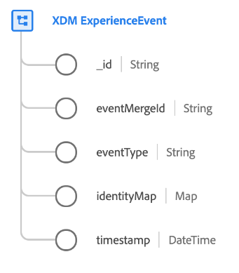
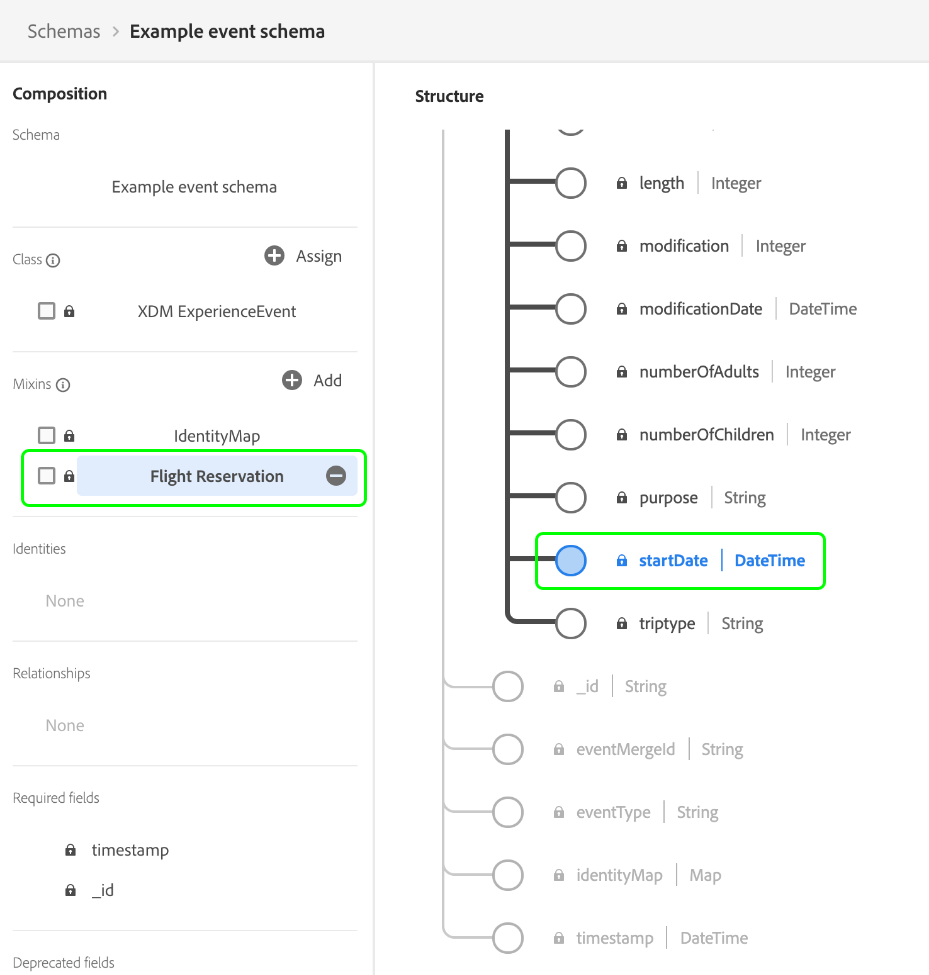

# [!DNL XDM ExperienceEvent] class

[!DNL XDM ExperienceEvent] is a standard Experience Data Model (XDM) class which allows you to create a timestamped snapshot of the system when a specific event occurs or a certain set of conditions have been reached.

An Experience Event is a fact record of what occurred, including the point in time and identity of the individual involved. Events can be either explicit (directly observable human actions) or implicit (raised without a direct human action) and are recorded without aggregation or interpretation. For more high-level information on the use of this class in the Platform ecosystem, refer to the [XDM overview](../home.md#data-behaviors).

The [!DNL XDM ExperienceEvent] class itself provides several time-series-related fields to a schema. Two of these fields (`_id` and `timestamp`) are **required** for all schemas based on the class, while the rest are optional. The values of some of the fields are automatically populated when data is ingested.

| Property | Description |
| --- | --- |
| `_id` **(Required)** | A unique string identifier for the event. This field is used to track the uniqueness of an individual event, prevent duplication of data, and look up that event in downstream services. In some cases, `_id` can be a [Universally Unique Identifier (UUID)](https://tools.ietf.org/html/rfc4122) or [Globally Unique Identifier (GUID)](https://docs.microsoft.com/en-us/dotnet/api/system.guid?view=net-5.0).  If you are streaming data from a source connection or ingesting directly from a Parquet file, you should generate this value by concatenating a certain combination of fields that make the event unique, such as a primary ID, timestamp, event type, and so on. The concatenated value must be a `uri-reference` formatted string, meaning any colon characters must be removed. Afterwards, the concatenated value should be hashed using SHA-256 or another algorithm of your choice.  It is important to distinguish that **this field does not represent an identity related to an individual person**, but rather the record of data itself. Identity data relating to a person should be relegated to [identity fields](../schema/composition.md#identity) provided by compatible field groups instead. |
| `eventMergeId` | If using the [Adobe Experience Platform Web SDK](../../edge/home.md) to ingest data, this represents the ID of the ingested batch that caused the record to be created. This field is automatically populated by the system upon data ingestion. The use of this field outside of the context of a Web SDK implementation is not supported. |
| `eventType` | A string that indicates the type or category for the event. This field can be used if you want to distinguish different event types within the same schema and dataset, such as distinguishing a product view event from an add-to-shopping-cart event for a retail company.  Standard values for this property are provided in the [appendix section](#eventType), including descriptions of their intended use case. This field is an extensible enum, meaning that you can also use your own event type strings to categorize the events you are tracking.  `eventType` limits you to using only a single event per hit on your application, and therefore you must use calculated fields to let the system know which event is most important. For more information, see the section on [best practices for calculated fields](#calculated). |
| `producedBy` | A string value that describes the producer or origin of the event. This field can be used to filter out certain event producers if needed for segmentation purposes.  Some suggested values for this property are provided in the [appendix section](#producedBy). This field is an extensible enum, meaning that you can also use your own strings to represent different event producers. |
| `identityMap` | A map field that contains a set of namespaced identities for the individual that the event applies to. This field is automatically updated by the system as identity data is ingested. In order to properly utilize this field for [Real-Time Customer Profile](../../profile/home.md), do not attempt to manually update the field's contents in your data operations.  See the section on identity maps in the [basics of schema composition](../schema/composition.md#identityMap) for more information on their use case. |
| `timestamp` **(Required)** | An ISO 8601 timestamp of when the event occurred, formatted as per [RFC 3339 Section 5.6](https://tools.ietf.org/html/rfc3339#section-5.6). This timestamp must occur in the past. See the section below on [timestamps](#timestamps) for best practices on the use of this field. |

{style="table-layout:auto"}

## Best practices for event modeling

The following sections cover best practices for designing your event-based Experience Data Model (XDM) schemas in Adobe Experience Platform.

### Timestamps {#timestamps}

The root `timestamp` field of an event schema can **only** represent the observation of the event itself, and must occur in the past. If your segmentation use cases require the use of timestamps that may occur in the future, these values must be constrained elsewhere in your Experience Event schema.

For example, if a business in the travel and hospitality industry is modeling a flight reservation event, the class-level `timestamp` field represents the time when the reservation event was observed. Other timestamps that are related to the event, such as the start date of the travel reservation, should be captured in separate fields provided by standard or custom field groups.

By keeping the class-level timestamp separate from other related datetime values in your event schemas, you can implement flexible segmentation use cases while preserving a timestamped account of customer journeys in your experience application.

### Using calculated fields {#calculated}

Certain interactions in your experience applications can result in multiple related events that technically share the same event timestamp, and can therefore be represented as a single event record. For example, if a customer views a product on your website, this can result in an event record that has two potential `eventType` values: a "product view" event (`commerce.productViews`) or a generic "page view" event (`web.webpagedetails.pageViews`). In these cases, you can use calculated fields to capture the most important attributes when multiple events are captured in a single hit.

[Adobe Experience Platform Data Prep](../../data-prep/home.md) allows you to map, transform, and validate data to and from XDM. Using the available [mapping functions](../../data-prep/functions.md) provided by the service you can invoke logical operators to prioritize, transform, and/or consolidate data from multi-event records when being ingested into Experience Platform. In the example above, you could designate `eventType` as a calculated field that would prioritize a "product view" over a "page view" whenever they both occur.

If you are manually ingesting data into Platform via the UI, see the guide on [calculated fields](../../data-prep/ui/mapping.md#calculated-fields) for specific steps on how to create calculated fields.

If you are streaming data to Platform using a source connection, you can configure the source to utilize calculated fields instead. Refer to the [documentation for your particular source](../../sources/home.md) for instructions on how to implement calculated fields when configuring the connection.

## Compatible schema field groups {#field-groups}

>[!NOTE]
>
>The names of several field groups have changed. See the document on [field group name updates](../field-groups/name-updates.md) for more information.

Adobe provides several standard field groups for use with the [!DNL XDM ExperienceEvent] class. The following is a list of some commonly used field groups for the class:

* [[!UICONTROL Adobe Analytics ExperienceEvent Full Extension]](../field-groups/event/analytics-full-extension.md)
* [[!UICONTROL Balance Transfers]](../field-groups/event/balance-transfers.md)
* [[!UICONTROL Campaign Marketing Details]](../field-groups/event/campaign-marketing-details.md)
* [[!UICONTROL Card Actions]](../field-groups/event/card-actions.md)
* [[!UICONTROL Channel Details]](../field-groups/event/channel-details.md)
* [[!UICONTROL Commerce Details]](../field-groups/event/commerce-details.md)
* [[!UICONTROL Deposit Details]](../field-groups/event/deposit-details.md)
* [[!UICONTROL Device Trade-In Details]](../field-groups/event/device-trade-in-details.md)
* [[!UICONTROL Dining Reservation]](../field-groups/event/dining-reservation.md)
* [[!UICONTROL End User ID Details]](../field-groups/event/enduserids.md)
* [[!UICONTROL Environment Details]](../field-groups/event/environment-details.md)
* [[!UICONTROL Flight Reservation]](../field-groups/event/flight-reservation.md)
* [[!UICONTROL IAB TCF 2.0 Consent]](../field-groups/event/iab.md)
* [[!UICONTROL Lodging Reservation]](../field-groups/event/lodging-reservation.md)
* [[!UICONTROL Quote Request Details]](../field-groups/event/quote-request-details.md)
* [[!UICONTROL Reservation Details]](../field-groups/event/reservation-details.md)
* [[!UICONTROL Web Details]](../field-groups/event/web-details.md)

## Appendix

The following section contains additional information about the [!UICONTROL XDM ExperienceEvent] class.

### Accepted values for `eventType` {#eventType}

The following table outlines the accepted values for `eventType`, along with their definitions:

| Value | Definition |
| --- | --- |
|`advertising.clicks` | Click action(s) on an advertisement. |
|`advertising.completes` | A timed media asset has been watched to completion. This does not necessarily mean the viewer watched the whole video, as the viewer could have skipped ahead. |
|`advertising.conversions` | Pre-defined action(s) performed by a customer which triggers an event for performance evaluation. |
|`advertising.federated` | Indicates if an Experience Event was created through data federation (data sharing between customers). |
|`advertising.firstQuartiles` | A digital video ad has played through 25% of its duration at normal speed. |
|`advertising.impressions` | Impression(s) of an advertisement to a customer with the potential of being viewed. |
|`advertising.midpoints` | A digital video ad has played through 50% of its duration at normal speed. |
|`advertising.starts` | A digital video ad has started playing. |
|`advertising.thirdQuartiles` | A digital video ad has played through 75% of its duration at normal speed. |
|`advertising.timePlayed` | Describes the amount of time spent by a user on a specific timed media asset. |
|`application.close` | An application was closed or sent into the background. |
|`application.launch` | An application was launched or brought into the foreground. |
|`commerce.checkouts` | A checkout event has occurred for a product list. There can be more than one checkout event if there are multiple steps in a checkout process. If there are multiple steps, the timestamp and referenced page/experience for each event are used to identify each individual event (step), represented in order. |
|`commerce.productListAdds` | A product has been added to the product list or shopping cart. |
|`commerce.productListOpens` | A new product list (shopping cart) has been initialized or created. |
|`commerce.productListRemovals` | One or more product entries have been removed from a product list or shopping cart. |
|`commerce.productListReopens` | A product list (shopping cart) that was no longer accessible (abandoned) has been re-activated by a customer, such as via a re-marketing activity. |
|`commerce.productListViews` | A product list or shopping cart has received one or more views. |
|`commerce.productViews` | A product has received one or more views. |
|`commerce.purchases` | An order has been accepted. This is the only required action in a commerce conversion. A purchase event must have a product list referenced. |
|`commerce.saveForLaters` | A product list has been saved for future use, such a product wishlist. |
|`decisioning.propositionDisplay` | A decisioning proposition was displayed to a person. |
|`decisioning.propositionInteract` | A person interacted with a decisioning proposition. |
|`delivery.feedback` | Feedback events for a delivery, such as an email delivery. |
|`directMarketing.emailBounced` | An email to a person bounced. |
|`directMarketing.emailBouncedSoft` | An email to a person soft-bounced. |
|`directMarketing.emailClicked` | A person clicked a link in a marketing email. |
|`directMarketing.emailDelivered` | An email was successfully delivered to person's email service |
|`directMarketing.emailOpened` | A person opened a marketing email. |
|`directMarketing.emailUnsubscribed` | A person unsubscribed from a marketing email. |
|`inappmessageTracking.dismiss` | An in-app message was dismissed. |
|`inappmessageTracking.display` | An in-app message was displayed. |
|`inappmessageTracking.interact` | An in-app message was interacted with. |
|`leadOperation.callWebhook` | A webhook was called in response to a lead. |
|`leadOperation.convertLead` | A lead was converted. |
|`leadOperation.interestingMoment` | An interesting moment was recorded for a person. |
|`leadOperation.newLead` | A lead was created. |
|`leadOperation.scoreChanged` | The value of the lead's score attribute was changed. |
|`leadOperation.statusInCampaignProgressionChanged` | A lead's status in a campaign has changed. |
|`listOperation.addToList` | A person was added to a marketing list. |
|`listOperation.removeFromList` | A person was removed from a marketing list. |
|`message.feedback` | Feedback events like sent/bounce/error for messages sent to a customer. |
|`message.tracking` | Tracking events like open/click/custom actions on messages sent to a customer. |
|`opportunityEvent.addToOpportunity` | A person was added to an opportunity. |
|`opportunityEvent.opportunityUpdated` | An opportunity was updated. |
|`opportunityEvent.removeFromOpportunity` | A person was removed from an opportunity. |
|`pushTracking.applicationOpened` | A person opened an application from a push notification. |
|`pushTracking.customAction` | A person clicked a custom action in a push notification. |
|`web.formFilledOut` | A person filled out a form on a wep page. |
|`web.webinteraction.linkClicks` | A link has been selected one or more times. |
|`web.webpagedetails.pageViews` | A webpage has received one or more views. |

{style="table-layout:auto"}

### Suggested values for `producedBy` {#producedBy}

The following table outlines some accepted values for `producedBy`:

| Value | Definition |
| --- | --- |
| `self` | Self |
| `system` | System |
| `salesRef` | Sales Representative |
| `customerRep` | Customer Representative |
