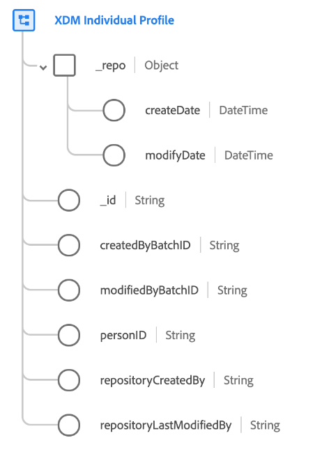

# [!DNL XDM Individual Profile] class

[!DNL XDM Individual Profile] is a standard Experience Data Model (XDM) class which forms a singular representation (or "profile") of an individual person. Specifically, the class (and its compatible field groups) captures the attributes and interests of both identified and partially identified individuals that interact with your brand.

Profiles can range from anonymous behavioral signals (such as browser cookies), to highly identified profiles containing detailed information such as name, date of birth, location, and email address. As a profile grows, it becomes a robust repository of personal information, identities, contact details, and communication preferences for an individual. For more high-level information on the use of this class in the Platform ecosystem, refer to the [XDM overview](../home.md#data-behaviors).

The [!DNL XDM Individual Profile] class itself provides several system-generated values that are automatically populated when data is ingested, whereas all other fields must be added through the use of [compatible schema field groups](#field-groups):

| Property | Description |
| --- | --- |
| `_repo` | An object containing the following [!UICONTROL DateTime] fields: <ul><li>`createDate`: The date and time when the resource was created in the data store, such as when data was first ingested.</li><li>`modifyDate`: The date and time when the resource was last modified.</li></ul> |
| `_id` |  A unique string identifier for the record. This field is used to track the uniqueness of an individual record, prevent duplication of data, and look up that record in downstream services. In some cases, `_id` can be a [Universally Unique Identifier (UUID)](https://tools.ietf.org/html/rfc4122) or [Globally Unique Identifier (GUID)](https://docs.microsoft.com/en-us/dotnet/api/system.guid?view=net-5.0).  If you are streaming data from a source connection or ingesting directly from a Parquet file, you should generate this value by concatenating a certain combination of fields that make the record unique, such as a primary ID, timestamp, record type, and so on. The concatenated value must be a `uri-reference` formatted string, meaning any colon characters must be removed. Afterwards, the concatenated value should be hashed using SHA-256 or another algorithm of your choice.  It is important to distinguish that **this field does not represent an identity related to an individual person**, but rather the record of data itself. Identity data relating to a person should be relegated to [identity fields](../schema/composition.md#identity) provided by compatible field groups instead. |
| `createdByBatchID` | The ID of the ingested batch that caused the record to be created. |
| `modifiedByBatchID` | The ID of the last ingested batch that caused the record to be updated. |
| `personID` | A unique identifier for the individual person this record relates to. This field does not necessarily represent an identity related to the person unless it is also designated as an [identity field](../schema/composition.md#identity). |
| `repositoryCreatedBy` | The ID of the user who created the record. |
| `repositoryLastModifiedBy` | The ID of the user who last modified the record. |

{style="table-layout:auto"}

## Compatible field groups {#field-groups}

>[!NOTE]
>
>The names of several field groups have changed. See the document on [field group name updates](../field-groups/name-updates.md) for more information.

Adobe provides several standard field groups for use with the [!DNL XDM Individual Profile] class. The following is a list of some commonly used field groups for the class:

* [[!UICONTROL Consents and Preferences]](../field-groups/profile/consents.md)
* [[!UICONTROL Demographic Details]](../field-groups/profile/demographic-details.md)
* [[!UICONTROL IdentityMap]](../field-groups/profile/identitymap.md)
* [[!UICONTROL Loyalty Details]](../field-groups/profile/loyalty-details.md)
* [[!UICONTROL Personal Contact Details]](../field-groups/profile/personal-contact-details.md)
* [[!UICONTROL Segment Membership Details]](../field-groups/profile/segmentation.md)
* [[!UICONTROL Telecom Subscription]](../field-groups/profile/telecom-subscription.md)
* [[!UICONTROL Work Contact Details]](../field-groups/profile/work-contact-details.md)
* [[!UICONTROL XDM Business Person Components]](../field-groups/profile/business-person-components.md)\*
* [[!UICONTROL XDM Business Person Details]](../field-groups/profile/business-person-details.md)\*

*\*This field group is only available to organizations with access to the B2B edition of Adobe Real-Time Customer Data Platform.*

For a complete list of all compatible field groups for [!DNL XDM Individual Profile], refer to the [XDM GitHub repo](https://github.com/adobe/xdm/tree/master/components/fieldgroups/profile).
