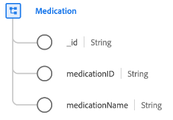

# [!UICONTROL Medication] class

In Experience Data Model (XDM), the [!UICONTROL Medication] class captures the minimum set of properties that define a substance used for medical treatment, especially a medicine or drug.

| Property | Data type | Description |
| --- | --- | --- |
| `_id` | [!UICONTROL String] | A unique, system-generated string identifier for the record. This field is used to track the uniqueness of an individual record, prevent duplication of data, and to look up that record in downstream services.  Since this field is system-generated, it does not be supplied an explicit value during data ingestion. However, you can still opt to supply your own unique ID values if you wish. |
| `medicationId` | [!UICONTROL String] | A unique identifier for the medication. |
| `medicationName` | [!UICONTROL String] | The name of the medication. |

{style="table-layout:auto"}

The class can be extended with the [[!UICONTROL Healthcare medication] field group](../field-groups/medication/healthcare-medication.md) to describe further details about the medicine or drug.
