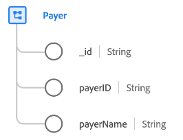

# [!UICONTROL Payer] class

In Experience Data Model (XDM), the [!UICONTROL Payer] class captures the minimum set of properties that define a payer business entity that collects data pertaining to insurance companies (such as health insurance).

| Property | Data type | Description |
| --- | --- | --- |
| `_id` | [!UICONTROL String] | A unique, system-generated string identifier for the record. This field is used to track the uniqueness of an individual record, prevent duplication of data, and to look up that record in downstream services.  Since this field is system-generated, it does not be supplied an explicit value during data ingestion. However, you can still opt to supply your own unique ID values if you wish. |
| `payerId` | [!UICONTROL String] | A unique identifier for the payer. |
| `payerName` | [!UICONTROL String] | The name of the payer. |

{style="table-layout:auto"}
