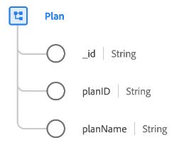

# [!UICONTROL Plan] class

In Experience Data Model (XDM), the [!UICONTROL Plan] class captures the minimum set of properties that define a plan, such as a health plan or insurance plan.

| Property | Data type | Description |
| --- | --- | --- |
| `_id` | [!UICONTROL String] | A unique, system-generated string identifier for the record. This field is used to track the uniqueness of an individual record, prevent duplication of data, and to look up that record in downstream services.  Since this field is system-generated, it does not be supplied an explicit value during data ingestion. However, you can still opt to supply your own unique ID values if you wish. |
| `planId` | [!UICONTROL String] | A unique identifier for the plan. |
| `planName` | [!UICONTROL String] | The name of the plan. |

{style="table-layout:auto"}

The class can be extended with the [[!UICONTROL Healthcare Plan Details] field group](../field-groups/plan/healthcare-plan-details.md) to describe further details about a health insurance plan.
