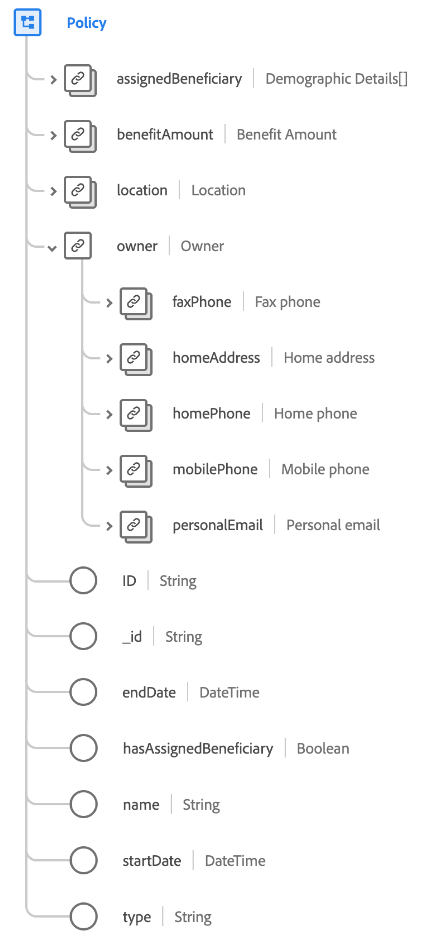

# [!UICONTROL Policy] class

In Experience Data Model (XDM), the [!UICONTROL Policy] class captures the minimum set of properties that define an insurance policy.

| Property | Data type | Description |
| --- | --- | --- |
| `assignedBeneficiary` | Array of [[!UICONTROL Person]](../data-types/person.md) data types | Captures the beneficiary (or beneficiaries) assigned to the policy. |
| `benefitAmount` | [[!UICONTROL Currency]](../data-types/currency.md) | The amount to be paid as per the policy terms. |
| `location` | [[!UICONTROL Postal address]](../data-types/postal-address.md) | The location in which the insurance policy is issued. |
| `owner` | [!UICONTROL Object] | Captures the policy holder's profile information. |
| `owner.faxPhone` | [[!UICONTROL Phone number]](../data-types/phone-number.md) | The owner's fax phone number. |
| `owner.homeAddress` | [[!UICONTROL Postal address]](../data-types/postal-address.md) | The owner's home address. |
| `owner.homePhone` | [[!UICONTROL Phone number]](../data-types/phone-number.md) | The owner's home phone number. |
| `owner.mobilePhone` | [[!UICONTROL Phone number]](../data-types/phone-number.md) | The owner's mobile phone number. |
| `owner.personalEmail` | [[!UICONTROL Email address]](../data-types/email-address.md) | The owner's personal email address. |
| `ID` | [!UICONTROL String] | An identifier for the insurance policy. |
| `_id` | [!UICONTROL String] | A unique, system-generated string identifier for the record. This field is used to track the uniqueness of an individual record, prevent duplication of data, and to look up that record in downstream services.  Since this field is system-generated, it does not be supplied an explicit value during data ingestion. However, you can still opt to supply your own unique ID values if you wish. |
| `endDate` | [!UICONTROL DateTime] | The date when the insurance policy coverage ends (or ended). |
| `hasAssignedBeneficiary` | [!UICONTROL Boolean] | Indicates whether the policy has a beneficiary assigned. |
| `name` | [!UICONTROL String] | The name of the insurance policy. |
| `startDate` | [!UICONTROL DateTime] | The date when the insurance policy coverage starts (or started). |
| `type` | [!UICONTROL String] | The type of insurance policy, such as home, automobile, renter, or boat. |

{style="table-layout:auto"}
