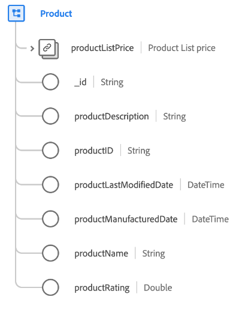

# [!UICONTROL Product] class

In Experience Data Model (XDM), the [!UICONTROL Product] class captures the minimum set of properties that define a retail product.

| Property | Data type | Description |
| --- | --- | --- |
| `productListPrice` | [Currency](../data-types/currency.md) | Describes the default price of the product before sales and discounting. |
| `_id` | String |  A unique, system-generated string identifier for the record. This field is used to track the uniqueness of an individual record, prevent duplication of data, and to look up that record in downstream services.  Since this field is system-generated, it does not be supplied an explicit value during data ingestion. However, you can still opt to supply your own unique ID values if you wish. |
| `productDescription` | String | A description of the product. |
| `productID` | String | A unique identifier for the product. |
| `productLastModifiedDate` | DateTime | An [RFC3339](https://datatracker.ietf.org/doc/html/rfc3339) timestamp of when this product was last modified for any updates. |
| `productManufacturedDate` | DateTime | An [RFC3339](https://datatracker.ietf.org/doc/html/rfc3339) timestamp of when this product was created. |
| `productName` | String | The name of the product. |
| `productRating` | String | The customer review rating of the product.|

{style="table-layout:auto"}

## Compatible field groups {#field-groups}

Adobe provides several standard field groups for use with the [!UICONTROL Product] class. The following is a list of some commonly used field groups for the class:

* [[!UICONTROL Product catalog]](../field-groups/product/product-catalog.md)
* [[!UICONTROL Product category]](../field-groups/product/product-category.md)
