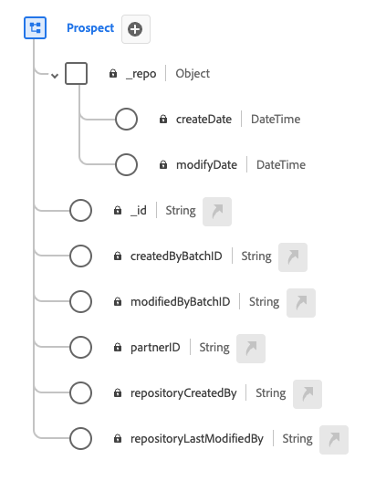

# (Beta) [!UICONTROL Prospect] class

>[!IMPORTANT]
>
>The [!UICONTROL Prospect] class is currently in beta and are not available to all users. The documentation and the functionality are subject to change.

In Experience Data Model (XDM), the [!UICONTROL Prospect] class captures ...

| Property | Data type | Description |
| --- | --- | --- |
| `_repo` | Object | This class enables you to bring in prospect profiles sourced from data vendors for the purpose of funneling customer aquisiton use cases. |
| `_repo.createDate` | [!UICONTROL DateTime] | The server date and time when the resource was created in the repository, such as when an asset file is first uploaded or a directory is created by the server as the parent of a new asset. The date time property should conform to ISO 8601 standard. An example of this format is "2004-10-23T12:00:00-06:00". |
| `_repo.modifyDate` | [!UICONTROL Modify Date] | The server date and time when the resource was last modified in the repository, such as when a new version of an asset is uploaded or a directory's child resource is added or removed. The date time property should conform to ISO 8601 standard. An example form is "2004-10-23T12:00:00-06:00". |
| `_id` | [!UICONTROL String] | A unique, system-generated string identifier for the record. This field is used to track the uniqueness of an individual record, prevent duplication of data, and to look up that record in downstream services.  Since this field is system-generated, it does not be supplied an explicit value during data ingestion. However, you can still opt to supply your own unique ID values if you wish. |
| `createdByBatchID` | [[!UICONTROL xxx]](../data-types/phone-number.md) | ... |
| `modifiedByBatchID` | [[!UICONTROL xxx]](../data-types/postal-address.md) | ... |
| `partnerID` | [[!UICONTROL xxx]](../data-types/phone-number.md) | ... |
| `repositoryCreatedBy` | [[!UICONTROL xxx]](../data-types/phone-number.md) | ... |
| `repositoryLastModifiedBy` | [[!UICONTROL xxx]](../data-types/email-address.md) | ... |

{style="table-layout:auto"}
