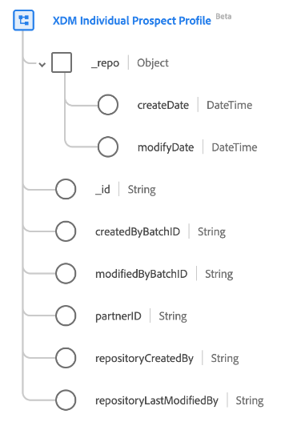

# [!UICONTROL XDM Individual Prospect Profile] class 

In Experience Data Model (XDM), the [!UICONTROL XDM Individual Prospect Profile] class captures prospect profiles typically sourced from data partners for top-of-the-funnel customer acquisition use-cases.

| Property | Data type | Description |
| --- | --- | --- |
| `_repo` | Object | This class enables you to bring in prospect profiles sourced from data vendors to funnel customer acquisition use cases. |
| `_repo.createDate` | [!UICONTROL DateTime] | The server date and time when the resource was created in the repository. The creation time could be when an asset file is first uploaded, or a directory is created by the server as the parent of a new asset. The datetime property should conform to ISO 8601 standard. An example of this format is "2004-10-23T12:00:00-06:00". |
| `_repo.modifyDate` | [!UICONTROL DateTime] | The server date and time when the resource was last modified in the repository, such as when a new version of an asset is uploaded or a directory's child resource is added or removed. The datetime property should conform to ISO 8601 standard. An example form is "2004-10-23T12:00:00-06:00". |
| `_id` | [!UICONTROL String] | A unique, system-generated string identifier for the record. This field is used to track the uniqueness of an individual record, prevent duplication of data, and to look up that record in downstream services.  Since this field is system-generated, it does not supply an explicit value during data ingestion. However, you can opt to supply your own unique ID values if you wish. |
| `createdByBatchID` | [!UICONTROL String] | The ID of the ingested batch that caused the record to be created. |
| `modifiedByBatchID` | [!UICONTROL String] | The ID of the last ingested batch that caused the record to be updated. |
| `partnerID` | [!UICONTROL String] | Typically, a unique pseudonymous identifier which identifies an individual prospect. See the documentation on [identity types](../../identity-service/namespaces.md#identity-type) to learn more about the Partner ID and the other identity types that are available within Adobe Experience Platform. |
| `repositoryCreatedBy` | [!UICONTROL String] | The ID of the user who created the record. |
| `repositoryLastModifiedBy` | [!UICONTROL String] | The ID of the user who last modified the record. When the record is created, the `modifiedByUser` value is set as the `createdByUser` value. |

{style="table-layout:auto"}
