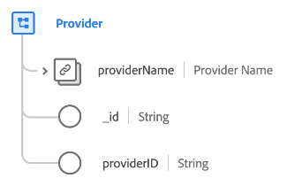

# [!UICONTROL Provider] class

In Experience Data Model (XDM), the [!UICONTROL Provider] class captures the minimum set of properties that define a provider business entity (such as a healthcare provider or insurance provider).

| Property | Data type | Description |
| --- | --- | --- |
| `providerName` | [[!UICONTROL Person name]](../data-types/person-name.md) | The name of the provider. |
| `_id` | [!UICONTROL String] | A unique, system-generated string identifier for the record. This field is used to track the uniqueness of an individual record, prevent duplication of data, and to look up that record in downstream services.  Since this field is system-generated, it does not be supplied an explicit value during data ingestion. However, you can still opt to supply your own unique ID values if you wish. |
| `providerId` | [!UICONTROL String] | A unique identifier for the provider. |

{style="table-layout:auto"}

The class can be extended with the [[!UICONTROL Healthcare Provider] field group](../field-groups/provider/healthcare-provider.md) to describe further details about a healthcare provider.
