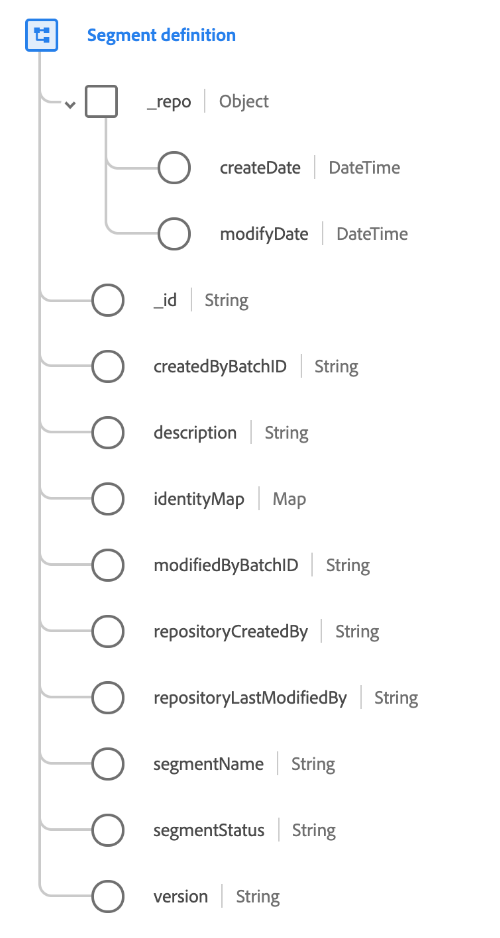

# [!UICONTROL Segment definition] class

"[!UICONTROL Segment definition]" is a standard Experience Data Model (XDM) class that captures the details of a segment definition. The class includes required fields such as the ID and name of a segment, along with other optional attributes. This class should be used if you are bringing in segment definitions from external systems into Adobe Experience Platform.

>[!NOTE]
>
>This class should only be used to capture information about segment definitions themselves. In order to capture segment membership information within your profile data, you should use the [Segment Membership Details field group](../field-groups/profile/segmentation.md) in your [!UICONTROL XDM Individual Profile] schema.

| Property | Description |
| --- | --- |
| `_repo` | An object containing the following [!UICONTROL DateTime] fields: <ul><li>`createDate`: The date and time when the resource was created in the data store, such as when data was first ingested.</li><li>`modifyDate`: The date and time when the resource was last modified.</li></ul> |
| `_id` |  A unique, system-generated string identifier for the record. This field is used to track the uniqueness of an individual record, prevent duplication of data, and to look up that record in downstream services.  Since this field is system-generated, it does not be supplied an explicit value during data ingestion. However, you can still opt to supply your own unique ID values if you wish.  It is important to distinguish that this field **does not** represent an identity related to an individual person, but rather the record of data itself. Identity data relating to a person should be relegated to [identity fields](../schema/composition.md#identity) instead. |
| `createdByBatchID` | The ID of the ingested batch that caused the record to be created. |
| `description` | A description for the segment definition. |
| `identityMap` | A map field that contains a set of namespaced identities for the individuals the segment applies to. See the section on identity maps in the [basics of schema composition](../schema/composition.md#identityMap) for more information on their use case. |
| `modifiedByBatchID` | The ID of the last ingested batch that caused the record to be updated. |
| `repositoryCreatedBy` | The ID of the user who created the record. |
| `repositoryLastModifiedBy` | The ID of the user who last modified the record. |
| `segmentName` | **(Required)** A name for the segment definition. |
| `segmentStatus` | The status of the segment from the external system. The following values are accepted: <ul><li>`ACTIVE`</li><li>`INACTIVE`</li><li>`DELETED`</li><li>`DRAFT`</li><li>`REVOKED`</li></ul> |
| `version` | The latest version number of the segment definition. |

{style="table-layout:auto"}
