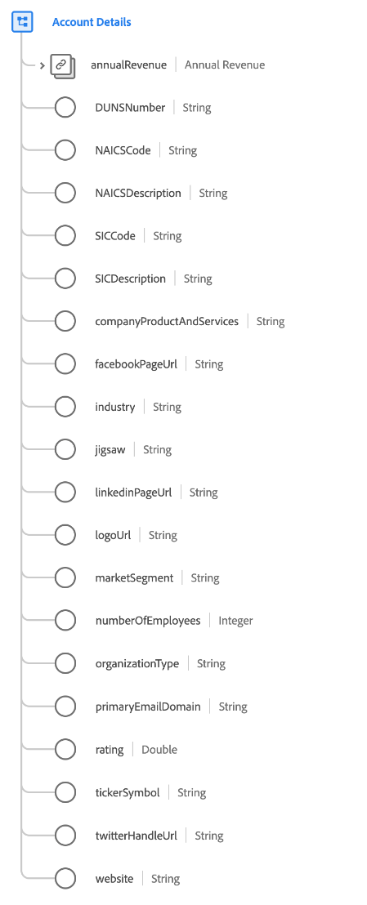

# [!UICONTROL Account Details] data type

[!UICONTROL Account Details] is a standard Experience Data Model (XDM) data type that describes details related to a business organization.

| Property | Data type | Description |
| --- | --- | --- |
| `annualRevenue` | [[!UICONTROL Currency]](./currency.md) | The estimated amount of annual revenue of the organization. |
| `DUNSNumber` | String | The organization's Dun & Bradstreet D-U-N-S Number. This is a non-indicative, nine-digit number assigned to each business location in the Dun & Bradstreet database having a unique, separate, and distinct operation, and is maintained solely by Dun & Bradstreet. |
| `NAICSCode` | String | The organization's classification within the North American Industry Classification System. |
| `NAICSDescription` | String | A brief description of an organization's line of business, based on its NAICS code. |
| `SICCode` | String | The organization's Standard Industrial Classification (SIC) code. This is a four-digit code that categorizes the industry that companies belong to based on their business activities. |
| `SICDescription` | String | A brief description of an organization's line of business, based on its SIC code. |
| `companyProductAndServices` | String | The products and services that the organization is dealing or doing business in. |
| `facebookPageUrl` | String | A website link to the Facebook account of the organization. |
| `industry` | String | The industry that this organization is a part of. This is a free-form field, and it is advisable to use a structured value for queries or to use the `xdm:classifier` property. |
| `jigsaw` | String | The Data.com key for the organization. |
| `linkedinPageUrl` | String | A website link to the LinkedIn account of the organization. |
| `logoUrl` | String | A path to be combined with the URL of a Salesforce instance (for example, `https://yourInstance.salesforce.com/`) to generate a URL to request the social network profile image associated with the organization. The generated URL returns an HTTP redirect (code 302) to the social network profile image for the organization. |
| `marketSegment` | String | The named market audience that the organization participates in. This is a free-form field, and it is advisable to use a structured value for queries or to use the `xdm:identifier` property. |
| `numberOfEmployees` | Integer | The number of employees at the organization. |
| `organizationType` | String | A label describing the type of organization. |
| `primaryEmailDomain` | String | The primary email domain that the organization uses for its personnel. |
| `rating` | Double | The calculated score or star-rating for this organization. `1` indicates the maximum possible rating, and `0` is the minimum possible rating. |
| `tickerSymbol` | String | The stock market symbol for this account. Maximum of 20 characters. |
| `twitterHandleUrl` | String | A website link to the twitter handle of the organization. |
| `website` | String | The URL of the organization's website. |

{style="table-layout:auto"}

For more details on the data type, refer to the public XDM repository:

* [Populated example](https://github.com/adobe/xdm/blob/master/components/datatypes/b2b/account-organization.example.1.json)
* [Full schema](https://github.com/adobe/xdm/blob/master/components/datatypes/b2b/account-organization.schema.json)
